QUESTION 1: Green Building

``` r
library(ggplot2)
library(dplyr)
```

    ## 
    ## Attaching package: 'dplyr'

    ## The following objects are masked from 'package:stats':
    ## 
    ##     filter, lag

    ## The following objects are masked from 'package:base':
    ## 
    ##     intersect, setdiff, setequal, union

``` r
#setwd("~/STA380-master/STA380-master/data")
setwd("~/GitHub/STA380/data/")
gb = read.csv("greenbuildings.csv")
gb$green_rating = as.logical(gb$green_rating)
gb = filter(gb, leasing_rate>=.1)
```

The first issue we immediately noticed with the Excel Guru’s analysis is
their valuation of rent of green versus non-green buildings. They
considered this green factor as independent from all other factors, so
we wanted to see how rent varied considerring multiple factors. We
wanted to compare rent prices for buildings similar to one another as
opposed to with every building in the dataset.

The first variable we explored was age. We started by plotting rent over
building age and differentiating green building by coloring those points
green.

``` r
ggplot(data=gb) + geom_point(aes(age, Rent, color=green_rating)) + scale_color_manual(values=c("black", "#4EC62A"))
```

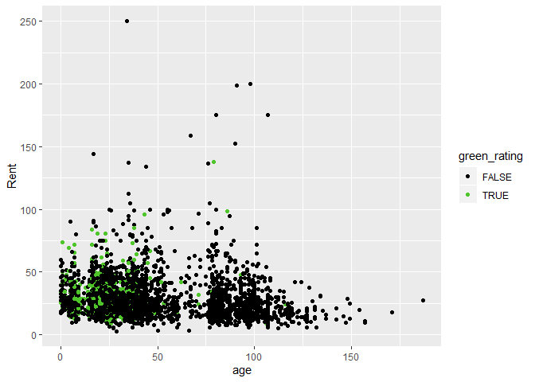

Looking at the plot, it’s very hard to tell if green buildings have
higher rent values than non green buildings. To more closely examine
this, we will group by age and take the median.

``` r
gb_age = group_by(gb, age, green_rating)
ggplot(data=summarize(gb_age, Median_Rent = median(Rent))) + geom_point(aes(age, Median_Rent, color=green_rating)) + scale_color_manual(values=c("black", "#4EC62A"))
```

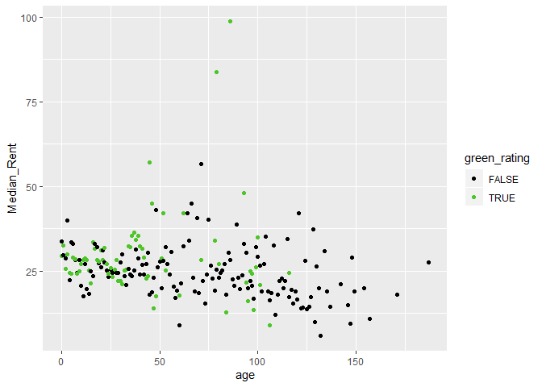

When doing this, it’s a little more coherent. Specifically when
considerring newer buildings younger than 20 years old, it appears that
median rent for green vs non-green does not differentiate much. Going
forward, we should consider younger apartments since they’re more
reflective of the apartment the company is building.

We should additionally consider how rent of green vs non-green buildings
compare within clusters. We also filter for only apartments 20 years old
or younger.

``` r
gb_cluster = group_by(filter(gb, age <= 20), cluster, green_rating)
#ggplot(data=summarize(gb_cluster, Median_Rent = median(Rent))) + geom_point(aes(cluster, Median_Rent, color=green_rating)) + scale_color_manual(values=c("black", "#4EC62A"))
gb_cluster_green = filter(summarize(gb_cluster, Rent = median(Rent)), green_rating==TRUE)
gb_cluster_nongreen = filter(summarize(gb_cluster, Rent = median(Rent)), green_rating==FALSE)
gb_cluster_merged = merge(gb_cluster_green, gb_cluster_nongreen, by="cluster", suffixes = c("_green","_nongreen"))
gb_cluster_merged$Difference = gb_cluster_merged$Rent_green-gb_cluster_merged$Rent_nongreen
print("Average within cluster difference between rent of green buildings and Median rent of non-green buildings")
```

    ## [1] "Average within cluster difference between rent of green buildings and Median rent of non-green buildings"

``` r
mean(gb_cluster_merged$Difference)
```

    ## [1] 1.024724

By filterring by age and only comparing to buildings within the same
clusters, we see that green buildings only have higher rent of 1.02 per
square foot, much smaller than the Excel Guru’s claim of 2.60.

``` r
5000000/(1.02*250000)
```

    ## [1] 19.60784

Using this valuation and assuming 100% occupancy, the investors can only
expect to recoup their extra investment in 19.6 years as opposed to the
initial claim of 7.7.

We additionally wanted to revisit the guru’s assumption of 90%-100%
occupancy. Because the anticipated payoff period is so long, small
deviations in average occupancy can affect the expected return.

Filterring on age &lt;= 20 and green buildings, we observe the
following:

``` r
filtered_gb = filter(gb, green_rating==TRUE & age <=20)
print("Proportion of 100% occupancy:")
```

    ## [1] "Proportion of 100% occupancy:"

``` r
nrow(filter(filtered_gb, leasing_rate==100))/nrow(filtered_gb)
```

    ## [1] 0.1433962

``` r
print("Looking at some quantiles")
```

    ## [1] "Looking at some quantiles"

``` r
quantile(filtered_gb$leasing_rate, .75)
```

    ##   75% 
    ## 98.52

``` r
quantile(filtered_gb$leasing_rate, .5)
```

    ##   50% 
    ## 93.47

``` r
quantile(filtered_gb$leasing_rate, .25)
```

    ##   25% 
    ## 85.59

``` r
quantile(filtered_gb$leasing_rate, .05)
```

    ##     5% 
    ## 64.228

We see that 90% occupancy is a good estimate for the expected occupancy
rate. By looking at the various quantiles, however, we should still
consider other options. Here are some observations: Only 14% of these
buildings have 100% occupancy. A little over 50% of these buildings have
90% occupancy or higher. 75% of these buildings have 85% occupancy or
higher. 95% of these buildings have 65% occupancy or higher.

It’s important to note that theres slightly less than 50% of having
occupancy less than 90%. To be ultra conservative, we can say that
there’s only a 5% chance of having occupancy of 65% or less.

We can visualize these potential payoff periods.

``` r
additionalRevenue <- data.frame(double(), double(), integer(), double())
occupancy_list = c(.65,.9,1)
for (rate in occupancy_list){
  year = 0
  while(year <= 30){
    additionalRevenue = rbind(additionalRevenue, c(1.02, rate, year, 1.02*year*250000*rate))
    year = year+1
  }
}
year = 0
while(year <= 25){
    additionalRevenue = rbind(additionalRevenue, c(2.60, .9, year, 2.60*year*250000))
    year = year+1
  }
colnames(additionalRevenue) <- c("additional_rent", "occupancy_rate", "year", "additional_revenue")
additionalRevenue$additional_rent = as.factor(additionalRevenue$additional_rent)
additionalRevenue$occupancy_rate = as.factor(additionalRevenue$occupancy_rate)

temp = filter(additionalRevenue, additional_rent==1.02)
temp$occupancy_rate = as.factor(temp$occupancy_rate)
ggplot() + 
  geom_line(data = filter(additionalRevenue, additional_rent==2.60), aes(year, additional_revenue), color="red", linetype="solid") +
  geom_line(data = temp, aes(year, additional_revenue, linetype=occupancy_rate)) +
  scale_linetype_manual(values=c("dotted","twodash", "solid")) +
  coord_cartesian(ylim=c(0,6000000)) +
  geom_hline(yintercept=5000000, linetype="solid", color = "#4EC62A") +
  ggtitle("Expected Payoff") + 
  ylab("Additional Revenue") +
  xlab("Year")
```

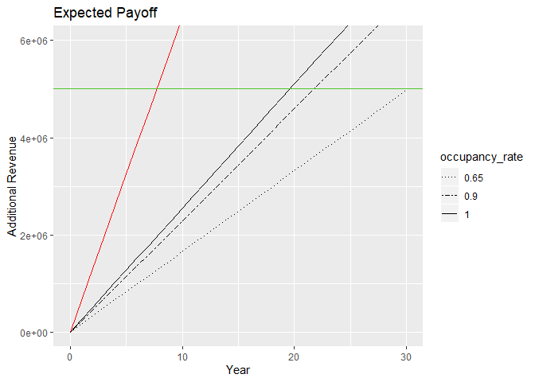

``` r
 #plot(ecdf(filter(gb, green_rating==TRUE & age <=20)$leasing_rate))
#quantile(filter(gb, green_rating==TRUE & age <=20)$leasing_rate, .25)
```

The initial estimate is displayed in red. The black lines are our
estimates. Best case scenario, the investors will only make back their
money by year 20. More realistically, they could expect to break even
between years 22 and 23. Conservatively, they can expect their money
back after 30 years.

There are other factors to consider that we weren’t able to cover in our
analysis. Given the data, it was difficult to quantify annual costs for
a building, so if a green building has less annual operating expenses
than a non-green building, the net payoff may occur earlier.
Additionally, employee happiness and productivity could be higher in
green buildings, but we don’t have a way to quantify this.

Given the current analysis, we think the Excel Guru’s estimate is too
optimistic. He anticipates payoffs in year 7 or 8, but it’s more
realistic to expect payoffs in year 22 or later. In our anlaysis, even
in best case scenario the payoff won’t occur until at least year 20. The
investors may be better off investing the additional $5M unless they can
uncover additional benefits of green buildings.

Question 2: flights at ABIA

``` r
library(ggplot2)
library(dplyr)
#setwd("~/STA380-master/STA380-master/data")
setwd("~/GitHub/STA380/data/")
abia <- read.csv("ABIA.csv")

#Creating dummy variable
abia$dummy <- 1
attach(abia)
#Converting numeric to factors 
Month <- as.factor(Month)
DayofMonth <- as.factor(DayofMonth)
DayOfWeek <- as.factor(DayOfWeek)
```

``` r
multiplot <- function(..., plotlist=NULL, file, cols=1, layout=NULL) {
  require(grid)

  # Make a list from the ... arguments and plotlist
  plots <- c(list(...), plotlist)

  numPlots = length(plots)

  # If layout is NULL, then use 'cols' to determine layout
  if (is.null(layout)) {
    # Make the panel
    # ncol: Number of columns of plots
    # nrow: Number of rows needed, calculated from # of cols
    layout <- matrix(seq(1, cols * ceiling(numPlots/cols)),
                    ncol = cols, nrow = ceiling(numPlots/cols))
  }

 if (numPlots==1) {
    print(plots[[1]])

  } else {
    # Set up the page
    grid.newpage()
    pushViewport(viewport(layout = grid.layout(nrow(layout), ncol(layout))))

    # Make each plot, in the correct location
    for (i in 1:numPlots) {
      # Get the i,j matrix positions of the regions that contain this subplot
      matchidx <- as.data.frame(which(layout == i, arr.ind = TRUE))

      print(plots[[i]], vp = viewport(layout.pos.row = matchidx$row,
                                      layout.pos.col = matchidx$col))
    }
  }
}
```

Checking out which airports are the best to fly from. In this case, US
and F9 have the lowest percentage of delayed flights with very short
delays relative to the other airlines.

``` r
#Creating subsets of the data for all flights leaving Austin as well as when they were delayed.
departABIA <- subset(abia, Origin == "AUS")
delayABIA <- subset(departABIA, DepDelay > 0)

#Sum of delayed flights by each airline
delayAirline <- aggregate(delayABIA$dummy,by=list(delayABIA$UniqueCarrier),FUN = sum, na.rm=TRUE)
names(delayAirline)[1] <- "Airline"
names(delayAirline)[2] <- "DelaysAnnually"

#Average delay time by Airline
avgDelayAir <- aggregate(delayABIA$DepDelay,by=list(delayABIA$UniqueCarrier),FUN = mean, na.rm=TRUE)
names(avgDelayAir)[1] <- "Airline"
names(avgDelayAir)[2] <- "AverageDelayTime"

#Sum of delayed flights by all airlines
totalAirline <- aggregate(departABIA$dummy,by=list(departABIA$UniqueCarrier),FUN = sum, na.rm=TRUE)
names(totalAirline)[1] <- "Airline"
names(totalAirline)[2] <- "FlightsAnnually"

#Merging the dataframes
delayPerc <- merge(totalAirline,delayAirline, by = "Airline")
delayPerc <- merge(delayPerc, avgDelayAir, by = "Airline")
delayPerc$perc <- round(delayPerc$DelaysAnnually/totalAirline$FlightsAnnually,3)*100
delayPerc$AverageDelayTime <- round(delayPerc$AverageDelayTime, 2)

#Percent of delayed flights by airline
p1 <- ggplot(delayPerc, aes(x=delayPerc$Airline, y=delayPerc$perc, fill = delayPerc$Airline)) + geom_col() + geom_text(aes(label = delayPerc$perc ), vjust = -0.5) + ylim(0,100) + xlab("") + ylab("Percent of Flight Delayed") + theme(legend.position = 'none',)

#Average delays by airline
p2 <- ggplot(delayPerc, aes(x=delayPerc$Airline, y=delayPerc$AverageDelayTime, fill = delayPerc$Airline)) + geom_col() + geom_text(aes(label = delayPerc$AverageDelayTime ), vjust = -0.5) + ylim(0,60) + xlab("Airlines") + ylab("Average Delay in Minutes") + theme(legend.position = 'none') 

multiplot(p1, p2, col = 1)
```

    ## Loading required package: grid

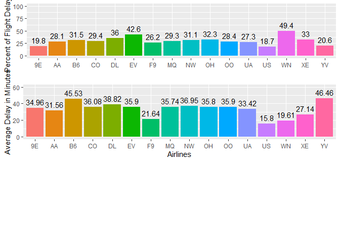

    ## [1] 1

Now looking at delays by airport,there is an outlier to be ignored. The
DSM airport has a 100% delay rate with a delay of 129 minutes. However,
this was for only 1 delay, so we can’t reliably say that it will happen
again. It would be our recommendation to arrive to the airport earlier
than normal if flying to EWR, IAD, and STL.

``` r
#Sum of delays by each destination
delayDest <- aggregate(delayABIA$dummy,by=list(delayABIA$Dest),FUN = sum, na.rm=TRUE)
names(delayDest)[1] <- "Destination"
names(delayDest)[2] <- "DelaysAnnually"

#Average delay time by destination
avgDelay <- aggregate(delayABIA$DepDelay,by=list(delayABIA$Dest),FUN = mean, na.rm=TRUE)
names(avgDelay)[1] <- "Destination"
names(avgDelay)[2] <- "AverageDelayTime"

#Sum of delays all destinations
totalDest <- aggregate(departABIA$dummy,by=list(departABIA$Dest),FUN = sum, na.rm=TRUE)
names(totalDest)[1] <- "Destination"
names(totalDest)[2] <- "FlightsAnnually"

#Delay percentage by destination
delayPercDest <- merge(totalDest,delayDest, by = "Destination")
delayPercDest <- merge(delayPercDest, avgDelay, by = "Destination")
delayPercDest$perc <-round(delayPercDest$DelaysAnnually/delayPercDest$FlightsAnnually,3)*100

#Rounding the delay time to 2 decimal places
delayPercDest$AverageDelayTime <- round(delayPercDest$AverageDelayTime,2)

#Destination percentage plot
p3 <- ggplot(delayPercDest, aes(x=delayPercDest$Destination, y=delayPercDest$perc, fill = delayPercDest$Destination)) + geom_col() + geom_text(aes(label = delayPercDest$perc), vjust = -0.5, size = 3) + ylim(0,100) + xlab("") + ylab("Percent of Flight Delayed") + theme(text = element_text(size=8),legend.position = 'none')

#Average delay by destination plot
p4 <- ggplot(delayPercDest, aes(x=delayPercDest$Destination, y=delayPercDest$AverageDelayTime, fill = delayPercDest$Destination)) + geom_col() + geom_text(aes(label = delayPercDest$AverageDelayTime), vjust = -0.5, size = 3) + ylim(0,150) + xlab("Airport") + ylab("Average Delay in Minutes") + theme(text = element_text(size=8),legend.position = 'none')


multiplot(p3, p4, cols=1)
```

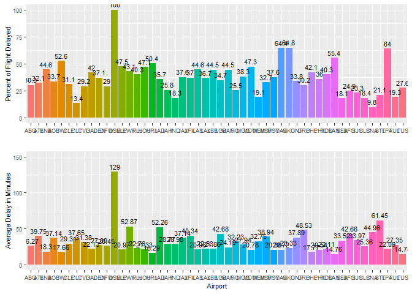

Intuitively there would be some interesting story to tell from delays by
day or month however there isn’t much to be gleaned from the plots
except that Decemeber and March have the highest average delay times.
That, and the fall months like September, October, and Novemeber are
good times to fly out of ABIA.

``` r
#Average Delays by month, day of month, and day of week.
avgDelayMonth = aggregate(delayABIA$DepDelay~factor(Month), delayABIA, mean)
names(avgDelayMonth)[1] <- "Month"
names(avgDelayMonth)[2] <- "AverageDelayTime"
avgDelayMonth$AverageDelayTime <- round(avgDelayMonth$AverageDelayTime,2)

avgDelayDoM = aggregate(delayABIA$DepDelay~factor(DayofMonth), delayABIA, mean)
names(avgDelayDoM)[1] <- "DayOfMonth"
names(avgDelayDoM)[2] <- "AverageDelayTime"
avgDelayDoM$AverageDelayTime <- round(avgDelayDoM$AverageDelayTime,2)


avgDelayDoW = aggregate(delayABIA$DepDelay~factor(DayOfWeek), delayABIA, mean)
names(avgDelayDoW)[1] <- "DayOfWeek"
names(avgDelayDoW)[2] <- "AverageDelayTime"
avgDelayDoW$AverageDelayTime <- round(avgDelayDoW$AverageDelayTime,2)


#Average delay by Month
p5 <- ggplot(avgDelayMonth, aes(x=avgDelayMonth$Month, y=avgDelayMonth$AverageDelayTime, fill = avgDelayMonth$Month)) + geom_col() + geom_text(aes(label = avgDelayMonth$AverageDelayTime), vjust = -0.5, size = 3) + ylim(0,60) + xlab("Month") + ylab("Average Delay in Minutes") + theme(text = element_text(size=8),legend.position = 'none')


#Average delay by Day of Month
p6 <- ggplot(avgDelayDoM, aes(x=avgDelayDoM$DayOfMonth, y=avgDelayDoM$AverageDelayTime, fill = avgDelayDoM$DayOfMonth)) + geom_col() + geom_text(aes(label = avgDelayDoM$AverageDelayTime), vjust = -0.5, size = 3) + ylim(0,60) + xlab("Day Of Month") + ylab("Average Delay in Minutes") + theme(text = element_text(size=8),legend.position = 'none')


#Average delay by Day of Week
p7 <- ggplot(avgDelayDoW, aes(x=avgDelayDoW$DayOfWeek, y=avgDelayDoW$AverageDelayTime, fill = avgDelayDoW$DayOfWeek)) + geom_col() + geom_text(aes(label = avgDelayDoW$AverageDelayTime), vjust = -0.5, size = 3) + ylim(0,60) + xlab("Day Of Week") + ylab("Average Delay in Minutes") + theme(text = element_text(size=8),legend.position = 'none')

multiplot(p5, p6, p7, cols=1)
```

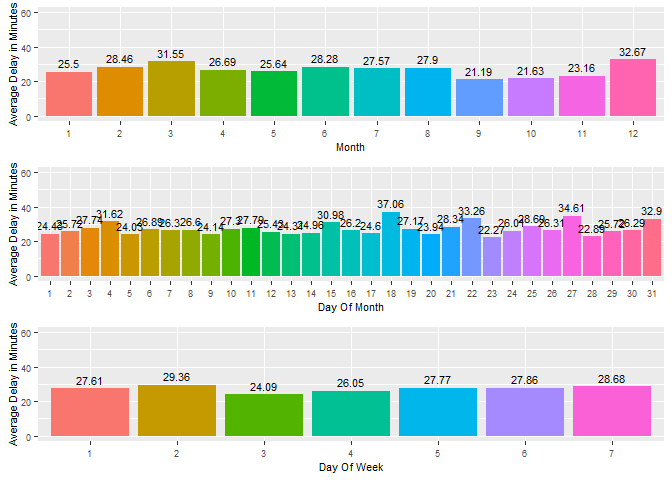

QUESTION 3: Portfolio Modeling

``` r
rm(list=ls())
library(mosaic)
```

    ## Loading required package: lattice

    ## Loading required package: ggformula

    ## Loading required package: ggstance

    ## 
    ## Attaching package: 'ggstance'

    ## The following objects are masked from 'package:ggplot2':
    ## 
    ##     geom_errorbarh, GeomErrorbarh

    ## 
    ## New to ggformula?  Try the tutorials: 
    ##  learnr::run_tutorial("introduction", package = "ggformula")
    ##  learnr::run_tutorial("refining", package = "ggformula")

    ## Loading required package: mosaicData

    ## Loading required package: Matrix

    ## Registered S3 method overwritten by 'mosaic':
    ##   method                           from   
    ##   fortify.SpatialPolygonsDataFrame ggplot2

    ## 
    ## The 'mosaic' package masks several functions from core packages in order to add 
    ## additional features.  The original behavior of these functions should not be affected by this.
    ## 
    ## Note: If you use the Matrix package, be sure to load it BEFORE loading mosaic.

    ## 
    ## Attaching package: 'mosaic'

    ## The following object is masked from 'package:Matrix':
    ## 
    ##     mean

    ## The following objects are masked from 'package:dplyr':
    ## 
    ##     count, do, tally

    ## The following object is masked from 'package:ggplot2':
    ## 
    ##     stat

    ## The following objects are masked from 'package:stats':
    ## 
    ##     binom.test, cor, cor.test, cov, fivenum, IQR, median,
    ##     prop.test, quantile, sd, t.test, var

    ## The following objects are masked from 'package:base':
    ## 
    ##     max, mean, min, prod, range, sample, sum

``` r
library(quantmod)
```

    ## Loading required package: xts

    ## Loading required package: zoo

    ## 
    ## Attaching package: 'zoo'

    ## The following objects are masked from 'package:base':
    ## 
    ##     as.Date, as.Date.numeric

    ## Registered S3 method overwritten by 'xts':
    ##   method     from
    ##   as.zoo.xts zoo

    ## 
    ## Attaching package: 'xts'

    ## The following objects are masked from 'package:dplyr':
    ## 
    ##     first, last

    ## Loading required package: TTR

    ## Registered S3 method overwritten by 'quantmod':
    ##   method            from
    ##   as.zoo.data.frame zoo

    ## Version 0.4-0 included new data defaults. See ?getSymbols.

``` r
library(foreach)
library(reshape2)
```

First, we choose our 3 portfolios.

We chose a small tech portfolio, mid-sized real estate portfolio, and a
large diverse portfolio. We expect the small tech portfolio to
outperform the others due to the technology industry having the best
overall performance in the past five years. However, this portfolio will
also have very high volatility due to the nature of technology stocks
over the past five years and the lack of diversification. The real
estate portfolio will have slightly lower volatility than the technology
one, but we suspect that the returns will not be as high. The diverse
portfolio may have the worst returns due to its investment in things
like commodity and treasury bonds which do not have high yield, however
it will perform much more consistently due to the nature of the markets
it is invested in as well as the high number of ETFs included in the
portfolio.

``` r
portfolio_tech = c("PTF","XSD","PSJ")
portfolio_re = c("VNQ","USRT","SCHH","RWR","MORT")
portfolio_diverse = c("VB", "UGA", "TLT", "XLE", "RLY", "IYF", "REET", "UUP")
```

``` r
tech_prices = getSymbols(portfolio_tech, from = "2014-08-14")
```

    ## 'getSymbols' currently uses auto.assign=TRUE by default, but will
    ## use auto.assign=FALSE in 0.5-0. You will still be able to use
    ## 'loadSymbols' to automatically load data. getOption("getSymbols.env")
    ## and getOption("getSymbols.auto.assign") will still be checked for
    ## alternate defaults.
    ## 
    ## This message is shown once per session and may be disabled by setting 
    ## options("getSymbols.warning4.0"=FALSE). See ?getSymbols for details.

``` r
re_prices = getSymbols(portfolio_re, from = "2014-08-14")
diverse_prices = getSymbols(portfolio_diverse, from = "2014-08-14")
```

    ## pausing 1 second between requests for more than 5 symbols

    ## pausing 1 second between requests for more than 5 symbols
    ## pausing 1 second between requests for more than 5 symbols
    ## pausing 1 second between requests for more than 5 symbols

``` r
for(ticker in portfolio_tech) {
    expr = paste0(ticker, "a = adjustOHLC(", ticker, ")")
    eval(parse(text=expr))
}
tech_returns = cbind(   ClCl(PTFa),
                                ClCl(XSDa),
                                ClCl(PSJa))
for(ticker in portfolio_re) {
    expr = paste0(ticker, "a = adjustOHLC(", ticker, ")")
    eval(parse(text=expr))
}
re_returns = cbind( ClCl(VNQa),
                                ClCl(USRTa),
                                ClCl(SCHHa),
                                ClCl(RWRa),
                                ClCl(MORTa))
for(ticker in portfolio_diverse) {
    expr = paste0(ticker, "a = adjustOHLC(", ticker, ")")
    eval(parse(text=expr))
}
diverse_returns = cbind(    ClCl(VBa),
                                ClCl(UGAa),
                                ClCl(TLTa),
                                ClCl(XLEa),
                                ClCl(RLYa),
                                ClCl(IYFa),
                                ClCl(REETa),
                                ClCl(UUPa))
```

``` r
tech_returns = as.matrix(na.omit(tech_returns))
re_returns = as.matrix(na.omit(re_returns))
diverse_returns = as.matrix(na.omit(diverse_returns))
```

Run 1000 20 day market simulations.

``` r
initial_wealth = 100000
num_simulations = 1000

tech_final_value = rep(0,num_simulations)
re_final_value = rep(0,num_simulations)
diverse_final_value = rep(0,num_simulations)
for(i in 1:num_simulations) {
#   total_wealth = initial_wealth
    tech_wealth = initial_wealth
    re_wealth = initial_wealth
    diverse_wealth = initial_wealth
    tech_weights = c(1/3,1/3,1/3)
    re_weights = c(0.2, 0.2, 0.2, 0.2, 0.2)
    diverse_weights = c(1/8,1/8,1/8,1/8,1/8,1/8,1/8,1/8)
    tech_holdings = tech_weights * tech_wealth
    re_holdings = re_weights * re_wealth
    diverse_holdings = diverse_weights * diverse_wealth

    n_days = 20
    tech_wealthtracker = rep(0, n_days)
    re_wealthtracker = rep(0, n_days)
    diverse_wealthtracker = rep(0, n_days)
    for(today in 1:n_days) {
        day = sample(c(1:nrow(tech_returns)), 1)
#     return.today = resample(all_returns, 1, orig.ids=FALSE)
#       holdings = holdings + holdings*return.today
        tech_holdings = tech_holdings + tech_holdings*tech_returns[day,]
        re_holdings = re_holdings + re_holdings*re_returns[day,]
        diverse_holdings = diverse_holdings + diverse_holdings*diverse_returns[day,]
        tech_total_wealth = sum(tech_holdings)
        re_total_wealth = sum(re_holdings)
        diverse_total_wealth = sum(diverse_holdings)
        tech_wealthtracker[today] = tech_total_wealth
        re_wealthtracker[today] = re_total_wealth
        diverse_wealthtracker[today] = diverse_total_wealth
    }
    tech_final_value[i]=tech_wealthtracker[n_days]
    re_final_value[i]=re_wealthtracker[n_days]
    diverse_final_value[i]=diverse_wealthtracker[n_days]
}
```

``` r
finalValues = data.frame(sim = 1:num_simulations, tech = tech_final_value, real_estate = re_final_value, diverse = diverse_final_value)
ggplot(finalValues) + 
  geom_histogram(aes(x=tech, fill="Technology"), alpha=.2) +
  geom_histogram(aes(x=real_estate, fill="Real Estate"), alpha=.2) +
  geom_histogram(aes(x=diverse, fill="Diverse"), alpha=.2) +
  xlab("Final Returns") +
  ylab("Count") + 
  ggtitle("Histogram of Final Return")
```

    ## `stat_bin()` using `bins = 30`. Pick better value with `binwidth`.
    ## `stat_bin()` using `bins = 30`. Pick better value with `binwidth`.
    ## `stat_bin()` using `bins = 30`. Pick better value with `binwidth`.

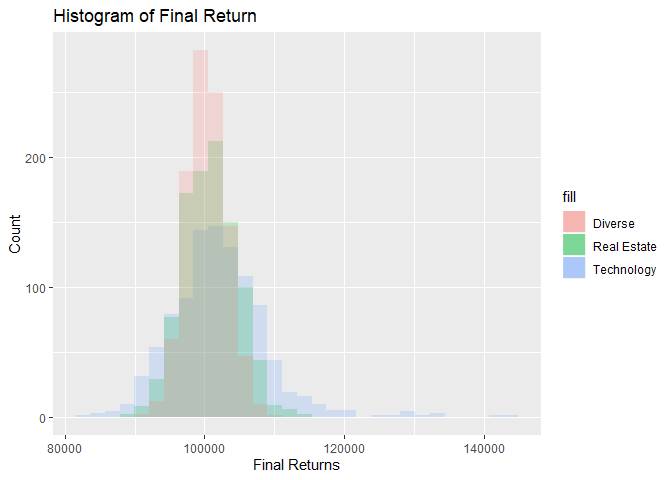

As you can see from the graph above, our hypothesis was fairly
consistent with the results. The Diverse portfolio was very consistent
in getting a value at or around 100000 due to the number of ETFs and the
diversity of types in them. The Real Estate portfolio performed more
sporadically and was distributed over a longer range. The Technology
portfolio was very volatile as it was composed entirely of ETFs in one
of the most volatile sectors, tech. The lack of ETFs made it have an
extremely large range of ending values, with a few ending up between
140,000 and 160,000. The Technology portfolio definitely performed the
best, with the majority of their returns being positive. It also had the
largest chance to lose money, so that is one thing to consider.

``` r
finalValues_melted=melt(finalValues, id.vars = "sim")
#finalValues_melted
ggplot(finalValues_melted) + geom_boxplot(aes(x=variable, y=value)) + ylab("Final Return") + xlab("") + ggtitle("Boxplot for Final Returns")
```

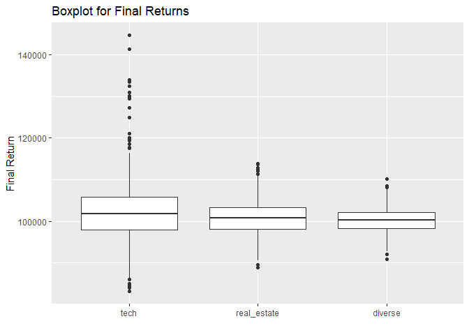

The points from the previous statement are shown better in this boxplot,
where you can see how the plot for tech is very large with numerous
positive outliers and the diverse is very condensed. Realistically the
tech portfolio is better in almost every situation, unless you want that
really consistent but very small increase in value. This trend does not
tell the future, however, and is very skewed by the increase in market
cap of the technology sector in the past five years.

``` r
print("Technology")
```

    ## [1] "Technology"

``` r
quantile(finalValues$tech)
```

    ##        0%       25%       50%       75%      100% 
    ##  83248.89  97901.43 101809.44 105777.55 144638.53

``` r
print("Real Estate")
```

    ## [1] "Real Estate"

``` r
quantile(finalValues$real_estate)
```

    ##        0%       25%       50%       75%      100% 
    ##  88908.93  98106.47 100796.56 103382.26 113783.48

``` r
print("Diverse")
```

    ## [1] "Diverse"

``` r
quantile(finalValues$diverse)
```

    ##        0%       25%       50%       75%      100% 
    ##  90846.34  98321.16 100228.95 102173.94 110112.42

Again the same points are reiterated with the quantiles, showing that in
the majority of cases tech will prevail, however the diverse option
prevents you from the poor times when tech lost over 17%. In a little
less than 3/4 of the cases, tech will be the most profitable, going up
significantly with a 5.8% profit margin in a quarter of the cases
compared to the 2.9% and 1.9% of Real Estate and Diverse, respectively.

Question 4: Market Segmentation

``` r
library(LICORS)
library(ggplot2)
library(foreach)
library(mosaic)
library(purrr)
```

    ## 
    ## Attaching package: 'purrr'

    ## The following objects are masked from 'package:foreach':
    ## 
    ##     accumulate, when

    ## The following object is masked from 'package:mosaic':
    ## 
    ##     cross

``` r
library(factoextra)
```

    ## Welcome! Related Books: `Practical Guide To Cluster Analysis in R` at https://goo.gl/13EFCZ

``` r
library(cluster)
#setwd("~/STA380-master/STA380-master/data")
setwd("~/GitHub/STA380/data/")
twitter = read.csv("social_marketing.csv")

#Trimming columns that won't be used: chatter, uncategorized, spam, and adult.
h20 <- twitter[-c(1,5,35,36)]
h20[1] <- NULL
h20[3] <- NULL
h20[31]<- NULL

#Scaling the data
h20 = scale(h20, center=TRUE, scale=TRUE)
```

Running the WSS

``` r
#Computing kmeans
set.seed(77)
# Compute and plot wss for k = 1 to k = 20.
k.values <- 1:20
wss <- function(k) {kmeans(h20, k, nstart = 20 )$tot.withinss}
wss_values <- map_dbl(k.values, wss)  
```

    ## Warning: did not converge in 10 iterations

    ## Warning: did not converge in 10 iterations

    ## Warning: did not converge in 10 iterations

Plotting the different k-vlaues and their Total WSS

``` r
plot(k.values, wss_values,
     pch = 12, frame = TRUE, 
     xlab="Number of Clusters K",
     ylab="Total Within-Clusters Sum of Squares")
```

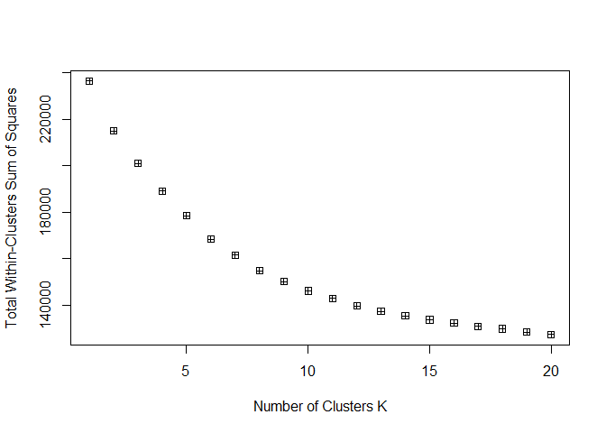

Plotting the clusters

``` r
k10 <- kmeans(h20, centers = 10, nstart = 30)
fviz_cluster(k10, data = h20)
```

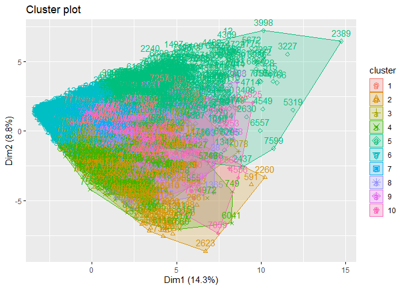

Deciphering the 10 Market Segments

``` r
# Extract the centers and scales from the rescaled data (which are named attributes)
mu = attr(h20,"scaled:center")
sigma = attr(h20,"scaled:scale")
```

Looking at each of top categories of each cluster, you can see
identifiers for news, college universities, cooking, health nutrition,
shopping. So it would be recommended to advertise to demographics
interested in those categories. In the future, it would be useful to
apply PCA in order to be able to specify the categories and demographics
better.

``` r
#Understanding how each cluster is defined
allClust <- rbind(k10$center[1,]*sigma + mu,
                  k10$center[2,]*sigma + mu,
                  k10$center[3,]*sigma + mu,
                  k10$center[4,]*sigma + mu,
                  k10$center[5,]*sigma + mu,
                  k10$center[6,]*sigma + mu,
                  k10$center[7,]*sigma + mu,
                  k10$center[8,]*sigma + mu,
                  k10$center[9,]*sigma + mu,
                  k10$center[10,]*sigma + mu)
allClust <- data.frame(allClust)

#Taking the top 5 characterstics of each cluster
values <- data.frame(t(allClust))
names(values)
```

    ##  [1] "X1"  "X2"  "X3"  "X4"  "X5"  "X6"  "X7"  "X8"  "X9"  "X10"

``` r
clust1 <- values[order(values$X1 ,decreasing=T)[1:5],]
clust2 <- values[order(values$X2 ,decreasing=T)[1:5],]
clust3 <- values[order(values$X3 ,decreasing=T)[1:5],]
clust4 <- values[order(values$X4 ,decreasing=T)[1:5],]
clust5 <- values[order(values$X5 ,decreasing=T)[1:5],]
clust6 <- values[order(values$X6 ,decreasing=T)[1:5],]
clust7 <- values[order(values$X7 ,decreasing=T)[1:5],]
clust8 <- values[order(values$X8 ,decreasing=T)[1:5],]
clust9 <- values[order(values$X9 ,decreasing=T)[1:5],]
clust10 <- values[order(values$X10 ,decreasing=T)[1:5],]

#Top categories of each cluster
par(mfrow=c(2,2))
barplot(clust1$X1, main="Cluster 1", xlab="Top Categories", ylab="Frequency", names.arg=row.names(clust1))
barplot(clust2$X2, main="Cluster 2", xlab="Top Categories", ylab="Frequency", names.arg=row.names(clust2))
barplot(clust3$X3, main="Cluster 3", xlab="Top Categories", ylab="Frequency", names.arg=row.names(clust3))
barplot(clust4$X4, main="Cluster 4", xlab="Top Categories", ylab="Frequency", names.arg=row.names(clust4))
```


``` r
barplot(clust5$X5, main="Cluster 5", xlab="Top Categories", ylab="Frequency", names.arg=row.names(clust5))
barplot(clust6$X6, main="Cluster 6", xlab="Top Categories", ylab="Frequency", names.arg=row.names(clust6))
barplot(clust7$X7, main="Cluster 7", xlab="Top Categories", ylab="Frequency", names.arg=row.names(clust7))
barplot(clust8$X8, main="Cluster 8", xlab="Top Categories", ylab="Frequency", names.arg=row.names(clust8))
```

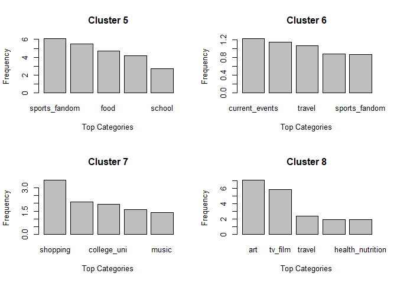

``` r
barplot(clust9$X9, main="Cluster 9", xlab="Top Categories", ylab="Frequency", names.arg=row.names(clust9))
barplot(clust10$X10, main="Cluster 10", xlab="Top Categories", ylab="Frequency", names.arg=row.names(clust10))
```

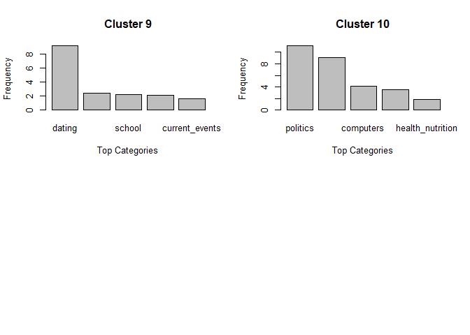

Question 5: Author Attribution

``` r
library(tm) 
```

    ## Loading required package: NLP

    ## 
    ## Attaching package: 'NLP'

    ## The following object is masked from 'package:ggplot2':
    ## 
    ##     annotate

    ## 
    ## Attaching package: 'tm'

    ## The following object is masked from 'package:mosaic':
    ## 
    ##     inspect

``` r
library(magrittr)
```

    ## 
    ## Attaching package: 'magrittr'

    ## The following object is masked from 'package:purrr':
    ## 
    ##     set_names

``` r
library(slam)
library(proxy)
```

    ## 
    ## Attaching package: 'proxy'

    ## The following object is masked from 'package:Matrix':
    ## 
    ##     as.matrix

    ## The following objects are masked from 'package:stats':
    ## 
    ##     as.dist, dist

    ## The following object is masked from 'package:base':
    ## 
    ##     as.matrix

``` r
#Setting Up the Training Data
#Make sure wording directory is correct
readerPlain = function(fname){
  readPlain(elem=list(content=readLines(fname)), 
            id=fname, language='en') }
#setwd("~/STA380-master/STA380-master/data/ReutersC50/C50train")
setwd("~/GitHub/STA380/data/ReutersC50/C50train")
doc_list = Sys.glob('*')
file_list = Sys.glob(paste0(doc_list, '/*.txt'))

temp = lapply(file_list, readerPlain) 
mynames = file_list %>%
{ strsplit(., '/', fixed=TRUE) } %>%
{ lapply(., tail, n=2) } %>%
{ lapply(., paste0, collapse = '') } %>%
  unlist
names(temp) = mynames
#Conversion to Corpus and setting names to authors
documents_raw = VCorpus(VectorSource(temp))
my_documents = documents_raw
names(my_documents) = names(temp)
#Preprocessing to remove certain features, such as number, space, etc...
my_documents = tm_map(my_documents, content_transformer(tolower))  #Lower Case
my_documents = tm_map(my_documents, content_transformer(removeNumbers)) #Removes numbers
my_documents = tm_map(my_documents, content_transformer(removePunctuation)) #removes puntuation
my_documents = tm_map(my_documents, content_transformer(stripWhitespace)) #Removes whitespace
my_documents = tm_map(my_documents, content_transformer(removeWords), stopwords("en")) #Removes Stop Words
#Setting up train dtm
DTM_train = DocumentTermMatrix(my_documents)
#chose to do 90% sparsity to decrease terms
DTM_train = removeSparseTerms(DTM_train, 0.9)
#TFIDF for train
tfidf = weightTfIdf(DTM_train)
```

``` r
#Setting Up Test Set
#Make sure to set directory to test set
readerPlain = function(fname){
  readPlain(elem=list(content=readLines(fname)), 
            id=fname, language='en') }
setwd("~/GitHub/STA380/data/ReutersC50/C50test")
doc_list2 = Sys.glob('*')
file_list = Sys.glob(paste0(doc_list2, '/*.txt'))


temp2 = lapply(file_list, readerPlain) 

mynames = file_list %>%
{ strsplit(., '/', fixed=TRUE) } %>%
{ lapply(., tail, n=2) } %>%
{ lapply(., paste0, collapse = '') } %>%
  unlist
names(temp2) = mynames
#Conversion to Corpus and setting names to authors
documents_raw_1 = VCorpus(VectorSource(temp2))
#Preprocessing similar to train set
my_documents1 = documents_raw_1
my_documents1 = tm_map(my_documents1, content_transformer(tolower)) 
my_documents1 = tm_map(my_documents1, content_transformer(removeNumbers))
my_documents1 = tm_map(my_documents1, content_transformer(removePunctuation)) 
my_documents1 = tm_map(my_documents1, content_transformer(stripWhitespace))
my_documents = tm_map(my_documents, content_transformer(removeWords), stopwords("en"))
#Setting up test DTM
DTM_test = DocumentTermMatrix(my_documents1,control = list(dictionary=Terms(DTM_train)))
DTM_test = removeSparseTerms(DTM_test, 0.90)
#TFIDF for test
tfidf_test = weightTfIdf(DTM_test)
```

``` r
x_train = as.matrix(DTM_train)
x_test = as.matrix(DTM_test)
#Isolates words in training and test set
X_words= colnames(x_train)
X_test_words = colnames(x_test)
# Here empty vectors are created to track dropped and added words from the test set
added = vector(length=0)
dropped = vector(length=0)

# Here you drop the test words not in train
for (word in X_test_words) {
  if (!word %in% X_words) {
    dropped = c(dropped, word)
  }
}

# Here you add the train words not in test
for (word in X_words) {
  if (!word %in% X_test_words) {
    added = c(added, word)
  }
}

# Dummy matrix of 0's is inserted into the test matrix
dummy = matrix(0, nrow = nrow(DTM_train), ncol=length(added))
colnames(dummy) = added
X_test_actual = cbind(x_test, dummy)

# Sort so that column order mathces training set, and drop words 
X_test_actual = X_test_actual[,order(colnames(X_test_actual))]
X_test_actual = X_test_actual[,!colnames(X_test_actual) %in% dropped]
```

``` r
counter = 1
#Here Doct_list has our authors
for (author in doc_list){
  dummy[counter] = author
  counter = counter+1
}
#Here we are creating a list of the authors for the train set of same size as the test sets
author_names = vector()
for( i in 1:2500){
  author_names[i] = dummy[ceiling(i/50)]
}

counter = 1
for (author in doc_list2){
  dummy[counter] = author
  counter = counter+1
}
#Here we are creating a list of authors for the test set of same size as the test sets
author_test = vector()
for( i in 1:2500){
  author_test[i] = dummy[ceiling(i/50)]
}
```

``` r
# Run multinomial regression
multi = glmnet(x=train_X, y=train_y, alpha=0, family="multinomial")

# Predict
predict = predict(multi, newx=new_test_x, type="class", s=0)
#Accuracy
(sum(predict==author_test, na.rm=T) + sum(is.na(predict) & is.na(author_test))) / length(predict)
```

    ## [1] 0.496

``` r
#For PCA multi. regression we got an accuracy of 49.6%
```

``` r
#Naive Bayes Model

# Calculate the smoothing factor and set up to get smoothing for each word for each author
smooth = 1/nrow(x_train)
by_word = rowsum(x_train + smooth, author_names)
total_wc = rowSums(by_word)

# Get multinomial probability vector and multiply to orginal test vector
int = log(by_word / total_wc)
X2 = t(int)
log_prob = X_test_actual %*% X2

# Prediction is max value outputted
pred = colnames(log_prob)[max.col(log_prob)]

#Here we check the accuracy, and we see that naive bayes is correct in predicting the correct author 52% of the time.
(sum(pred==author_test, na.rm=T) + sum(is.na(pred) & is.na(author_test))) / length(pred)
```

    ## [1] 0.5244

For our models here, we acheieved about 50% accuracy in classification.
This could perhaps be improved by increasing the amount of data given,
so that we have a better count of unique words associated to specific
authors. OUt of the two models, Naive Bayes provided the better accuracy
and was also computationally less intensive. However, it may not be the
best model out of all of the possible model choices as the key
assumption of independence of the X’s is not true here.

QUESTION 6:Association rule mining

Just studying the dataset here we can see that the common items you
would buy from the grocery store appear more frequently than others.

``` r
library(tidyverse)
```

    ## -- Attaching packages ----------------------------------------------------------------------------------------------------------------------------------------------- tidyverse 1.2.1 --

    ## v tibble  2.1.3     v readr   1.3.1
    ## v tidyr   0.8.3     v stringr 1.4.0
    ## v tibble  2.1.3     v forcats 0.4.0

    ## -- Conflicts -------------------------------------------------------------------------------------------------------------------------------------------------- tidyverse_conflicts() --
    ## x purrr::accumulate()        masks foreach::accumulate()
    ## x NLP::annotate()            masks ggplot2::annotate()
    ## x mosaic::count()            masks dplyr::count()
    ## x purrr::cross()             masks mosaic::cross()
    ## x mosaic::do()               masks dplyr::do()
    ## x tidyr::expand()            masks Matrix::expand()
    ## x tidyr::extract()           masks magrittr::extract()
    ## x dplyr::filter()            masks stats::filter()
    ## x xts::first()               masks dplyr::first()
    ## x ggstance::geom_errorbarh() masks ggplot2::geom_errorbarh()
    ## x dplyr::lag()               masks stats::lag()
    ## x xts::last()                masks dplyr::last()
    ## x magrittr::set_names()      masks purrr::set_names()
    ## x mosaic::stat()             masks ggplot2::stat()
    ## x mosaic::tally()            masks dplyr::tally()
    ## x purrr::when()              masks foreach::when()

``` r
library(arules)  # has a big ecosystem of packages built around it
```

    ## 
    ## Attaching package: 'arules'

    ## The following object is masked from 'package:tm':
    ## 
    ##     inspect

    ## The following objects are masked from 'package:mosaic':
    ## 
    ##     inspect, lhs, rhs

    ## The following object is masked from 'package:dplyr':
    ## 
    ##     recode

    ## The following objects are masked from 'package:base':
    ## 
    ##     abbreviate, write

``` r
library(arulesViz)
```

    ## Registered S3 methods overwritten by 'registry':
    ##   method               from 
    ##   print.registry_field proxy
    ##   print.registry_entry proxy

    ## Registered S3 method overwritten by 'seriation':
    ##   method         from 
    ##   reorder.hclust gclus

``` r
library(grid)

#groceries = read.transactions("C:\\Users\\chris\\Desktop\\UT MSBA\\Summer 2019\\Predictive Models\\Part #2\\STA380-master\\STA380-master\\data\\groceries.txt",
#                              sep=',')

setwd("~/GitHub/STA380/data/")
groceries = read.transactions("groceries.txt",sep=',')


inspect(groceries[1:10])
```

    ##      items                     
    ## [1]  {citrus fruit,            
    ##       margarine,               
    ##       ready soups,             
    ##       semi-finished bread}     
    ## [2]  {coffee,                  
    ##       tropical fruit,          
    ##       yogurt}                  
    ## [3]  {whole milk}              
    ## [4]  {cream cheese,            
    ##       meat spreads,            
    ##       pip fruit,               
    ##       yogurt}                  
    ## [5]  {condensed milk,          
    ##       long life bakery product,
    ##       other vegetables,        
    ##       whole milk}              
    ## [6]  {abrasive cleaner,        
    ##       butter,                  
    ##       rice,                    
    ##       whole milk,              
    ##       yogurt}                  
    ## [7]  {rolls/buns}              
    ## [8]  {bottled beer,            
    ##       liquor (appetizer),      
    ##       other vegetables,        
    ##       rolls/buns,              
    ##       UHT-milk}                
    ## [9]  {pot plants}              
    ## [10] {cereals,                 
    ##       whole milk}

``` r
itemFrequencyPlot(groceries, topN = 20)
```


Here we run the apriori algorithm on different subsets characterized by
different confidence and support levels. We decided to try ones with
high support and low confidence, low support and high confidence, and
one where both were high. The third subset with high confidence and low
support ended up having the most interesting rules, due to the high
lifts created from that subset.

``` r
groceryrules = apriori(groceries, parameter = list(support =0.001, confidence = 0.1, minlen = 2))
```

    ## Apriori
    ## 
    ## Parameter specification:
    ##  confidence minval smax arem  aval originalSupport maxtime support minlen
    ##         0.1    0.1    1 none FALSE            TRUE       5   0.001      2
    ##  maxlen target   ext
    ##      10  rules FALSE
    ## 
    ## Algorithmic control:
    ##  filter tree heap memopt load sort verbose
    ##     0.1 TRUE TRUE  FALSE TRUE    2    TRUE
    ## 
    ## Absolute minimum support count: 9 
    ## 
    ## set item appearances ...[0 item(s)] done [0.00s].
    ## set transactions ...[169 item(s), 9835 transaction(s)] done [0.01s].
    ## sorting and recoding items ... [157 item(s)] done [0.00s].
    ## creating transaction tree ... done [0.01s].
    ## checking subsets of size 1 2 3 4 5 6 done [0.04s].
    ## writing ... [32783 rule(s)] done [0.01s].
    ## creating S4 object  ... done [0.03s].

``` r
summary(groceryrules)
```

    ## set of 32783 rules
    ## 
    ## rule length distribution (lhs + rhs):sizes
    ##     2     3     4     5     6 
    ##  2121 16468 12254  1880    60 
    ## 
    ##    Min. 1st Qu.  Median    Mean 3rd Qu.    Max. 
    ##   2.000   3.000   3.000   3.429   4.000   6.000 
    ## 
    ## summary of quality measures:
    ##     support           confidence          lift             count       
    ##  Min.   :0.001017   Min.   :0.1000   Min.   : 0.4193   Min.   : 10.00  
    ##  1st Qu.:0.001118   1st Qu.:0.1692   1st Qu.: 1.9568   1st Qu.: 11.00  
    ##  Median :0.001423   Median :0.2609   Median : 2.5778   Median : 14.00  
    ##  Mean   :0.002032   Mean   :0.3118   Mean   : 2.8382   Mean   : 19.98  
    ##  3rd Qu.:0.002034   3rd Qu.:0.4167   3rd Qu.: 3.3984   3rd Qu.: 20.00  
    ##  Max.   :0.074835   Max.   :1.0000   Max.   :35.7158   Max.   :736.00  
    ## 
    ## mining info:
    ##       data ntransactions support confidence
    ##  groceries          9835   0.001        0.1

``` r
sub1 = subset(groceryrules, subset=confidence > 0.25 & support > 0.01)
inspect(sort(sub1, by="lift")[1:20])
```

    ##      lhs                     rhs                   support confidence     lift count
    ## [1]  {citrus fruit,                                                                 
    ##       other vegetables}   => {root vegetables}  0.01037112  0.3591549 3.295045   102
    ## [2]  {other vegetables,                                                             
    ##       tropical fruit}     => {root vegetables}  0.01230300  0.3427762 3.144780   121
    ## [3]  {beef}               => {root vegetables}  0.01738688  0.3313953 3.040367   171
    ## [4]  {citrus fruit,                                                                 
    ##       root vegetables}    => {other vegetables} 0.01037112  0.5862069 3.029608   102
    ## [5]  {root vegetables,                                                              
    ##       tropical fruit}     => {other vegetables} 0.01230300  0.5845411 3.020999   121
    ## [6]  {other vegetables,                                                             
    ##       whole milk}         => {root vegetables}  0.02318251  0.3097826 2.842082   228
    ## [7]  {curd,                                                                         
    ##       whole milk}         => {yogurt}           0.01006609  0.3852140 2.761356    99
    ## [8]  {other vegetables,                                                             
    ##       yogurt}             => {root vegetables}  0.01291307  0.2974239 2.728698   127
    ## [9]  {other vegetables,                                                             
    ##       yogurt}             => {tropical fruit}   0.01230300  0.2833724 2.700550   121
    ## [10] {other vegetables,                                                             
    ##       rolls/buns}         => {root vegetables}  0.01220132  0.2863962 2.627525   120
    ## [11] {tropical fruit,                                                               
    ##       whole milk}         => {root vegetables}  0.01199797  0.2836538 2.602365   118
    ## [12] {rolls/buns,                                                                   
    ##       root vegetables}    => {other vegetables} 0.01220132  0.5020921 2.594890   120
    ## [13] {root vegetables,                                                              
    ##       yogurt}             => {other vegetables} 0.01291307  0.5000000 2.584078   127
    ## [14] {whole milk,                                                                   
    ##       yogurt}             => {tropical fruit}   0.01514997  0.2704174 2.577089   149
    ## [15] {pip fruit}          => {tropical fruit}   0.02043721  0.2701613 2.574648   201
    ## [16] {tropical fruit,                                                               
    ##       whole milk}         => {yogurt}           0.01514997  0.3581731 2.567516   149
    ## [17] {whipped/sour cream,                                                           
    ##       yogurt}             => {other vegetables} 0.01016777  0.4901961 2.533410   100
    ## [18] {other vegetables,                                                             
    ##       whipped/sour cream} => {yogurt}           0.01016777  0.3521127 2.524073   100
    ## [19] {other vegetables,                                                             
    ##       root vegetables}    => {tropical fruit}   0.01230300  0.2596567 2.474538   121
    ## [20] {other vegetables,                                                             
    ##       tropical fruit}     => {yogurt}           0.01230300  0.3427762 2.457146   121

``` r
sub2 = subset(groceryrules, subset=confidence > 0.25 & support > 0.005)
inspect(sort(sub2, by="lift")[1:20])
```

    ##      lhs                        rhs                      support confidence     lift count
    ## [1]  {citrus fruit,                                                                       
    ##       other vegetables,                                                                   
    ##       whole milk}            => {root vegetables}    0.005795628  0.4453125 4.085493    57
    ## [2]  {butter,                                                                             
    ##       other vegetables}      => {whipped/sour cream} 0.005795628  0.2893401 4.036397    57
    ## [3]  {herbs}                 => {root vegetables}    0.007015760  0.4312500 3.956477    69
    ## [4]  {citrus fruit,                                                                       
    ##       pip fruit}             => {tropical fruit}     0.005592272  0.4044118 3.854060    55
    ## [5]  {berries}               => {whipped/sour cream} 0.009049314  0.2721713 3.796886    89
    ## [6]  {other vegetables,                                                                   
    ##       tropical fruit,                                                                     
    ##       whole milk}            => {root vegetables}    0.007015760  0.4107143 3.768074    69
    ## [7]  {root vegetables,                                                                    
    ##       whole milk,                                                                         
    ##       yogurt}                => {tropical fruit}     0.005693950  0.3916084 3.732043    56
    ## [8]  {other vegetables,                                                                   
    ##       pip fruit,                                                                          
    ##       whole milk}            => {root vegetables}    0.005490595  0.4060150 3.724961    54
    ## [9]  {citrus fruit,                                                                       
    ##       tropical fruit}        => {pip fruit}          0.005592272  0.2806122 3.709437    55
    ## [10] {curd,                                                                               
    ##       tropical fruit}        => {yogurt}             0.005287239  0.5148515 3.690645    52
    ## [11] {beef,                                                                               
    ##       other vegetables}      => {root vegetables}    0.007930859  0.4020619 3.688692    78
    ## [12] {onions,                                                                             
    ##       other vegetables}      => {root vegetables}    0.005693950  0.4000000 3.669776    56
    ## [13] {other vegetables,                                                                   
    ##       whole milk,                                                                         
    ##       yogurt}                => {whipped/sour cream} 0.005592272  0.2511416 3.503514    55
    ## [14] {other vegetables,                                                                   
    ##       tropical fruit}        => {pip fruit}          0.009456024  0.2634561 3.482649    93
    ## [15] {fruit/vegetable juice,                                                              
    ##       other vegetables,                                                                   
    ##       whole milk}            => {yogurt}             0.005083884  0.4854369 3.479790    50
    ## [16] {beef,                                                                               
    ##       whole milk}            => {root vegetables}    0.008032537  0.3779904 3.467851    79
    ## [17] {other vegetables,                                                                   
    ##       pip fruit}             => {tropical fruit}     0.009456024  0.3618677 3.448613    93
    ## [18] {tropical fruit,                                                                     
    ##       whole milk,                                                                         
    ##       yogurt}                => {root vegetables}    0.005693950  0.3758389 3.448112    56
    ## [19] {root vegetables,                                                                    
    ##       tropical fruit,                                                                     
    ##       whole milk}            => {yogurt}             0.005693950  0.4745763 3.401937    56
    ## [20] {pip fruit,                                                                          
    ##       yogurt}                => {tropical fruit}     0.006405694  0.3559322 3.392048    63

``` r
sub3 = subset(groceryrules, subset=confidence > 0.40 & support > 0.001)
inspect(sort(sub3, by="lift")[1:20])
```

    ##      lhs                        rhs                  support confidence     lift count
    ## [1]  {bottled beer,                                                                   
    ##       liquor}                => {red/blush wine} 0.001931876  0.4130435 21.49356    19
    ## [2]  {Instant food products,                                                          
    ##       soda}                  => {hamburger meat} 0.001220132  0.6315789 18.99565    12
    ## [3]  {processed cheese,                                                               
    ##       white bread}           => {ham}            0.001931876  0.4634146 17.80345    19
    ## [4]  {popcorn,                                                                        
    ##       soda}                  => {salty snack}    0.001220132  0.6315789 16.69779    12
    ## [5]  {baking powder,                                                                  
    ##       flour}                 => {sugar}          0.001016777  0.5555556 16.40807    10
    ## [6]  {ham,                                                                            
    ##       processed cheese}      => {white bread}    0.001931876  0.6333333 15.04549    19
    ## [7]  {Instant food products,                                                          
    ##       whole milk}            => {hamburger meat} 0.001525165  0.5000000 15.03823    15
    ## [8]  {curd,                                                                           
    ##       other vegetables,                                                               
    ##       whipped/sour cream,                                                             
    ##       yogurt}                => {cream cheese}   0.001016777  0.5882353 14.83409    10
    ## [9]  {Instant food products,                                                          
    ##       rolls/buns}            => {hamburger meat} 0.001016777  0.4347826 13.07672    10
    ## [10] {flour,                                                                          
    ##       margarine}             => {sugar}          0.001626843  0.4324324 12.77169    16
    ## [11] {domestic eggs,                                                                  
    ##       processed cheese}      => {white bread}    0.001118454  0.5238095 12.44364    11
    ## [12] {other vegetables,                                                               
    ##       tropical fruit,                                                                 
    ##       white bread,                                                                    
    ##       yogurt}                => {butter}         0.001016777  0.6666667 12.03058    10
    ## [13] {hamburger meat,                                                                 
    ##       whipped/sour cream,                                                             
    ##       yogurt}                => {butter}         0.001016777  0.6250000 11.27867    10
    ## [14] {domestic eggs,                                                                  
    ##       other vegetables,                                                               
    ##       tropical fruit,                                                                 
    ##       whole milk,                                                                     
    ##       yogurt}                => {butter}         0.001016777  0.6250000 11.27867    10
    ## [15] {liquor,                                                                         
    ##       red/blush wine}        => {bottled beer}   0.001931876  0.9047619 11.23527    19
    ## [16] {cream cheese,                                                                   
    ##       other vegetables,                                                               
    ##       whipped/sour cream,                                                             
    ##       yogurt}                => {curd}           0.001016777  0.5882353 11.04064    10
    ## [17] {hard cheese,                                                                    
    ##       whipped/sour cream,                                                             
    ##       yogurt}                => {butter}         0.001016777  0.5882353 10.61522    10
    ## [18] {curd,                                                                           
    ##       other vegetables,                                                               
    ##       root vegetables,                                                                
    ##       yogurt}                => {cream cheese}   0.001016777  0.4166667 10.50748    10
    ## [19] {other vegetables,                                                               
    ##       rolls/buns,                                                                     
    ##       root vegetables,                                                                
    ##       tropical fruit,                                                                 
    ##       whole milk}            => {beef}           0.001118454  0.5500000 10.48304    11
    ## [20] {pip fruit,                                                                      
    ##       processed cheese}      => {white bread}    0.001016777  0.4347826 10.32871    10

From looking at the subsets we picked out three items that seemed to
have some interesting combinations. Beef ended up being a somewhat
boring one since it is such a common item. Beer was interesting due to
its high confidence to be bought with other alcohol items. The three
highest lift rules all have to do with buying combinations of liquor,
wine, and beer. This came as somewhat of a surprise to me because
usually if I go to the grocery store I’ll get one or the other. Berries
has some interesting rules with whipped cream, which makes sense because
they are a common combo.

``` r
beefrules = subset(groceryrules, items %in% "beef")
inspect(sort(beefrules, by="lift")[1:10])
```

    ##      lhs                     rhs                      support confidence      lift count
    ## [1]  {other vegetables,                                                                 
    ##       rolls/buns,                                                                       
    ##       root vegetables,                                                                  
    ##       tropical fruit,                                                                   
    ##       whole milk}         => {beef}               0.001118454  0.5500000 10.483043    11
    ## [2]  {butter,                                                                           
    ##       rolls/buns,                                                                       
    ##       root vegetables,                                                                  
    ##       whole milk}         => {beef}               0.001118454  0.4782609  9.115689    11
    ## [3]  {butter,                                                                           
    ##       root vegetables,                                                                  
    ##       sausage}            => {beef}               0.001016777  0.4545455  8.663672    10
    ## [4]  {beef,                                                                             
    ##       citrus fruit,                                                                     
    ##       other vegetables,                                                                 
    ##       tropical fruit}     => {root vegetables}    0.001016777  0.8333333  7.645367    10
    ## [5]  {butter,                                                                           
    ##       root vegetables,                                                                  
    ##       yogurt}             => {beef}               0.001525165  0.3947368  7.523715    15
    ## [6]  {beef,                                                                             
    ##       tropical fruit}     => {pickled vegetables} 0.001016777  0.1333333  7.450758    10
    ## [7]  {beef,                                                                             
    ##       whipped/sour cream,                                                               
    ##       whole milk}         => {cream cheese}       0.001016777  0.2941176  7.417044    10
    ## [8]  {beef,                                                                             
    ##       other vegetables,                                                                 
    ##       tropical fruit}     => {onions}             0.001016777  0.2272727  7.328614    10
    ## [9]  {rolls/buns,                                                                       
    ##       root vegetables,                                                                  
    ##       tropical fruit,                                                                   
    ##       whole milk}         => {beef}               0.001423488  0.3783784  7.211921    14
    ## [10] {berries,                                                                          
    ##       pork}               => {beef}               0.001220132  0.3750000  7.147529    12

``` r
beerrules = subset(groceryrules, items %in% "bottled beer")
inspect(sort(beerrules, by="lift")[1:20])
```

    ##      lhs                   rhs                     support confidence      lift count
    ## [1]  {bottled beer,                                                                  
    ##       red/blush wine}   => {liquor}            0.001931876  0.3958333 35.715787    19
    ## [2]  {bottled beer,                                                                  
    ##       liquor}           => {red/blush wine}    0.001931876  0.4130435 21.493559    19
    ## [3]  {liquor,                                                                        
    ##       red/blush wine}   => {bottled beer}      0.001931876  0.9047619 11.235269    19
    ## [4]  {bottled beer,                                                                  
    ##       tropical fruit,                                                                
    ##       whole milk}       => {white bread}       0.001016777  0.3225806  7.663238    10
    ## [5]  {bottled beer,                                                                  
    ##       root vegetables}  => {herbs}             0.001118454  0.1157895  7.117434    11
    ## [6]  {liquor,                                                                        
    ##       soda}             => {bottled beer}      0.001220132  0.5714286  7.095960    12
    ## [7]  {bottled beer,                                                                  
    ##       citrus fruit}     => {oil}               0.001016777  0.1666667  5.939010    10
    ## [8]  {bottled beer,                                                                  
    ##       domestic eggs,                                                                 
    ##       whole milk}       => {margarine}         0.001016777  0.3448276  5.887811    10
    ## [9]  {bottled beer,                                                                  
    ##       other vegetables,                                                              
    ##       yogurt}           => {frozen vegetables} 0.001016777  0.2777778  5.775781    10
    ## [10] {berries,                                                                       
    ##       bottled beer}     => {root vegetables}   0.001016777  0.6250000  5.734025    10
    ## [11] {bottled beer,                                                                  
    ##       herbs}            => {bottled water}     0.001220132  0.6315789  5.714424    12
    ## [12] {bottled beer,                                                                  
    ##       butter}           => {onions}            0.001016777  0.1754386  5.657176    10
    ## [13] {bottled beer,                                                                  
    ##       onions}           => {butter}            0.001016777  0.3030303  5.468446    10
    ## [14] {bottled beer,                                                                  
    ##       herbs}            => {root vegetables}   0.001118454  0.5789474  5.311518    11
    ## [15] {bottled beer,                                                                  
    ##       whole milk,                                                                    
    ##       yogurt}           => {frozen vegetables} 0.001321810  0.2549020  5.300129    13
    ## [16] {bottled beer,                                                                  
    ##       white bread,                                                                   
    ##       whole milk}       => {tropical fruit}    0.001016777  0.5555556  5.294466    10
    ## [17] {bottled beer,                                                                  
    ##       margarine,                                                                     
    ##       whole milk}       => {domestic eggs}     0.001016777  0.3333333  5.253739    10
    ## [18] {liquor}           => {bottled beer}      0.004677173  0.4220183  5.240594    46
    ## [19] {bottled beer,                                                                  
    ##       domestic eggs}    => {butter}            0.001321810  0.2826087  5.099920    13
    ## [20] {bottled beer,                                                                  
    ##       other vegetables,                                                              
    ##       pip fruit}        => {tropical fruit}    0.001016777  0.5263158  5.015810    10

``` r
berryrules = subset(groceryrules, items %in% "berries")
inspect(sort(berryrules, by="lift")[1:20])
```

    ##      lhs                                     rhs                 
    ## [1]  {berries,sausage,whole milk}         => {butter}            
    ## [2]  {berries,pork}                       => {beef}              
    ## [3]  {butter,sausage,whole milk}          => {berries}           
    ## [4]  {berries,butter,whole milk}          => {whipped/sour cream}
    ## [5]  {shopping bags,whipped/sour cream}   => {berries}           
    ## [6]  {berries,other vegetables}           => {grapes}            
    ## [7]  {sausage,whipped/sour cream}         => {berries}           
    ## [8]  {berries,bottled beer}               => {root vegetables}   
    ## [9]  {berries,whole milk,yogurt}          => {whipped/sour cream}
    ## [10] {berries,tropical fruit,whole milk}  => {butter}            
    ## [11] {berries,root vegetables,whole milk} => {beef}              
    ## [12] {berries,domestic eggs}              => {whipped/sour cream}
    ## [13] {berries,whole milk}                 => {whipped/sour cream}
    ## [14] {berries,root vegetables,whole milk} => {butter}            
    ## [15] {berries,bottled water}              => {butter}            
    ## [16] {butter,tropical fruit,whole milk}   => {berries}           
    ## [17] {berries,sausage}                    => {whipped/sour cream}
    ## [18] {beef,pork}                          => {berries}           
    ## [19] {berries,curd}                       => {whipped/sour cream}
    ## [20] {detergent,other vegetables}         => {berries}           
    ##      support     confidence lift     count
    ## [1]  0.001016777 0.4166667  7.519113 10   
    ## [2]  0.001220132 0.3750000  7.147529 12   
    ## [3]  0.001016777 0.2127660  6.399245 10   
    ## [4]  0.001016777 0.4166667  5.812648 10   
    ## [5]  0.001525165 0.1923077  5.783933 15   
    ## [6]  0.001321810 0.1287129  5.754050 13   
    ## [7]  0.001728521 0.1910112  5.744940 17   
    ## [8]  0.001016777 0.6250000  5.734025 10   
    ## [9]  0.001321810 0.3939394  5.495594 13   
    ## [10] 0.001016777 0.3030303  5.468446 10   
    ## [11] 0.001016777 0.2777778  5.294466 10   
    ## [12] 0.001423488 0.3684211  5.139604 14   
    ## [13] 0.004270463 0.3620690  5.050990 42   
    ## [14] 0.001016777 0.2777778  5.012742 10   
    ## [15] 0.001118454 0.2750000  4.962615 11   
    ## [16] 0.001016777 0.1639344  4.930566 10   
    ## [17] 0.001728521 0.3469388  4.839919 17   
    ## [18] 0.001220132 0.1600000  4.812232 12   
    ## [19] 0.001016777 0.3448276  4.810467 10   
    ## [20] 0.001016777 0.1587302  4.774040 10

Here we first make a graph with all the rules, however it is very
difficult to look at so we made one for just 50 rules to make it easier
to comprehend any interesting connections.

``` r
plot(sub1, method='graph')
```

    ## Warning: plot: Too many rules supplied. Only plotting the best 100 rules
    ## using 'support' (change control parameter max if needed)

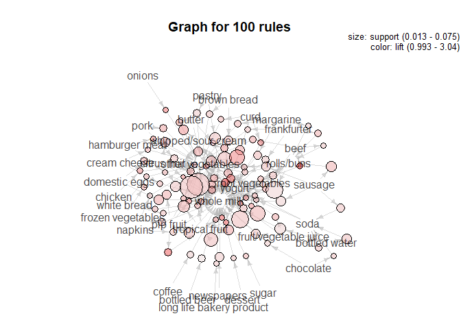

``` r
plot(head(sub1, 50, by='lift'), method='graph')
```

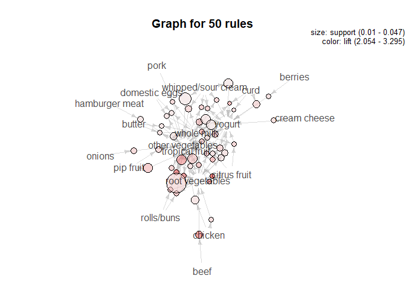

This plot shoes all the rules colored by confidence and shows their
lift.

``` r
plot(groceryrules, measure = c("support", "lift"), shading = "confidence")
```

    ## To reduce overplotting, jitter is added! Use jitter = 0 to prevent jitter.

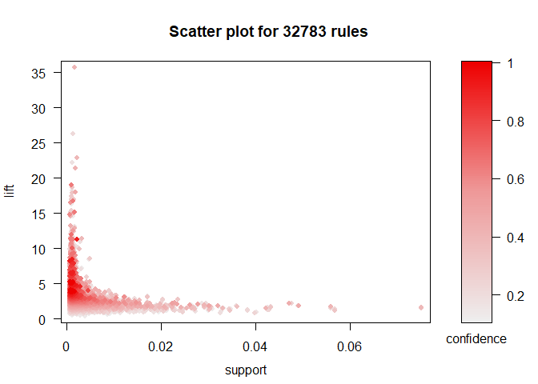

Here we see how often certain orders of pairs are picked. As you can
see, the more items that are involved in a rule usually means it has a
higher confidence on average. This makes sense because of the rules
behind apriori.

``` r
plot(groceryrules, method='two-key plot')
```

    ## To reduce overplotting, jitter is added! Use jitter = 0 to prevent jitter.

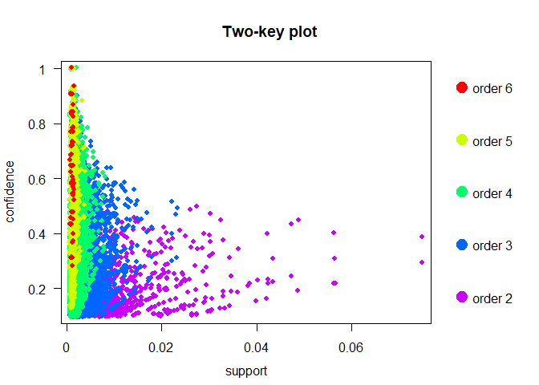
