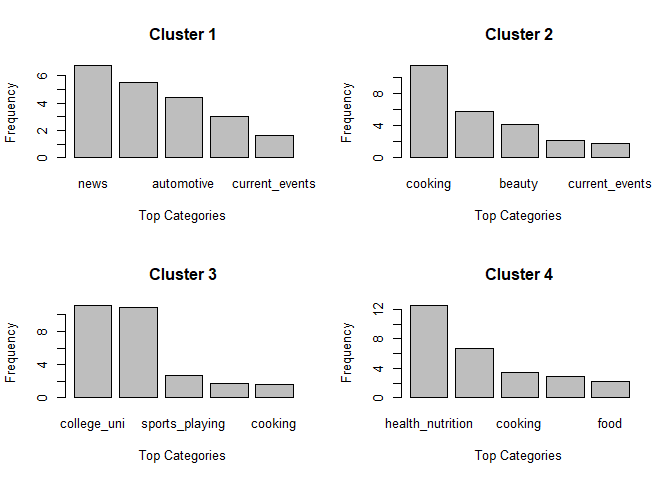

QUESTION 1: Green Building

``` r
library(ggplot2)
library(dplyr)
```

    ## 
    ## Attaching package: 'dplyr'

    ## The following objects are masked from 'package:stats':
    ## 
    ##     filter, lag

    ## The following objects are masked from 'package:base':
    ## 
    ##     intersect, setdiff, setequal, union

``` r
#setwd("~/STA380-master/STA380-master/data")
setwd("~/GitHub/STA380/data/")
gb = read.csv("greenbuildings.csv")
gb$green_rating = as.logical(gb$green_rating)
gb = filter(gb, leasing_rate>=.1)
```

The first issue we immediately noticed with the Excel Guru’s analysis is
their valuation of rent of green versus non-green buildings. They
considered this green factor as independent from all other factors, so
we wanted to see how rent varied considerring multiple factors. We
wanted to compare rent prices for buildings similar to one another as
opposed to with every building in the dataset.

The first variable we explored was age. We started by plotting rent over
building age and differentiating green building by coloring those points
green.

``` r
ggplot(data=gb) + geom_point(aes(age, Rent, color=green_rating)) + scale_color_manual(values=c("black", "#4EC62A"))
```


Looking at the plot, it’s very hard to tell if green buildings have
higher rent values than non green buildings. To more closely examine
this, we will group by age and take the median.

``` r
gb_age = group_by(gb, age, green_rating)
ggplot(data=summarize(gb_age, Median_Rent = median(Rent))) + geom_point(aes(age, Median_Rent, color=green_rating)) + scale_color_manual(values=c("black", "#4EC62A"))
```


When doing this, it’s a little more coherent. Specifically when
considerring newer buildings younger than 20 years old, it appears that
median rent for green vs non-green does not differentiate much. Going
forward, we should consider younger apartments since they’re more
reflective of the apartment the company is building.

We should additionally consider how rent of green vs non-green buildings
compare within clusters. We also filter for only apartments 20 years old
or younger.

``` r
gb_cluster = group_by(filter(gb, age <= 20), cluster, green_rating)
#ggplot(data=summarize(gb_cluster, Median_Rent = median(Rent))) + geom_point(aes(cluster, Median_Rent, color=green_rating)) + scale_color_manual(values=c("black", "#4EC62A"))
gb_cluster_green = filter(summarize(gb_cluster, Rent = median(Rent)), green_rating==TRUE)
gb_cluster_nongreen = filter(summarize(gb_cluster, Rent = median(Rent)), green_rating==FALSE)
gb_cluster_merged = merge(gb_cluster_green, gb_cluster_nongreen, by="cluster", suffixes = c("_green","_nongreen"))
gb_cluster_merged$Difference = gb_cluster_merged$Rent_green-gb_cluster_merged$Rent_nongreen
print("Average within cluster difference between rent of green buildings and Median rent of non-green buildings")
```

    ## [1] "Average within cluster difference between rent of green buildings and Median rent of non-green buildings"

``` r
mean(gb_cluster_merged$Difference)
```

    ## [1] 1.024724

By filterring by age and only comparing to buildings within the same
clusters, we see that green buildings only have higher rent of 1.02 per
square foot, much smaller than the Excel Guru’s claim of 2.60.

``` r
5000000/(1.02*250000)
```

    ## [1] 19.60784

Using this valuation and assuming 100% occupancy, the investors can only
expect to recoup their extra investment in 19.6 years as opposed to the
initial claim of 7.7.

We additionally wanted to revisit the guru’s assumption of 90%-100%
occupancy. Because the anticipated payoff period is so long, small
deviations in average occupancy can affect the expected return.

Filterring on age &lt;= 20 and green buildings, we observe the
following:

``` r
filtered_gb = filter(gb, green_rating==TRUE & age <=20)
print("Proportion of 100% occupancy:")
```

    ## [1] "Proportion of 100% occupancy:"

``` r
nrow(filter(filtered_gb, leasing_rate==100))/nrow(filtered_gb)
```

    ## [1] 0.1433962

``` r
print("Looking at some quantiles")
```

    ## [1] "Looking at some quantiles"

``` r
quantile(filtered_gb$leasing_rate, .75)
```

    ##   75% 
    ## 98.52

``` r
quantile(filtered_gb$leasing_rate, .5)
```

    ##   50% 
    ## 93.47

``` r
quantile(filtered_gb$leasing_rate, .25)
```

    ##   25% 
    ## 85.59

``` r
quantile(filtered_gb$leasing_rate, .05)
```

    ##     5% 
    ## 64.228

We see that 90% occupancy is a good estimate for the expected occupancy
rate. By looking at the various quantiles, however, we should still
consider other options. Here are some observations: Only 14% of these
buildings have 100% occupancy. A little over 50% of these buildings have
90% occupancy or higher. 75% of these buildings have 85% occupancy or
higher. 95% of these buildings have 65% occupancy or higher.

It’s important to note that theres slightly less than 50% of having
occupancy less than 90%. To be ultra conservative, we can say that
there’s only a 5% chance of having occupancy of 65% or less.

We can visualize these potential payoff periods.

``` r
additionalRevenue <- data.frame(double(), double(), integer(), double())
occupancy_list = c(.65,.9,1)
for (rate in occupancy_list){
  year = 0
  while(year <= 30){
    additionalRevenue = rbind(additionalRevenue, c(1.02, rate, year, 1.02*year*250000*rate))
    year = year+1
  }
}
year = 0
while(year <= 25){
    additionalRevenue = rbind(additionalRevenue, c(2.60, .9, year, 2.60*year*250000))
    year = year+1
  }
colnames(additionalRevenue) <- c("additional_rent", "occupancy_rate", "year", "additional_revenue")
additionalRevenue$additional_rent = as.factor(additionalRevenue$additional_rent)
additionalRevenue$occupancy_rate = as.factor(additionalRevenue$occupancy_rate)

temp = filter(additionalRevenue, additional_rent==1.02)
temp$occupancy_rate = as.factor(temp$occupancy_rate)
ggplot() + 
  geom_line(data = filter(additionalRevenue, additional_rent==2.60), aes(year, additional_revenue), color="red", linetype="solid") +
  geom_line(data = temp, aes(year, additional_revenue, linetype=occupancy_rate)) +
  scale_linetype_manual(values=c("dotted","twodash", "solid")) +
  coord_cartesian(ylim=c(0,6000000)) +
  geom_hline(yintercept=5000000, linetype="solid", color = "#4EC62A") +
  ggtitle("Expected Payoff") + 
  ylab("Additional Revenue") +
  xlab("Year")
```


``` r
 #plot(ecdf(filter(gb, green_rating==TRUE & age <=20)$leasing_rate))
#quantile(filter(gb, green_rating==TRUE & age <=20)$leasing_rate, .25)
```

The initial estimate is displayed in red. The black lines are our
estimates. Best case scenario, the investors will only make back their
money by year 20. More realistically, they could expect to break even
between years 22 and 23. Conservatively, they can expect their money
back after 30 years.

There are other factors to consider that we weren’t able to cover in our
analysis. Given the data, it was difficult to quantify annual costs for
a building, so if a green building has less annual operating expenses
than a non-green building, the net payoff may occur earlier.
Additionally, employee happiness and productivity could be higher in
green buildings, but we don’t have a way to quantify this.

Given the current analysis, we think the Excel Guru’s estimate is too
optimistic. He anticipates payoffs in year 7 or 8, but it’s more
realistic to expect payoffs in year 22 or later. In our anlaysis, even
in best case scenario the payoff won’t occur until at least year 20. The
investors may be better off investing the additional $5M unless they can
uncover additional benefits of green buildings.

Question 2: flights at ABIA

``` r
library(ggplot2)
library(dplyr)
#setwd("~/STA380-master/STA380-master/data")
setwd("~/GitHub/STA380/data/")
abia <- read.csv("ABIA.csv")

#Creating dummy variable
abia$dummy <- 1
attach(abia)
#Converting numeric to factors 
Month <- as.factor(Month)
DayofMonth <- as.factor(DayofMonth)
DayOfWeek <- as.factor(DayOfWeek)
```

``` r
multiplot <- function(..., plotlist=NULL, file, cols=1, layout=NULL) {
  require(grid)

  # Make a list from the ... arguments and plotlist
  plots <- c(list(...), plotlist)

  numPlots = length(plots)

  # If layout is NULL, then use 'cols' to determine layout
  if (is.null(layout)) {
    # Make the panel
    # ncol: Number of columns of plots
    # nrow: Number of rows needed, calculated from # of cols
    layout <- matrix(seq(1, cols * ceiling(numPlots/cols)),
                    ncol = cols, nrow = ceiling(numPlots/cols))
  }

 if (numPlots==1) {
    print(plots[[1]])

  } else {
    # Set up the page
    grid.newpage()
    pushViewport(viewport(layout = grid.layout(nrow(layout), ncol(layout))))

    # Make each plot, in the correct location
    for (i in 1:numPlots) {
      # Get the i,j matrix positions of the regions that contain this subplot
      matchidx <- as.data.frame(which(layout == i, arr.ind = TRUE))

      print(plots[[i]], vp = viewport(layout.pos.row = matchidx$row,
                                      layout.pos.col = matchidx$col))
    }
  }
}
```

Checking out which airports are the best to fly from. In this case, US
and F9 have the lowest percentage of delayed flights with very short
delays relative to the other airlines.

``` r
#Creating subsets of the data for all flights leaving Austin as well as when they were delayed.
departABIA <- subset(abia, Origin == "AUS")
delayABIA <- subset(departABIA, DepDelay > 0)

#Sum of delayed flights by each airline
delayAirline <- aggregate(delayABIA$dummy,by=list(delayABIA$UniqueCarrier),FUN = sum, na.rm=TRUE)
names(delayAirline)[1] <- "Airline"
names(delayAirline)[2] <- "DelaysAnnually"

#Average delay time by Airline
avgDelayAir <- aggregate(delayABIA$DepDelay,by=list(delayABIA$UniqueCarrier),FUN = mean, na.rm=TRUE)
names(avgDelayAir)[1] <- "Airline"
names(avgDelayAir)[2] <- "AverageDelayTime"

#Sum of delayed flights by all airlines
totalAirline <- aggregate(departABIA$dummy,by=list(departABIA$UniqueCarrier),FUN = sum, na.rm=TRUE)
names(totalAirline)[1] <- "Airline"
names(totalAirline)[2] <- "FlightsAnnually"

#Merging the dataframes
delayPerc <- merge(totalAirline,delayAirline, by = "Airline")
delayPerc <- merge(delayPerc, avgDelayAir, by = "Airline")
delayPerc$perc <- round(delayPerc$DelaysAnnually/totalAirline$FlightsAnnually,3)*100
delayPerc$AverageDelayTime <- round(delayPerc$AverageDelayTime, 2)

#Percent of delayed flights by airline
p1 <- ggplot(delayPerc, aes(x=delayPerc$Airline, y=delayPerc$perc, fill = delayPerc$Airline)) + geom_col() + geom_text(aes(label = delayPerc$perc ), vjust = -0.5) + ylim(0,100) + xlab("") + ylab("Percent of Flight Delayed") + theme(legend.position = 'none',)

#Average delays by airline
p2 <- ggplot(delayPerc, aes(x=delayPerc$Airline, y=delayPerc$AverageDelayTime, fill = delayPerc$Airline)) + geom_col() + geom_text(aes(label = delayPerc$AverageDelayTime ), vjust = -0.5) + ylim(0,60) + xlab("Airlines") + ylab("Average Delay in Minutes") + theme(legend.position = 'none') 

multiplot(p1, p2, col = 1)
```

    ## Loading required package: grid


    ## [1] 1

Now looking at delays by airport,there is an outlier to be ignored. The
DSM airport has a 100% delay rate with a delay of 129 minutes. However,
this was for only 1 delay, so we can’t reliably say that it will happen
again. It would be our recommendation to arrive to the airport earlier
than normal if flying to EWR, IAD, and STL.

``` r
#Sum of delays by each destination
delayDest <- aggregate(delayABIA$dummy,by=list(delayABIA$Dest),FUN = sum, na.rm=TRUE)
names(delayDest)[1] <- "Destination"
names(delayDest)[2] <- "DelaysAnnually"

#Average delay time by destination
avgDelay <- aggregate(delayABIA$DepDelay,by=list(delayABIA$Dest),FUN = mean, na.rm=TRUE)
names(avgDelay)[1] <- "Destination"
names(avgDelay)[2] <- "AverageDelayTime"

#Sum of delays all destinations
totalDest <- aggregate(departABIA$dummy,by=list(departABIA$Dest),FUN = sum, na.rm=TRUE)
names(totalDest)[1] <- "Destination"
names(totalDest)[2] <- "FlightsAnnually"

#Delay percentage by destination
delayPercDest <- merge(totalDest,delayDest, by = "Destination")
delayPercDest <- merge(delayPercDest, avgDelay, by = "Destination")
delayPercDest$perc <-round(delayPercDest$DelaysAnnually/delayPercDest$FlightsAnnually,3)*100

#Rounding the delay time to 2 decimal places
delayPercDest$AverageDelayTime <- round(delayPercDest$AverageDelayTime,2)

#Destination percentage plot
p3 <- ggplot(delayPercDest, aes(x=delayPercDest$Destination, y=delayPercDest$perc, fill = delayPercDest$Destination)) + geom_col() + geom_text(aes(label = delayPercDest$perc), vjust = -0.5, size = 3) + ylim(0,100) + xlab("") + ylab("Percent of Flight Delayed") + theme(text = element_text(size=8),legend.position = 'none')

#Average delay by destination plot
p4 <- ggplot(delayPercDest, aes(x=delayPercDest$Destination, y=delayPercDest$AverageDelayTime, fill = delayPercDest$Destination)) + geom_col() + geom_text(aes(label = delayPercDest$AverageDelayTime), vjust = -0.5, size = 3) + ylim(0,150) + xlab("Airport") + ylab("Average Delay in Minutes") + theme(text = element_text(size=8),legend.position = 'none')


multiplot(p3, p4, cols=1)
```


Intuitively there would be some interesting story to tell from delays by
day or month however there isn’t much to be gleaned from the plots
except that Decemeber and March have the highest average delay times.
That, and the fall months like September, October, and Novemeber are
good times to fly out of ABIA.

``` r
#Average Delays by month, day of month, and day of week.
avgDelayMonth = aggregate(delayABIA$DepDelay~factor(Month), delayABIA, mean)
names(avgDelayMonth)[1] <- "Month"
names(avgDelayMonth)[2] <- "AverageDelayTime"
avgDelayMonth$AverageDelayTime <- round(avgDelayMonth$AverageDelayTime,2)

avgDelayDoM = aggregate(delayABIA$DepDelay~factor(DayofMonth), delayABIA, mean)
names(avgDelayDoM)[1] <- "DayOfMonth"
names(avgDelayDoM)[2] <- "AverageDelayTime"
avgDelayDoM$AverageDelayTime <- round(avgDelayDoM$AverageDelayTime,2)


avgDelayDoW = aggregate(delayABIA$DepDelay~factor(DayOfWeek), delayABIA, mean)
names(avgDelayDoW)[1] <- "DayOfWeek"
names(avgDelayDoW)[2] <- "AverageDelayTime"
avgDelayDoW$AverageDelayTime <- round(avgDelayDoW$AverageDelayTime,2)


#Average delay by Month
p5 <- ggplot(avgDelayMonth, aes(x=avgDelayMonth$Month, y=avgDelayMonth$AverageDelayTime, fill = avgDelayMonth$Month)) + geom_col() + geom_text(aes(label = avgDelayMonth$AverageDelayTime), vjust = -0.5, size = 3) + ylim(0,60) + xlab("Month") + ylab("Average Delay in Minutes") + theme(text = element_text(size=8),legend.position = 'none')


#Average delay by Day of Month
p6 <- ggplot(avgDelayDoM, aes(x=avgDelayDoM$DayOfMonth, y=avgDelayDoM$AverageDelayTime, fill = avgDelayDoM$DayOfMonth)) + geom_col() + geom_text(aes(label = avgDelayDoM$AverageDelayTime), vjust = -0.5, size = 3) + ylim(0,60) + xlab("Day Of Month") + ylab("Average Delay in Minutes") + theme(text = element_text(size=8),legend.position = 'none')


#Average delay by Day of Week
p7 <- ggplot(avgDelayDoW, aes(x=avgDelayDoW$DayOfWeek, y=avgDelayDoW$AverageDelayTime, fill = avgDelayDoW$DayOfWeek)) + geom_col() + geom_text(aes(label = avgDelayDoW$AverageDelayTime), vjust = -0.5, size = 3) + ylim(0,60) + xlab("Day Of Week") + ylab("Average Delay in Minutes") + theme(text = element_text(size=8),legend.position = 'none')

multiplot(p5, p6, p7, cols=1)
```


QUESTION 3: Portfolio Modeling

``` r
rm(list=ls())
library(mosaic)
```

    ## Loading required package: lattice

    ## Loading required package: ggformula

    ## Loading required package: ggstance

    ## 
    ## Attaching package: 'ggstance'

    ## The following objects are masked from 'package:ggplot2':
    ## 
    ##     geom_errorbarh, GeomErrorbarh

    ## 
    ## New to ggformula?  Try the tutorials: 
    ##  learnr::run_tutorial("introduction", package = "ggformula")
    ##  learnr::run_tutorial("refining", package = "ggformula")

    ## Loading required package: mosaicData

    ## Loading required package: Matrix

    ## Registered S3 method overwritten by 'mosaic':
    ##   method                           from   
    ##   fortify.SpatialPolygonsDataFrame ggplot2

    ## 
    ## The 'mosaic' package masks several functions from core packages in order to add 
    ## additional features.  The original behavior of these functions should not be affected by this.
    ## 
    ## Note: If you use the Matrix package, be sure to load it BEFORE loading mosaic.

    ## 
    ## Attaching package: 'mosaic'

    ## The following object is masked from 'package:Matrix':
    ## 
    ##     mean

    ## The following objects are masked from 'package:dplyr':
    ## 
    ##     count, do, tally

    ## The following object is masked from 'package:ggplot2':
    ## 
    ##     stat

    ## The following objects are masked from 'package:stats':
    ## 
    ##     binom.test, cor, cor.test, cov, fivenum, IQR, median,
    ##     prop.test, quantile, sd, t.test, var

    ## The following objects are masked from 'package:base':
    ## 
    ##     max, mean, min, prod, range, sample, sum

``` r
library(quantmod)
```

    ## Loading required package: xts

    ## Loading required package: zoo

    ## 
    ## Attaching package: 'zoo'

    ## The following objects are masked from 'package:base':
    ## 
    ##     as.Date, as.Date.numeric

    ## Registered S3 method overwritten by 'xts':
    ##   method     from
    ##   as.zoo.xts zoo

    ## 
    ## Attaching package: 'xts'

    ## The following objects are masked from 'package:dplyr':
    ## 
    ##     first, last

    ## Loading required package: TTR

    ## Registered S3 method overwritten by 'quantmod':
    ##   method            from
    ##   as.zoo.data.frame zoo

    ## Version 0.4-0 included new data defaults. See ?getSymbols.

``` r
library(foreach)
library(reshape2)
```

First, we choose our 3 portfolios.

We chose a small tech portfolio, mid-sized real estate portfolio, and a
large diverse portfolio. We expect the small tech portfolio to
outperform the others due to the technology industry having the best
overall performance in the past five years. However, this portfolio will
also have very high volatility due to the nature of technology stocks
over the past five years and the lack of diversification. The real
estate portfolio will have slightly lower volatility than the technology
one, but we suspect that the returns will not be as high. The diverse
portfolio may have the worst returns due to its investment in things
like commodity and treasury bonds which do not have high yield, however
it will perform much more consistently due to the nature of the markets
it is invested in as well as the high number of ETFs included in the
portfolio.

``` r
portfolio_tech = c("PTF","XSD","PSJ")
portfolio_re = c("VNQ","USRT","SCHH","RWR","MORT")
portfolio_diverse = c("VB", "UGA", "TLT", "XLE", "RLY", "IYF", "REET", "UUP")
```

``` r
tech_prices = getSymbols(portfolio_tech, from = "2014-08-14")
```

    ## 'getSymbols' currently uses auto.assign=TRUE by default, but will
    ## use auto.assign=FALSE in 0.5-0. You will still be able to use
    ## 'loadSymbols' to automatically load data. getOption("getSymbols.env")
    ## and getOption("getSymbols.auto.assign") will still be checked for
    ## alternate defaults.
    ## 
    ## This message is shown once per session and may be disabled by setting 
    ## options("getSymbols.warning4.0"=FALSE). See ?getSymbols for details.

``` r
re_prices = getSymbols(portfolio_re, from = "2014-08-14")
diverse_prices = getSymbols(portfolio_diverse, from = "2014-08-14")
```

    ## pausing 1 second between requests for more than 5 symbols

    ## pausing 1 second between requests for more than 5 symbols
    ## pausing 1 second between requests for more than 5 symbols
    ## pausing 1 second between requests for more than 5 symbols

``` r
for(ticker in portfolio_tech) {
    expr = paste0(ticker, "a = adjustOHLC(", ticker, ")")
    eval(parse(text=expr))
}
tech_returns = cbind(   ClCl(PTFa),
                                ClCl(XSDa),
                                ClCl(PSJa))
for(ticker in portfolio_re) {
    expr = paste0(ticker, "a = adjustOHLC(", ticker, ")")
    eval(parse(text=expr))
}
re_returns = cbind( ClCl(VNQa),
                                ClCl(USRTa),
                                ClCl(SCHHa),
                                ClCl(RWRa),
                                ClCl(MORTa))
for(ticker in portfolio_diverse) {
    expr = paste0(ticker, "a = adjustOHLC(", ticker, ")")
    eval(parse(text=expr))
}
diverse_returns = cbind(    ClCl(VBa),
                                ClCl(UGAa),
                                ClCl(TLTa),
                                ClCl(XLEa),
                                ClCl(RLYa),
                                ClCl(IYFa),
                                ClCl(REETa),
                                ClCl(UUPa))
```

``` r
tech_returns = as.matrix(na.omit(tech_returns))
re_returns = as.matrix(na.omit(re_returns))
diverse_returns = as.matrix(na.omit(diverse_returns))
```

Run 1000 20 day market simulations.

``` r
initial_wealth = 100000
num_simulations = 1000

tech_final_value = rep(0,num_simulations)
re_final_value = rep(0,num_simulations)
diverse_final_value = rep(0,num_simulations)
for(i in 1:num_simulations) {
#   total_wealth = initial_wealth
    tech_wealth = initial_wealth
    re_wealth = initial_wealth
    diverse_wealth = initial_wealth
    tech_weights = c(1/3,1/3,1/3)
    re_weights = c(0.2, 0.2, 0.2, 0.2, 0.2)
    diverse_weights = c(1/8,1/8,1/8,1/8,1/8,1/8,1/8,1/8)
    tech_holdings = tech_weights * tech_wealth
    re_holdings = re_weights * re_wealth
    diverse_holdings = diverse_weights * diverse_wealth

    n_days = 20
    tech_wealthtracker = rep(0, n_days)
    re_wealthtracker = rep(0, n_days)
    diverse_wealthtracker = rep(0, n_days)
    for(today in 1:n_days) {
        day = sample(c(1:nrow(tech_returns)), 1)
#     return.today = resample(all_returns, 1, orig.ids=FALSE)
#       holdings = holdings + holdings*return.today
        tech_holdings = tech_holdings + tech_holdings*tech_returns[day,]
        re_holdings = re_holdings + re_holdings*re_returns[day,]
        diverse_holdings = diverse_holdings + diverse_holdings*diverse_returns[day,]
        tech_total_wealth = sum(tech_holdings)
        re_total_wealth = sum(re_holdings)
        diverse_total_wealth = sum(diverse_holdings)
        tech_wealthtracker[today] = tech_total_wealth
        re_wealthtracker[today] = re_total_wealth
        diverse_wealthtracker[today] = diverse_total_wealth
    }
    tech_final_value[i]=tech_wealthtracker[n_days]
    re_final_value[i]=re_wealthtracker[n_days]
    diverse_final_value[i]=diverse_wealthtracker[n_days]
}
```

``` r
finalValues = data.frame(sim = 1:num_simulations, tech = tech_final_value, real_estate = re_final_value, diverse = diverse_final_value)
ggplot(finalValues) + 
  geom_histogram(aes(x=tech, fill="Technology"), alpha=.2) +
  geom_histogram(aes(x=real_estate, fill="Real Estate"), alpha=.2) +
  geom_histogram(aes(x=diverse, fill="Diverse"), alpha=.2) +
  xlab("Final Returns") +
  ylab("Count") + 
  ggtitle("Histogram of Final Return")
```

    ## `stat_bin()` using `bins = 30`. Pick better value with `binwidth`.
    ## `stat_bin()` using `bins = 30`. Pick better value with `binwidth`.
    ## `stat_bin()` using `bins = 30`. Pick better value with `binwidth`.


As you can see from the graph above, our hypthesis was fairly consistent
with the results. The Diverse portfolio was very consistent in getting a
value at or around 100000 due to the number of ETFs and the diversity of
types in them. The Real Estate portfolio performed more sporadically and
was distributed over a longer range. The Technology portfolio was very
volatile as it was composed entirely of ETFs in one of the most volatile
sectors, tech. The lack of ETFs made it have an extremely large range of
ending values, with a few ending up between 140,000 and 160,000. The
Technology portfolio definitely performed the best, with the majority of
their returns being positive. It also had the largest chance to lose
money, so that is one thing to consider.

``` r
finalValues_melted=melt(finalValues, id.vars = "sim")
finalValues_melted
```

    ##       sim    variable     value
    ## 1       1        tech 113414.44
    ## 2       2        tech  95183.08
    ## 3       3        tech 105270.46
    ## 4       4        tech  88883.08
    ## 5       5        tech  95369.48
    ## 6       6        tech 101595.23
    ## 7       7        tech 105768.17
    ## 8       8        tech 111744.10
    ## 9       9        tech  90485.99
    ## 10     10        tech  97409.79
    ## 11     11        tech  96094.81
    ## 12     12        tech 103163.57
    ## 13     13        tech 102859.27
    ## 14     14        tech 102347.05
    ## 15     15        tech  89282.92
    ## 16     16        tech  94429.17
    ## 17     17        tech  91552.96
    ## 18     18        tech 101211.35
    ## 19     19        tech  96095.51
    ## 20     20        tech 110902.69
    ## 21     21        tech 106876.28
    ## 22     22        tech 101645.57
    ## 23     23        tech  89952.73
    ## 24     24        tech 104394.80
    ## 25     25        tech 107977.54
    ## 26     26        tech  96334.63
    ## 27     27        tech 106387.31
    ## 28     28        tech 100589.63
    ## 29     29        tech  91100.92
    ## 30     30        tech  96937.70
    ## 31     31        tech 102110.43
    ## 32     32        tech  94305.45
    ## 33     33        tech 100478.64
    ## 34     34        tech  99387.07
    ## 35     35        tech 102778.35
    ## 36     36        tech 139344.20
    ## 37     37        tech  97544.36
    ## 38     38        tech  95775.44
    ## 39     39        tech  88235.40
    ## 40     40        tech  98958.20
    ## 41     41        tech 105467.48
    ## 42     42        tech 109511.25
    ## 43     43        tech 107274.63
    ## 44     44        tech 107855.48
    ## 45     45        tech 109366.63
    ## 46     46        tech 105964.71
    ## 47     47        tech  99132.72
    ## 48     48        tech 105127.41
    ## 49     49        tech  99916.11
    ## 50     50        tech 100393.19
    ## 51     51        tech 106718.31
    ## 52     52        tech 103739.65
    ## 53     53        tech 103012.59
    ## 54     54        tech  99587.52
    ## 55     55        tech 105559.26
    ## 56     56        tech 107331.97
    ## 57     57        tech  91994.32
    ## 58     58        tech 105431.00
    ## 59     59        tech 103460.88
    ## 60     60        tech 111762.20
    ## 61     61        tech  96820.16
    ## 62     62        tech  97612.53
    ## 63     63        tech  97896.68
    ## 64     64        tech 102173.86
    ## 65     65        tech 112611.30
    ## 66     66        tech 109649.28
    ## 67     67        tech 103091.95
    ## 68     68        tech 102703.56
    ## 69     69        tech  97126.12
    ## 70     70        tech 106007.17
    ## 71     71        tech  97217.18
    ## 72     72        tech  96021.57
    ## 73     73        tech  91748.44
    ## 74     74        tech  95810.46
    ## 75     75        tech  98758.61
    ## 76     76        tech 112338.41
    ## 77     77        tech 108140.07
    ## 78     78        tech  95638.60
    ## 79     79        tech  99657.12
    ## 80     80        tech 109476.21
    ## 81     81        tech 101476.71
    ## 82     82        tech  93849.56
    ## 83     83        tech  91356.53
    ## 84     84        tech 104891.26
    ## 85     85        tech 107303.93
    ## 86     86        tech 103285.62
    ## 87     87        tech 108312.54
    ## 88     88        tech  94514.18
    ## 89     89        tech 101495.83
    ## 90     90        tech 100980.42
    ## 91     91        tech  97213.05
    ## 92     92        tech  90865.39
    ## 93     93        tech 103428.93
    ## 94     94        tech  96943.95
    ## 95     95        tech  98356.16
    ## 96     96        tech 106212.45
    ## 97     97        tech 154362.60
    ## 98     98        tech  96703.33
    ## 99     99        tech  96695.41
    ## 100   100        tech  97710.19
    ## 101   101        tech 112800.37
    ## 102   102        tech 103538.83
    ## 103   103        tech 101203.77
    ## 104   104        tech 112720.55
    ## 105   105        tech 111089.38
    ## 106   106        tech 111708.72
    ## 107   107        tech 106151.01
    ## 108   108        tech 106641.83
    ## 109   109        tech  97648.22
    ## 110   110        tech 107320.91
    ## 111   111        tech  98906.83
    ## 112   112        tech 101532.13
    ## 113   113        tech  98002.30
    ## 114   114        tech 106036.45
    ## 115   115        tech  89775.82
    ## 116   116        tech 101592.12
    ## 117   117        tech 108579.71
    ## 118   118        tech 101351.25
    ## 119   119        tech  97508.38
    ## 120   120        tech  99344.26
    ## 121   121        tech  96179.98
    ## 122   122        tech 104923.37
    ## 123   123        tech  97703.07
    ## 124   124        tech 108061.91
    ## 125   125        tech 110064.56
    ## 126   126        tech  97630.41
    ## 127   127        tech 101173.46
    ## 128   128        tech 104501.74
    ## 129   129        tech 105032.10
    ## 130   130        tech 117740.27
    ## 131   131        tech  98698.50
    ## 132   132        tech 101040.88
    ## 133   133        tech  99258.71
    ## 134   134        tech  92621.07
    ## 135   135        tech  87515.31
    ## 136   136        tech 121264.21
    ## 137   137        tech  97805.56
    ## 138   138        tech 101659.75
    ## 139   139        tech 139865.24
    ## 140   140        tech  97117.71
    ## 141   141        tech 116523.33
    ## 142   142        tech 104418.45
    ## 143   143        tech 102878.80
    ## 144   144        tech 107906.66
    ## 145   145        tech  92931.44
    ## 146   146        tech  99103.72
    ## 147   147        tech 125232.61
    ## 148   148        tech 100803.01
    ## 149   149        tech  91615.60
    ## 150   150        tech 102054.27
    ## 151   151        tech 104949.27
    ## 152   152        tech  93584.45
    ## 153   153        tech  98126.27
    ## 154   154        tech  94729.06
    ## 155   155        tech  93402.85
    ## 156   156        tech 107850.66
    ## 157   157        tech  90753.31
    ## 158   158        tech  96451.14
    ## 159   159        tech 103144.19
    ## 160   160        tech 107938.17
    ## 161   161        tech  95056.79
    ## 162   162        tech 103889.11
    ## 163   163        tech 102145.83
    ## 164   164        tech 104793.68
    ## 165   165        tech 100517.36
    ## 166   166        tech 105252.18
    ## 167   167        tech 106031.21
    ## 168   168        tech  94671.28
    ## 169   169        tech  96772.10
    ## 170   170        tech  98576.31
    ## 171   171        tech 100695.08
    ## 172   172        tech 109220.33
    ## 173   173        tech 100657.08
    ## 174   174        tech  93956.47
    ## 175   175        tech 106602.69
    ## 176   176        tech  97112.62
    ## 177   177        tech 104396.52
    ## 178   178        tech  95846.65
    ## 179   179        tech 102065.34
    ## 180   180        tech 101239.17
    ## 181   181        tech  87864.10
    ## 182   182        tech  99407.00
    ## 183   183        tech 105059.98
    ## 184   184        tech  98876.04
    ## 185   185        tech 103043.48
    ## 186   186        tech 117377.29
    ## 187   187        tech 103091.95
    ## 188   188        tech 110849.18
    ## 189   189        tech 101737.95
    ## 190   190        tech 103722.67
    ## 191   191        tech  94904.11
    ## 192   192        tech 105324.32
    ## 193   193        tech 107437.85
    ## 194   194        tech 106904.33
    ## 195   195        tech  97264.84
    ## 196   196        tech 113496.90
    ## 197   197        tech 106578.41
    ## 198   198        tech 145263.93
    ## 199   199        tech  99815.44
    ## 200   200        tech  96219.63
    ## 201   201        tech  98882.96
    ## 202   202        tech  89179.14
    ## 203   203        tech 101568.69
    ## 204   204        tech 146843.12
    ## 205   205        tech 110589.38
    ## 206   206        tech 103174.46
    ## 207   207        tech  98888.85
    ## 208   208        tech 109829.09
    ## 209   209        tech 104658.38
    ## 210   210        tech 101159.01
    ## 211   211        tech  98876.64
    ## 212   212        tech 103980.94
    ## 213   213        tech  96468.80
    ## 214   214        tech 114751.28
    ## 215   215        tech 104498.64
    ## 216   216        tech 100692.74
    ## 217   217        tech  98275.94
    ## 218   218        tech  94847.22
    ## 219   219        tech 105282.04
    ## 220   220        tech  97443.36
    ## 221   221        tech  97375.34
    ## 222   222        tech  91901.88
    ## 223   223        tech 100540.24
    ## 224   224        tech 134541.72
    ## 225   225        tech 109927.48
    ## 226   226        tech 106083.43
    ## 227   227        tech 102731.57
    ## 228   228        tech 112092.12
    ## 229   229        tech  98746.40
    ## 230   230        tech  95090.07
    ## 231   231        tech 106560.17
    ## 232   232        tech  94207.96
    ## 233   233        tech  96975.51
    ## 234   234        tech 101609.17
    ## 235   235        tech 104985.30
    ## 236   236        tech  81283.93
    ## 237   237        tech  89946.92
    ## 238   238        tech 112948.27
    ## 239   239        tech 104273.48
    ## 240   240        tech 103730.88
    ## 241   241        tech 109635.02
    ## 242   242        tech  97922.83
    ## 243   243        tech  94897.61
    ## 244   244        tech  93041.82
    ## 245   245        tech 114604.65
    ## 246   246        tech  99826.78
    ## 247   247        tech 101012.87
    ## 248   248        tech 107816.04
    ## 249   249        tech 105623.20
    ## 250   250        tech 103029.56
    ## 251   251        tech 100768.39
    ## 252   252        tech  96136.99
    ## 253   253        tech  95136.16
    ## 254   254        tech 100830.74
    ## 255   255        tech  94024.58
    ## 256   256        tech 100308.68
    ## 257   257        tech 107875.86
    ## 258   258        tech 107731.58
    ## 259   259        tech  94059.05
    ## 260   260        tech 113114.94
    ## 261   261        tech 101233.23
    ## 262   262        tech 104591.15
    ## 263   263        tech 103938.09
    ## 264   264        tech 104880.41
    ## 265   265        tech 108056.23
    ## 266   266        tech 102253.20
    ## 267   267        tech 101400.25
    ## 268   268        tech 102939.88
    ## 269   269        tech 103339.23
    ## 270   270        tech  96190.77
    ## 271   271        tech  91744.51
    ## 272   272        tech  98615.51
    ## 273   273        tech 109125.86
    ## 274   274        tech  98450.74
    ## 275   275        tech 106565.75
    ## 276   276        tech 109345.70
    ## 277   277        tech 101082.08
    ## 278   278        tech  92850.74
    ## 279   279        tech  98596.11
    ## 280   280        tech  91614.86
    ## 281   281        tech  97241.55
    ## 282   282        tech 101110.55
    ## 283   283        tech 100604.90
    ## 284   284        tech  97280.39
    ## 285   285        tech  98867.54
    ## 286   286        tech  97691.44
    ## 287   287        tech 100975.96
    ## 288   288        tech 102201.52
    ## 289   289        tech  97041.77
    ## 290   290        tech 101361.55
    ## 291   291        tech 104893.18
    ## 292   292        tech 100697.83
    ## 293   293        tech  94291.73
    ## 294   294        tech 103759.05
    ## 295   295        tech  97545.20
    ## 296   296        tech  91800.30
    ## 297   297        tech 100382.38
    ## 298   298        tech 105198.15
    ## 299   299        tech 105044.13
    ## 300   300        tech 115282.24
    ## 301   301        tech 103173.07
    ## 302   302        tech  93472.00
    ## 303   303        tech  89953.04
    ## 304   304        tech 115884.37
    ## 305   305        tech  95976.32
    ## 306   306        tech  97022.87
    ## 307   307        tech 105967.18
    ## 308   308        tech 101988.33
    ## 309   309        tech 129816.31
    ## 310   310        tech  99550.95
    ## 311   311        tech 116514.27
    ## 312   312        tech 105616.37
    ## 313   313        tech 107726.06
    ## 314   314        tech  93825.39
    ## 315   315        tech  99783.64
    ## 316   316        tech  97257.19
    ## 317   317        tech 104593.97
    ## 318   318        tech 100127.02
    ## 319   319        tech  96577.34
    ## 320   320        tech 104032.10
    ## 321   321        tech 109207.19
    ## 322   322        tech 109913.98
    ## 323   323        tech  97619.21
    ## 324   324        tech 118660.35
    ## 325   325        tech  98138.01
    ## 326   326        tech 104778.79
    ## 327   327        tech 103265.96
    ## 328   328        tech  99465.89
    ## 329   329        tech  89125.19
    ## 330   330        tech  99208.76
    ## 331   331        tech  98718.90
    ## 332   332        tech 108832.95
    ## 333   333        tech 101040.49
    ## 334   334        tech  93050.07
    ## 335   335        tech 106368.11
    ## 336   336        tech 101922.85
    ## 337   337        tech  96500.19
    ## 338   338        tech 101913.54
    ## 339   339        tech 104150.85
    ## 340   340        tech  82049.53
    ## 341   341        tech  99076.81
    ## 342   342        tech  95815.85
    ## 343   343        tech 101356.53
    ## 344   344        tech 107652.44
    ## 345   345        tech 113967.04
    ## 346   346        tech 121883.92
    ## 347   347        tech 106668.97
    ## 348   348        tech  97512.82
    ## 349   349        tech  99262.79
    ## 350   350        tech 101067.28
    ## 351   351        tech  96419.81
    ## 352   352        tech 108740.11
    ## 353   353        tech  95195.98
    ## 354   354        tech  96182.89
    ## 355   355        tech 106632.21
    ## 356   356        tech 108019.86
    ## 357   357        tech  97728.53
    ## 358   358        tech 106857.51
    ## 359   359        tech  95968.84
    ## 360   360        tech 103552.42
    ## 361   361        tech 100999.50
    ## 362   362        tech  97334.24
    ## 363   363        tech 102308.21
    ## 364   364        tech 107018.93
    ## 365   365        tech  92884.30
    ## 366   366        tech 105376.09
    ## 367   367        tech  92789.08
    ## 368   368        tech 105091.20
    ## 369   369        tech  98472.17
    ## 370   370        tech 100186.29
    ## 371   371        tech 108666.23
    ## 372   372        tech  98869.27
    ## 373   373        tech 107141.87
    ## 374   374        tech 105350.34
    ## 375   375        tech  95816.42
    ## 376   376        tech 102068.94
    ## 377   377        tech 101424.84
    ## 378   378        tech  90715.26
    ## 379   379        tech 104821.44
    ## 380   380        tech 121075.15
    ## 381   381        tech  98629.06
    ## 382   382        tech 103746.03
    ## 383   383        tech  99811.52
    ## 384   384        tech 103058.40
    ## 385   385        tech 106480.68
    ## 386   386        tech 102359.51
    ## 387   387        tech 105835.74
    ## 388   388        tech 102231.24
    ## 389   389        tech 102897.33
    ## 390   390        tech 107037.60
    ## 391   391        tech 100486.58
    ## 392   392        tech  95830.54
    ## 393   393        tech  99545.13
    ## 394   394        tech 112642.05
    ## 395   395        tech  96614.41
    ## 396   396        tech 106792.72
    ## 397   397        tech 102960.83
    ## 398   398        tech 101477.12
    ## 399   399        tech 101099.96
    ## 400   400        tech 100014.60
    ## 401   401        tech 107923.50
    ## 402   402        tech  98507.58
    ## 403   403        tech 102024.30
    ## 404   404        tech 111973.26
    ## 405   405        tech 100003.78
    ## 406   406        tech 109284.66
    ## 407   407        tech 102345.65
    ## 408   408        tech  95924.67
    ## 409   409        tech 102838.79
    ## 410   410        tech  94030.94
    ## 411   411        tech 103741.41
    ## 412   412        tech 107247.88
    ## 413   413        tech 101464.75
    ## 414   414        tech  99489.91
    ## 415   415        tech 104212.90
    ## 416   416        tech 142790.00
    ## 417   417        tech  98122.86
    ## 418   418        tech  95741.39
    ## 419   419        tech 105033.17
    ## 420   420        tech 134617.86
    ## 421   421        tech 135475.16
    ## 422   422        tech  99265.30
    ## 423   423        tech 106287.61
    ## 424   424        tech 107732.51
    ## 425   425        tech 101074.43
    ## 426   426        tech 106164.16
    ## 427   427        tech  99062.36
    ## 428   428        tech  97809.91
    ## 429   429        tech 110489.90
    ## 430   430        tech 104468.73
    ## 431   431        tech 109156.13
    ## 432   432        tech 102141.81
    ## 433   433        tech 109121.09
    ## 434   434        tech 104874.69
    ## 435   435        tech  98383.49
    ## 436   436        tech 125306.27
    ## 437   437        tech  98899.03
    ## 438   438        tech 104871.94
    ## 439   439        tech 112935.15
    ## 440   440        tech  98690.48
    ## 441   441        tech  91898.56
    ## 442   442        tech 114368.55
    ## 443   443        tech  93572.19
    ## 444   444        tech  94571.72
    ## 445   445        tech  95641.83
    ## 446   446        tech 102127.65
    ## 447   447        tech 104271.86
    ## 448   448        tech 100175.23
    ## 449   449        tech 108872.36
    ## 450   450        tech 105874.73
    ## 451   451        tech 107550.22
    ## 452   452        tech 105799.88
    ## 453   453        tech  99656.87
    ## 454   454        tech  95623.28
    ## 455   455        tech  99368.33
    ## 456   456        tech 101203.56
    ## 457   457        tech 107202.53
    ## 458   458        tech 104932.05
    ## 459   459        tech 104369.97
    ## 460   460        tech 109907.29
    ## 461   461        tech  99812.05
    ## 462   462        tech 108641.10
    ## 463   463        tech  95175.03
    ## 464   464        tech  99237.42
    ## 465   465        tech  89474.97
    ## 466   466        tech 103184.09
    ## 467   467        tech  98636.77
    ## 468   468        tech  96081.21
    ## 469   469        tech  99732.53
    ## 470   470        tech 108879.34
    ## 471   471        tech 100018.60
    ## 472   472        tech  99385.24
    ## 473   473        tech  94547.58
    ## 474   474        tech 101152.25
    ## 475   475        tech 108743.00
    ## 476   476        tech  95148.82
    ## 477   477        tech 104849.64
    ## 478   478        tech  92916.15
    ## 479   479        tech 109989.34
    ## 480   480        tech 130699.42
    ## 481   481        tech 101126.77
    ## 482   482        tech  87622.09
    ## 483   483        tech  97304.84
    ## 484   484        tech 110615.00
    ## 485   485        tech  99411.81
    ## 486   486        tech 145529.42
    ## 487   487        tech  94364.54
    ## 488   488        tech  89645.29
    ## 489   489        tech 104509.94
    ## 490   490        tech  95377.28
    ## 491   491        tech  98390.78
    ## 492   492        tech 108489.37
    ## 493   493        tech 106158.99
    ## 494   494        tech 101145.81
    ## 495   495        tech  96145.88
    ## 496   496        tech  97680.90
    ## 497   497        tech 115627.09
    ## 498   498        tech 102136.09
    ## 499   499        tech  97221.75
    ## 500   500        tech 103984.39
    ## 501   501        tech  96536.47
    ## 502   502        tech 100695.72
    ## 503   503        tech 112377.73
    ## 504   504        tech 100917.68
    ## 505   505        tech  95151.00
    ## 506   506        tech 104070.75
    ## 507   507        tech  90717.89
    ## 508   508        tech 105440.01
    ## 509   509        tech 102743.09
    ## 510   510        tech  86589.11
    ## 511   511        tech 100047.77
    ## 512   512        tech 100846.09
    ## 513   513        tech 107287.47
    ## 514   514        tech  95385.57
    ## 515   515        tech 108252.83
    ## 516   516        tech 104296.62
    ## 517   517        tech 101297.19
    ## 518   518        tech 103710.68
    ## 519   519        tech 101822.97
    ## 520   520        tech  94172.26
    ## 521   521        tech  98278.69
    ## 522   522        tech 105688.43
    ## 523   523        tech 115422.23
    ## 524   524        tech 102945.74
    ## 525   525        tech 101628.49
    ## 526   526        tech 102351.47
    ## 527   527        tech 108223.49
    ## 528   528        tech  94737.70
    ## 529   529        tech 103817.60
    ## 530   530        tech 103244.05
    ## 531   531        tech  98659.69
    ## 532   532        tech 106066.38
    ## 533   533        tech 105308.24
    ## 534   534        tech 114912.86
    ## 535   535        tech  97466.08
    ## 536   536        tech 116973.27
    ## 537   537        tech  91681.55
    ## 538   538        tech 102250.53
    ## 539   539        tech  91888.93
    ## 540   540        tech 110389.92
    ## 541   541        tech 111363.42
    ## 542   542        tech 109948.55
    ## 543   543        tech 103435.68
    ## 544   544        tech  96583.98
    ## 545   545        tech 101261.22
    ## 546   546        tech 103511.78
    ## 547   547        tech 108739.70
    ## 548   548        tech  98070.05
    ## 549   549        tech  99950.23
    ## 550   550        tech 105448.26
    ## 551   551        tech 106111.69
    ## 552   552        tech 103744.09
    ## 553   553        tech  98009.92
    ## 554   554        tech  99348.27
    ## 555   555        tech 106604.19
    ## 556   556        tech 104414.44
    ## 557   557        tech 109275.74
    ## 558   558        tech  99804.88
    ## 559   559        tech 106434.38
    ## 560   560        tech  98232.87
    ## 561   561        tech  94544.03
    ## 562   562        tech 115311.07
    ## 563   563        tech 108438.12
    ## 564   564        tech 112922.37
    ## 565   565        tech 139556.64
    ## 566   566        tech 100993.11
    ## 567   567        tech 100683.67
    ## 568   568        tech  97730.27
    ## 569   569        tech  87777.93
    ## 570   570        tech 107370.49
    ## 571   571        tech 105630.74
    ## 572   572        tech 103826.26
    ## 573   573        tech  99090.96
    ## 574   574        tech 100636.32
    ## 575   575        tech  92750.93
    ## 576   576        tech 100766.37
    ## 577   577        tech  91133.85
    ## 578   578        tech  96105.71
    ## 579   579        tech  93551.79
    ## 580   580        tech 105214.01
    ## 581   581        tech 103755.43
    ## 582   582        tech 105612.11
    ## 583   583        tech  95688.35
    ## 584   584        tech 110061.33
    ## 585   585        tech 100327.02
    ## 586   586        tech 101592.84
    ## 587   587        tech  99910.87
    ## 588   588        tech 101824.59
    ## 589   589        tech  99484.18
    ## 590   590        tech 101289.82
    ## 591   591        tech 109474.28
    ## 592   592        tech  98706.99
    ## 593   593        tech 106307.82
    ## 594   594        tech 104789.01
    ## 595   595        tech  96501.61
    ## 596   596        tech 108439.81
    ## 597   597        tech 104955.57
    ## 598   598        tech 106516.31
    ## 599   599        tech 102358.76
    ## 600   600        tech 107081.04
    ## 601   601        tech  95780.14
    ## 602   602        tech 101502.75
    ## 603   603        tech  98040.15
    ## 604   604        tech  97609.00
    ## 605   605        tech 100754.28
    ## 606   606        tech 103080.94
    ## 607   607        tech 101475.76
    ## 608   608        tech 110802.06
    ## 609   609        tech 100122.39
    ## 610   610        tech  90469.55
    ## 611   611        tech 106204.97
    ## 612   612        tech 109557.51
    ## 613   613        tech  94350.75
    ## 614   614        tech  94024.00
    ## 615   615        tech 105130.95
    ## 616   616        tech 106833.13
    ## 617   617        tech  99825.06
    ## 618   618        tech  98704.00
    ## 619   619        tech 105954.39
    ## 620   620        tech 103450.80
    ## 621   621        tech 106446.22
    ## 622   622        tech 104547.31
    ## 623   623        tech  88407.42
    ## 624   624        tech 102024.91
    ## 625   625        tech 146106.94
    ## 626   626        tech 109806.92
    ## 627   627        tech 102060.58
    ## 628   628        tech 104734.72
    ## 629   629        tech 101338.77
    ## 630   630        tech 110132.36
    ## 631   631        tech 100097.93
    ## 632   632        tech 104891.72
    ## 633   633        tech 105599.10
    ## 634   634        tech  94053.93
    ## 635   635        tech  97429.09
    ## 636   636        tech  97314.74
    ## 637   637        tech  99904.86
    ## 638   638        tech 102408.28
    ## 639   639        tech 108159.68
    ## 640   640        tech 102211.52
    ## 641   641        tech  95072.55
    ## 642   642        tech 107164.85
    ## 643   643        tech  99759.71
    ## 644   644        tech 103899.49
    ## 645   645        tech 103323.17
    ## 646   646        tech  94985.64
    ## 647   647        tech 103392.04
    ## 648   648        tech 103558.41
    ## 649   649        tech 102295.71
    ## 650   650        tech 107942.85
    ## 651   651        tech 102360.22
    ## 652   652        tech  96319.40
    ## 653   653        tech  99908.67
    ## 654   654        tech 101860.84
    ## 655   655        tech 105798.25
    ## 656   656        tech 107541.84
    ## 657   657        tech 110048.68
    ## 658   658        tech 104914.06
    ## 659   659        tech  89480.17
    ## 660   660        tech 106835.05
    ## 661   661        tech  94843.00
    ## 662   662        tech 101437.02
    ## 663   663        tech 102537.79
    ## 664   664        tech  95408.72
    ## 665   665        tech  97822.84
    ## 666   666        tech 107940.83
    ## 667   667        tech 107021.33
    ## 668   668        tech 110721.38
    ## 669   669        tech 106207.03
    ## 670   670        tech  96261.07
    ## 671   671        tech 100372.35
    ## 672   672        tech 106671.85
    ## 673   673        tech  99160.58
    ## 674   674        tech  96206.38
    ## 675   675        tech 100978.89
    ## 676   676        tech 107293.61
    ## 677   677        tech 104178.44
    ## 678   678        tech 100601.17
    ## 679   679        tech 104880.51
    ## 680   680        tech 100173.88
    ## 681   681        tech 101065.30
    ## 682   682        tech 102405.51
    ## 683   683        tech 108938.45
    ## 684   684        tech 104363.91
    ## 685   685        tech  89448.59
    ## 686   686        tech 108366.82
    ## 687   687        tech  93360.07
    ## 688   688        tech 106685.04
    ## 689   689        tech 101514.44
    ## 690   690        tech 101455.33
    ## 691   691        tech 107733.09
    ## 692   692        tech  98504.76
    ## 693   693        tech  96158.18
    ## 694   694        tech 100128.67
    ## 695   695        tech 108097.57
    ## 696   696        tech  95549.41
    ## 697   697        tech 106226.69
    ## 698   698        tech  98744.67
    ## 699   699        tech 104220.90
    ## 700   700        tech  99469.00
    ## 701   701        tech  99310.58
    ## 702   702        tech 101494.84
    ## 703   703        tech 103996.70
    ## 704   704        tech  98104.13
    ## 705   705        tech 101148.72
    ## 706   706        tech 107235.36
    ## 707   707        tech 101847.01
    ## 708   708        tech 106076.96
    ## 709   709        tech  99898.88
    ## 710   710        tech  99785.65
    ## 711   711        tech 101087.20
    ## 712   712        tech 102716.43
    ## 713   713        tech  92088.35
    ## 714   714        tech  99513.88
    ## 715   715        tech  88742.03
    ## 716   716        tech 113455.02
    ## 717   717        tech  99669.47
    ## 718   718        tech 105473.89
    ## 719   719        tech  97052.17
    ## 720   720        tech 114516.30
    ## 721   721        tech 105350.48
    ## 722   722        tech 100208.46
    ## 723   723        tech  94530.78
    ## 724   724        tech 103608.82
    ## 725   725        tech 103194.90
    ## 726   726        tech 104341.21
    ## 727   727        tech  98893.89
    ## 728   728        tech 109160.98
    ## 729   729        tech 116901.93
    ## 730   730        tech  93439.58
    ## 731   731        tech  90718.40
    ## 732   732        tech  98154.05
    ## 733   733        tech 104773.07
    ## 734   734        tech 105977.27
    ## 735   735        tech  98882.46
    ## 736   736        tech 102355.01
    ## 737   737        tech  99114.33
    ## 738   738        tech  99941.93
    ## 739   739        tech 112526.08
    ## 740   740        tech 115684.64
    ## 741   741        tech 108784.48
    ## 742   742        tech  95474.08
    ## 743   743        tech 102192.50
    ## 744   744        tech 108884.38
    ## 745   745        tech  99397.62
    ## 746   746        tech 105852.66
    ## 747   747        tech  95068.61
    ## 748   748        tech 105280.07
    ## 749   749        tech 106672.44
    ## 750   750        tech  97505.22
    ## 751   751        tech 102466.94
    ## 752   752        tech 100618.73
    ## 753   753        tech 142445.86
    ## 754   754        tech 104452.54
    ## 755   755        tech 100041.92
    ## 756   756        tech  98117.27
    ## 757   757        tech 108189.50
    ## 758   758        tech  92360.11
    ## 759   759        tech 101244.65
    ## 760   760        tech  99510.10
    ## 761   761        tech 100484.37
    ## 762   762        tech  89363.86
    ## 763   763        tech 100908.17
    ## 764   764        tech 107152.31
    ## 765   765        tech  95818.58
    ## 766   766        tech  99741.90
    ## 767   767        tech  92196.36
    ## 768   768        tech  95931.18
    ## 769   769        tech  99484.88
    ## 770   770        tech 115438.00
    ## 771   771        tech  96814.78
    ## 772   772        tech 107643.16
    ## 773   773        tech 108226.55
    ## 774   774        tech 104528.33
    ## 775   775        tech 108084.30
    ## 776   776        tech 104931.12
    ## 777   777        tech 102794.91
    ## 778   778        tech 100398.25
    ## 779   779        tech  98357.06
    ## 780   780        tech 101831.47
    ## 781   781        tech 104612.79
    ## 782   782        tech  95203.67
    ## 783   783        tech 102093.63
    ## 784   784        tech 104847.08
    ## 785   785        tech 105022.79
    ## 786   786        tech  91433.48
    ## 787   787        tech  99659.75
    ## 788   788        tech 105957.21
    ## 789   789        tech 112181.37
    ## 790   790        tech 104338.31
    ## 791   791        tech 108056.01
    ## 792   792        tech 100447.28
    ## 793   793        tech 103213.11
    ## 794   794        tech 104704.30
    ## 795   795        tech 109195.46
    ## 796   796        tech  95125.38
    ## 797   797        tech 106748.21
    ## 798   798        tech  97050.43
    ## 799   799        tech  99345.22
    ## 800   800        tech 109340.87
    ## 801   801        tech 100020.19
    ## 802   802        tech 103969.48
    ## 803   803        tech  95491.93
    ## 804   804        tech 105101.22
    ## 805   805        tech 104916.37
    ## 806   806        tech 111619.80
    ## 807   807        tech  94344.54
    ## 808   808        tech 104562.09
    ## 809   809        tech 100776.70
    ## 810   810        tech  94539.97
    ## 811   811        tech  99518.03
    ## 812   812        tech  98766.24
    ## 813   813        tech 107557.13
    ## 814   814        tech 104230.33
    ## 815   815        tech  95655.12
    ## 816   816        tech 103454.38
    ## 817   817        tech  90697.38
    ## 818   818        tech 104203.76
    ## 819   819        tech 101234.55
    ## 820   820        tech 103514.28
    ## 821   821        tech 111396.54
    ## 822   822        tech  98089.64
    ## 823   823        tech  97175.67
    ## 824   824        tech  97317.58
    ## 825   825        tech  99305.31
    ## 826   826        tech 109541.57
    ## 827   827        tech  99910.51
    ## 828   828        tech 100571.89
    ## 829   829        tech 112950.14
    ## 830   830        tech 100280.02
    ## 831   831        tech 107510.67
    ## 832   832        tech  99433.44
    ## 833   833        tech 101656.97
    ## 834   834        tech 100483.72
    ## 835   835        tech 102920.67
    ## 836   836        tech  97974.84
    ## 837   837        tech 105169.95
    ## 838   838        tech  91715.29
    ## 839   839        tech  96098.28
    ## 840   840        tech 102947.63
    ## 841   841        tech 101989.09
    ## 842   842        tech 101944.85
    ## 843   843        tech  93051.38
    ## 844   844        tech  96202.18
    ## 845   845        tech 111249.70
    ## 846   846        tech 107241.34
    ## 847   847        tech  96227.44
    ## 848   848        tech 106881.06
    ## 849   849        tech 105335.00
    ## 850   850        tech  94818.41
    ## 851   851        tech 107159.89
    ## 852   852        tech  99541.64
    ## 853   853        tech  91435.98
    ## 854   854        tech 108377.60
    ## 855   855        tech  98714.70
    ## 856   856        tech 102346.44
    ## 857   857        tech  94130.31
    ## 858   858        tech 102005.36
    ## 859   859        tech 101510.46
    ## 860   860        tech 108023.77
    ## 861   861        tech 105557.19
    ## 862   862        tech  98294.29
    ## 863   863        tech  88692.99
    ## 864   864        tech  97281.41
    ## 865   865        tech  90769.92
    ## 866   866        tech  98375.36
    ## 867   867        tech  98023.12
    ## 868   868        tech  98884.69
    ## 869   869        tech 103115.87
    ## 870   870        tech  97318.41
    ## 871   871        tech 104335.74
    ## 872   872        tech 107323.77
    ## 873   873        tech  98164.64
    ## 874   874        tech 106146.95
    ## 875   875        tech 130785.00
    ## 876   876        tech  96878.57
    ## 877   877        tech 103430.80
    ## 878   878        tech 101160.57
    ## 879   879        tech 109669.05
    ## 880   880        tech  96811.29
    ## 881   881        tech 143004.57
    ## 882   882        tech 100099.53
    ## 883   883        tech 101007.40
    ## 884   884        tech  92419.42
    ## 885   885        tech 104047.27
    ## 886   886        tech  99928.91
    ## 887   887        tech 109882.56
    ## 888   888        tech 102966.56
    ## 889   889        tech 102737.48
    ## 890   890        tech 104811.82
    ## 891   891        tech 133979.39
    ## 892   892        tech 109178.73
    ## 893   893        tech 115002.68
    ## 894   894        tech  83746.17
    ## 895   895        tech 106270.65
    ## 896   896        tech 100859.12
    ## 897   897        tech 100370.20
    ## 898   898        tech 141871.95
    ## 899   899        tech 102951.18
    ## 900   900        tech  87738.72
    ## 901   901        tech  94120.34
    ## 902   902        tech 100836.23
    ## 903   903        tech  98736.27
    ## 904   904        tech 101748.85
    ## 905   905        tech 103628.41
    ## 906   906        tech 104138.88
    ## 907   907        tech 114478.80
    ## 908   908        tech  97648.91
    ## 909   909        tech 100797.14
    ## 910   910        tech 103499.22
    ## 911   911        tech  98035.50
    ## 912   912        tech 111920.42
    ## 913   913        tech 100826.32
    ## 914   914        tech 115562.80
    ## 915   915        tech  93249.03
    ## 916   916        tech  98571.77
    ## 917   917        tech 101049.39
    ## 918   918        tech 102814.79
    ## 919   919        tech 116898.82
    ## 920   920        tech 108283.12
    ## 921   921        tech 105127.20
    ## 922   922        tech  93576.53
    ## 923   923        tech 106651.67
    ## 924   924        tech 102207.31
    ## 925   925        tech 149742.26
    ## 926   926        tech  91995.53
    ## 927   927        tech 103956.59
    ## 928   928        tech  97042.67
    ## 929   929        tech  92988.19
    ## 930   930        tech 100435.21
    ## 931   931        tech 100261.89
    ## 932   932        tech  93214.63
    ## 933   933        tech  99486.42
    ## 934   934        tech  97234.00
    ## 935   935        tech  98098.53
    ## 936   936        tech  98942.35
    ## 937   937        tech  99890.00
    ## 938   938        tech 103834.80
    ## 939   939        tech 101310.36
    ## 940   940        tech 111241.63
    ## 941   941        tech  91303.67
    ## 942   942        tech 103959.85
    ## 943   943        tech 110390.41
    ## 944   944        tech 103577.85
    ## 945   945        tech  97683.51
    ## 946   946        tech 104461.98
    ## 947   947        tech 101563.74
    ## 948   948        tech 104825.07
    ## 949   949        tech 102538.75
    ## 950   950        tech 110745.86
    ## 951   951        tech 104234.32
    ## 952   952        tech 113007.92
    ## 953   953        tech 106915.74
    ## 954   954        tech  96690.98
    ## 955   955        tech 108005.19
    ## 956   956        tech 108174.83
    ## 957   957        tech 104714.14
    ## 958   958        tech 106613.41
    ## 959   959        tech 101670.14
    ## 960   960        tech 101062.59
    ## 961   961        tech 103478.53
    ## 962   962        tech  98574.47
    ## 963   963        tech 127886.01
    ## 964   964        tech 102618.41
    ## 965   965        tech  93039.45
    ## 966   966        tech  95654.66
    ## 967   967        tech 114947.01
    ## 968   968        tech 102030.94
    ## 969   969        tech  97652.25
    ## 970   970        tech 100569.70
    ## 971   971        tech 105391.35
    ## 972   972        tech 104952.74
    ## 973   973        tech  95765.66
    ## 974   974        tech 109336.79
    ## 975   975        tech 101598.96
    ## 976   976        tech  99279.00
    ## 977   977        tech 109222.46
    ## 978   978        tech 107907.08
    ## 979   979        tech 100853.38
    ## 980   980        tech 101356.13
    ## 981   981        tech 104219.58
    ## 982   982        tech 107721.72
    ## 983   983        tech  98494.14
    ## 984   984        tech 102537.82
    ## 985   985        tech 100687.10
    ## 986   986        tech  98650.79
    ## 987   987        tech 113342.61
    ## 988   988        tech 103578.56
    ## 989   989        tech  99248.93
    ## 990   990        tech 109011.44
    ## 991   991        tech 103370.28
    ## 992   992        tech  94220.86
    ## 993   993        tech 102980.99
    ## 994   994        tech 100645.12
    ## 995   995        tech 102258.99
    ## 996   996        tech 112904.06
    ## 997   997        tech  98186.06
    ## 998   998        tech 109293.71
    ## 999   999        tech  86716.78
    ## 1000 1000        tech  97213.34
    ## 1001    1 real_estate 109502.46
    ## 1002    2 real_estate  94683.03
    ## 1003    3 real_estate 103595.35
    ## 1004    4 real_estate  95927.19
    ## 1005    5 real_estate 106610.60
    ## 1006    6 real_estate  96063.81
    ## 1007    7 real_estate 104605.08
    ## 1008    8 real_estate 103804.07
    ## 1009    9 real_estate  93196.76
    ## 1010   10 real_estate  95018.41
    ## 1011   11 real_estate  96622.34
    ## 1012   12 real_estate  96303.95
    ## 1013   13 real_estate  96911.32
    ## 1014   14 real_estate 101982.83
    ## 1015   15 real_estate  93539.21
    ## 1016   16 real_estate  98701.30
    ## 1017   17 real_estate  99676.24
    ## 1018   18 real_estate 101659.84
    ## 1019   19 real_estate  97035.44
    ## 1020   20 real_estate 102610.64
    ## 1021   21 real_estate 103814.16
    ## 1022   22 real_estate  94786.73
    ## 1023   23 real_estate 101959.20
    ## 1024   24 real_estate 111656.03
    ## 1025   25 real_estate  98237.66
    ## 1026   26 real_estate  99151.93
    ## 1027   27 real_estate 102566.43
    ## 1028   28 real_estate 102993.70
    ## 1029   29 real_estate  93925.54
    ## 1030   30 real_estate 105366.54
    ## 1031   31 real_estate 104516.13
    ## 1032   32 real_estate 101789.74
    ## 1033   33 real_estate 101137.00
    ## 1034   34 real_estate  98629.89
    ## 1035   35 real_estate  90461.90
    ## 1036   36 real_estate 102057.44
    ## 1037   37 real_estate  98568.30
    ## 1038   38 real_estate  93499.85
    ## 1039   39 real_estate  99440.68
    ## 1040   40 real_estate 104840.98
    ## 1041   41 real_estate  96269.77
    ## 1042   42 real_estate  95598.70
    ## 1043   43 real_estate 100969.86
    ## 1044   44 real_estate 102998.30
    ## 1045   45 real_estate  96112.54
    ## 1046   46 real_estate 100302.33
    ## 1047   47 real_estate 103176.17
    ## 1048   48 real_estate 102537.37
    ## 1049   49 real_estate  98104.18
    ## 1050   50 real_estate 100752.00
    ## 1051   51 real_estate 105417.77
    ## 1052   52 real_estate  98649.51
    ## 1053   53 real_estate  97613.77
    ## 1054   54 real_estate  95073.10
    ## 1055   55 real_estate  98361.79
    ## 1056   56 real_estate 102807.10
    ## 1057   57 real_estate 100027.48
    ## 1058   58 real_estate 101050.54
    ## 1059   59 real_estate 109494.79
    ## 1060   60 real_estate 107992.33
    ## 1061   61 real_estate  98499.49
    ## 1062   62 real_estate 102675.75
    ## 1063   63 real_estate  98171.75
    ## 1064   64 real_estate 100446.28
    ## 1065   65 real_estate 102680.58
    ## 1066   66 real_estate 103066.50
    ## 1067   67 real_estate 100057.22
    ## 1068   68 real_estate 104723.58
    ## 1069   69 real_estate 103141.30
    ## 1070   70 real_estate  99468.51
    ## 1071   71 real_estate 106408.05
    ## 1072   72 real_estate 103974.07
    ## 1073   73 real_estate 100418.77
    ## 1074   74 real_estate  97843.11
    ## 1075   75 real_estate 102209.34
    ## 1076   76 real_estate  97261.21
    ## 1077   77 real_estate 106947.82
    ## 1078   78 real_estate  97365.99
    ## 1079   79 real_estate  96309.64
    ## 1080   80 real_estate 107756.67
    ## 1081   81 real_estate  99714.51
    ## 1082   82 real_estate  90581.59
    ## 1083   83 real_estate  91804.58
    ## 1084   84 real_estate 102130.83
    ## 1085   85 real_estate 105107.55
    ## 1086   86 real_estate  96032.33
    ## 1087   87 real_estate 104430.18
    ## 1088   88 real_estate 100958.05
    ## 1089   89 real_estate 100234.48
    ## 1090   90 real_estate 104911.12
    ## 1091   91 real_estate 103488.57
    ## 1092   92 real_estate  98380.04
    ## 1093   93 real_estate 100521.10
    ## 1094   94 real_estate  96875.88
    ## 1095   95 real_estate  99155.46
    ## 1096   96 real_estate 100833.51
    ## 1097   97 real_estate 106397.87
    ## 1098   98 real_estate 102559.08
    ## 1099   99 real_estate  97390.95
    ## 1100  100 real_estate  98672.02
    ## 1101  101 real_estate 112698.46
    ## 1102  102 real_estate 102328.39
    ## 1103  103 real_estate 107004.99
    ## 1104  104 real_estate 102781.33
    ## 1105  105 real_estate 101416.62
    ## 1106  106 real_estate 102555.18
    ## 1107  107 real_estate  93468.68
    ## 1108  108 real_estate 100494.41
    ## 1109  109 real_estate  96177.83
    ## 1110  110 real_estate 103318.15
    ## 1111  111 real_estate  94617.57
    ## 1112  112 real_estate  98015.07
    ## 1113  113 real_estate 104700.09
    ## 1114  114 real_estate 102486.49
    ## 1115  115 real_estate  91211.50
    ## 1116  116 real_estate 105091.50
    ## 1117  117 real_estate 102537.99
    ## 1118  118 real_estate 103170.63
    ## 1119  119 real_estate  98687.72
    ## 1120  120 real_estate 104706.28
    ## 1121  121 real_estate  92556.76
    ## 1122  122 real_estate  97896.69
    ## 1123  123 real_estate  93510.42
    ## 1124  124 real_estate  94838.36
    ## 1125  125 real_estate  99088.09
    ## 1126  126 real_estate  98203.32
    ## 1127  127 real_estate 103821.68
    ## 1128  128 real_estate  97501.81
    ## 1129  129 real_estate 106825.39
    ## 1130  130 real_estate 103173.69
    ## 1131  131 real_estate  92608.37
    ## 1132  132 real_estate  96786.61
    ## 1133  133 real_estate 100498.43
    ## 1134  134 real_estate  97271.71
    ## 1135  135 real_estate 100910.91
    ## 1136  136 real_estate 104553.70
    ## 1137  137 real_estate 103135.22
    ## 1138  138 real_estate 102819.92
    ## 1139  139 real_estate 107999.35
    ## 1140  140 real_estate  96753.61
    ## 1141  141 real_estate 102002.61
    ## 1142  142 real_estate 102069.03
    ## 1143  143 real_estate  99263.83
    ## 1144  144 real_estate 104182.93
    ## 1145  145 real_estate  91047.29
    ## 1146  146 real_estate 101524.40
    ## 1147  147 real_estate  97461.86
    ## 1148  148 real_estate 100219.43
    ## 1149  149 real_estate  98127.63
    ## 1150  150 real_estate  97648.20
    ## 1151  151 real_estate 103986.41
    ## 1152  152 real_estate 103506.28
    ## 1153  153 real_estate  98404.66
    ## 1154  154 real_estate  96571.88
    ## 1155  155 real_estate  97511.45
    ## 1156  156 real_estate  99424.99
    ## 1157  157 real_estate  95846.84
    ## 1158  158 real_estate  97769.71
    ## 1159  159 real_estate 103803.48
    ## 1160  160 real_estate  97106.63
    ## 1161  161 real_estate 101258.94
    ## 1162  162 real_estate  97871.03
    ## 1163  163 real_estate 102246.91
    ## 1164  164 real_estate 101299.08
    ## 1165  165 real_estate 100026.18
    ## 1166  166 real_estate  97889.53
    ## 1167  167 real_estate 104642.64
    ## 1168  168 real_estate  91827.25
    ## 1169  169 real_estate 101051.79
    ## 1170  170 real_estate 104537.10
    ## 1171  171 real_estate  99074.11
    ## 1172  172 real_estate 101958.71
    ## 1173  173 real_estate  98155.41
    ## 1174  174 real_estate  98726.88
    ## 1175  175 real_estate  97235.72
    ## 1176  176 real_estate  94256.72
    ## 1177  177 real_estate 100678.67
    ## 1178  178 real_estate  98415.61
    ## 1179  179 real_estate 105365.21
    ## 1180  180 real_estate  99897.84
    ## 1181  181 real_estate  98943.28
    ## 1182  182 real_estate 103010.70
    ## 1183  183 real_estate  96329.49
    ## 1184  184 real_estate 100622.01
    ## 1185  185 real_estate 102121.79
    ## 1186  186 real_estate 104598.33
    ## 1187  187 real_estate 104209.96
    ## 1188  188 real_estate 105585.96
    ## 1189  189 real_estate  95941.18
    ## 1190  190 real_estate 102343.20
    ## 1191  191 real_estate  95857.83
    ## 1192  192 real_estate 102423.42
    ## 1193  193 real_estate  97678.94
    ## 1194  194 real_estate 100807.56
    ## 1195  195 real_estate 108878.44
    ## 1196  196 real_estate 105623.21
    ## 1197  197 real_estate 101978.35
    ## 1198  198 real_estate 104575.48
    ## 1199  199 real_estate  96331.64
    ## 1200  200 real_estate 104317.10
    ## 1201  201 real_estate 102811.25
    ## 1202  202 real_estate 101583.85
    ## 1203  203 real_estate  94705.37
    ## 1204  204 real_estate 100331.12
    ## 1205  205 real_estate 102358.69
    ## 1206  206 real_estate  96089.24
    ## 1207  207 real_estate 104702.32
    ## 1208  208 real_estate 106531.35
    ## 1209  209 real_estate 101349.07
    ## 1210  210 real_estate  99598.15
    ## 1211  211 real_estate  96066.03
    ## 1212  212 real_estate 105571.93
    ## 1213  213 real_estate  96046.97
    ## 1214  214 real_estate 100692.55
    ## 1215  215 real_estate 109060.29
    ## 1216  216 real_estate 100354.22
    ## 1217  217 real_estate  93407.51
    ## 1218  218 real_estate  97275.56
    ## 1219  219 real_estate  98553.44
    ## 1220  220 real_estate 100238.30
    ## 1221  221 real_estate 101114.41
    ## 1222  222 real_estate  93741.51
    ## 1223  223 real_estate  94730.89
    ## 1224  224 real_estate  96459.36
    ## 1225  225 real_estate 108164.26
    ## 1226  226 real_estate 102860.79
    ## 1227  227 real_estate 109637.21
    ## 1228  228 real_estate 100820.69
    ## 1229  229 real_estate 100081.51
    ## 1230  230 real_estate 104729.90
    ## 1231  231 real_estate 104769.72
    ## 1232  232 real_estate 100116.34
    ## 1233  233 real_estate 102128.75
    ## 1234  234 real_estate  96517.51
    ## 1235  235 real_estate 102870.27
    ## 1236  236 real_estate  94245.98
    ## 1237  237 real_estate  98739.36
    ## 1238  238 real_estate 104635.72
    ## 1239  239 real_estate 104288.87
    ## 1240  240 real_estate 104548.38
    ## 1241  241 real_estate  95387.78
    ## 1242  242 real_estate 102831.49
    ## 1243  243 real_estate  98966.68
    ## 1244  244 real_estate  99924.29
    ## 1245  245 real_estate 102995.65
    ## 1246  246 real_estate 103012.13
    ## 1247  247 real_estate  96251.95
    ## 1248  248 real_estate 109316.04
    ## 1249  249 real_estate 101203.20
    ## 1250  250 real_estate  97582.72
    ## 1251  251 real_estate 103833.23
    ## 1252  252 real_estate 103352.91
    ## 1253  253 real_estate  97876.08
    ## 1254  254 real_estate  95920.13
    ## 1255  255 real_estate  98012.74
    ## 1256  256 real_estate  98583.39
    ## 1257  257 real_estate  98887.89
    ## 1258  258 real_estate 108271.41
    ## 1259  259 real_estate  98364.59
    ## 1260  260 real_estate 104835.73
    ## 1261  261 real_estate 102684.50
    ## 1262  262 real_estate  95439.82
    ## 1263  263 real_estate 103645.15
    ## 1264  264 real_estate 100232.31
    ## 1265  265 real_estate 100031.11
    ## 1266  266 real_estate  96580.56
    ## 1267  267 real_estate  94573.75
    ## 1268  268 real_estate 101242.33
    ## 1269  269 real_estate  97547.37
    ## 1270  270 real_estate  96193.59
    ## 1271  271 real_estate  96843.57
    ## 1272  272 real_estate 102172.33
    ## 1273  273 real_estate 107061.05
    ## 1274  274 real_estate  99654.05
    ## 1275  275 real_estate  95330.08
    ## 1276  276 real_estate 108628.23
    ## 1277  277 real_estate 103077.29
    ## 1278  278 real_estate  98008.18
    ## 1279  279 real_estate  98152.82
    ## 1280  280 real_estate  98141.85
    ## 1281  281 real_estate 101222.84
    ## 1282  282 real_estate  99325.30
    ## 1283  283 real_estate  97140.33
    ## 1284  284 real_estate 100792.18
    ## 1285  285 real_estate 100845.41
    ## 1286  286 real_estate 103703.83
    ## 1287  287 real_estate 102820.34
    ## 1288  288 real_estate  98421.08
    ## 1289  289 real_estate 104001.05
    ## 1290  290 real_estate  96799.12
    ## 1291  291 real_estate  98933.42
    ## 1292  292 real_estate  93524.38
    ## 1293  293 real_estate  99464.92
    ## 1294  294 real_estate  97859.66
    ## 1295  295 real_estate  98916.89
    ## 1296  296 real_estate  99509.83
    ## 1297  297 real_estate 104400.33
    ## 1298  298 real_estate 102847.21
    ## 1299  299 real_estate 101873.72
    ## 1300  300 real_estate 105394.08
    ## 1301  301 real_estate 100583.15
    ## 1302  302 real_estate  99824.98
    ## 1303  303 real_estate 102157.47
    ## 1304  304 real_estate 105277.13
    ## 1305  305 real_estate  99013.31
    ## 1306  306 real_estate  99605.89
    ## 1307  307 real_estate 102799.71
    ## 1308  308 real_estate  99368.23
    ## 1309  309 real_estate 103780.03
    ## 1310  310 real_estate  95532.24
    ## 1311  311 real_estate 106278.71
    ## 1312  312 real_estate 104544.40
    ## 1313  313 real_estate 106530.68
    ## 1314  314 real_estate  93070.06
    ## 1315  315 real_estate  98049.93
    ## 1316  316 real_estate 100041.00
    ## 1317  317 real_estate 102349.23
    ## 1318  318 real_estate  94551.20
    ## 1319  319 real_estate  96518.07
    ## 1320  320 real_estate 104802.32
    ## 1321  321 real_estate 106859.74
    ## 1322  322 real_estate 101275.91
    ## 1323  323 real_estate  96640.61
    ## 1324  324 real_estate 105018.70
    ## 1325  325 real_estate  98462.45
    ## 1326  326 real_estate  99518.08
    ## 1327  327 real_estate 107466.29
    ## 1328  328 real_estate  98518.70
    ## 1329  329 real_estate  92346.76
    ## 1330  330 real_estate  97460.82
    ## 1331  331 real_estate  95126.47
    ## 1332  332 real_estate 102202.30
    ## 1333  333 real_estate  95456.73
    ## 1334  334 real_estate 103505.13
    ## 1335  335 real_estate  97981.65
    ## 1336  336 real_estate  98759.73
    ## 1337  337 real_estate 108229.84
    ## 1338  338 real_estate  98173.80
    ## 1339  339 real_estate  97556.49
    ## 1340  340 real_estate  93947.23
    ## 1341  341 real_estate  98601.47
    ## 1342  342 real_estate 100126.96
    ## 1343  343 real_estate 103687.90
    ## 1344  344 real_estate 109060.73
    ## 1345  345 real_estate  98220.39
    ## 1346  346 real_estate  99965.84
    ## 1347  347 real_estate 106239.63
    ## 1348  348 real_estate 104478.75
    ## 1349  349 real_estate  92034.95
    ## 1350  350 real_estate  92478.53
    ## 1351  351 real_estate  94863.14
    ## 1352  352 real_estate 103923.34
    ## 1353  353 real_estate  97079.20
    ## 1354  354 real_estate 100659.30
    ## 1355  355 real_estate  99293.03
    ## 1356  356 real_estate 101297.26
    ## 1357  357 real_estate  97923.97
    ## 1358  358 real_estate 101243.49
    ## 1359  359 real_estate 103270.37
    ## 1360  360 real_estate 104207.06
    ## 1361  361 real_estate  99480.12
    ## 1362  362 real_estate  96506.46
    ## 1363  363 real_estate 106263.50
    ## 1364  364 real_estate 102010.04
    ## 1365  365 real_estate  93257.85
    ## 1366  366 real_estate  98003.66
    ## 1367  367 real_estate  97635.46
    ## 1368  368 real_estate 100841.81
    ## 1369  369 real_estate  98456.22
    ## 1370  370 real_estate 105402.31
    ## 1371  371 real_estate 103380.67
    ## 1372  372 real_estate 100400.91
    ## 1373  373 real_estate 100224.77
    ## 1374  374 real_estate  99615.22
    ## 1375  375 real_estate 100265.67
    ## 1376  376 real_estate  99321.86
    ## 1377  377 real_estate 100795.37
    ## 1378  378 real_estate  97104.18
    ## 1379  379 real_estate 105589.62
    ## 1380  380 real_estate 107367.67
    ## 1381  381 real_estate  97009.63
    ## 1382  382 real_estate  94529.00
    ## 1383  383 real_estate 104610.00
    ## 1384  384 real_estate 105808.11
    ## 1385  385 real_estate 106385.18
    ## 1386  386 real_estate 104582.71
    ## 1387  387 real_estate  98523.10
    ## 1388  388 real_estate 102301.04
    ## 1389  389 real_estate  99159.07
    ## 1390  390 real_estate 104175.99
    ## 1391  391 real_estate  98588.36
    ## 1392  392 real_estate 105420.34
    ## 1393  393 real_estate 100205.69
    ## 1394  394 real_estate 108304.18
    ## 1395  395 real_estate 101721.73
    ## 1396  396 real_estate  99237.76
    ## 1397  397 real_estate  99074.67
    ## 1398  398 real_estate  96577.09
    ## 1399  399 real_estate  99378.97
    ## 1400  400 real_estate 101559.32
    ## 1401  401 real_estate  97986.81
    ## 1402  402 real_estate  98646.47
    ## 1403  403 real_estate  99512.09
    ## 1404  404 real_estate 101939.67
    ## 1405  405 real_estate  99208.33
    ## 1406  406 real_estate 102228.12
    ## 1407  407 real_estate 100132.30
    ## 1408  408 real_estate  96834.13
    ## 1409  409 real_estate  96310.67
    ## 1410  410 real_estate  97826.08
    ## 1411  411 real_estate  97399.56
    ## 1412  412 real_estate 106858.73
    ## 1413  413 real_estate 104817.67
    ## 1414  414 real_estate 100122.23
    ## 1415  415 real_estate 102449.72
    ## 1416  416 real_estate 103283.75
    ## 1417  417 real_estate 102798.13
    ## 1418  418 real_estate  94733.12
    ## 1419  419 real_estate 103752.82
    ## 1420  420 real_estate 105377.57
    ## 1421  421 real_estate 105545.81
    ## 1422  422 real_estate  98961.61
    ## 1423  423 real_estate  99174.31
    ## 1424  424 real_estate 100064.14
    ## 1425  425 real_estate  97351.81
    ## 1426  426 real_estate 106345.17
    ## 1427  427 real_estate  99474.61
    ## 1428  428 real_estate 103106.91
    ## 1429  429 real_estate 103242.17
    ## 1430  430 real_estate 102256.03
    ## 1431  431 real_estate 104056.75
    ## 1432  432 real_estate  99995.63
    ## 1433  433 real_estate  99001.77
    ## 1434  434 real_estate  95951.44
    ## 1435  435 real_estate  95640.96
    ## 1436  436 real_estate 102057.17
    ## 1437  437 real_estate 101766.88
    ## 1438  438 real_estate 105688.77
    ## 1439  439 real_estate 103030.67
    ## 1440  440 real_estate  94450.42
    ## 1441  441 real_estate 105550.21
    ## 1442  442 real_estate 100284.53
    ## 1443  443 real_estate  94989.58
    ## 1444  444 real_estate  97485.64
    ## 1445  445 real_estate  98152.90
    ## 1446  446 real_estate  99812.16
    ## 1447  447 real_estate 107257.83
    ## 1448  448 real_estate 104892.41
    ## 1449  449 real_estate 108145.45
    ## 1450  450 real_estate  96040.71
    ## 1451  451 real_estate  98994.78
    ## 1452  452 real_estate 102378.03
    ## 1453  453 real_estate 103460.94
    ## 1454  454 real_estate 101660.69
    ## 1455  455 real_estate 101015.87
    ## 1456  456 real_estate 105664.28
    ## 1457  457 real_estate 108728.19
    ## 1458  458 real_estate  99803.03
    ## 1459  459 real_estate 105749.12
    ## 1460  460 real_estate 101535.47
    ## 1461  461 real_estate 101622.42
    ## 1462  462 real_estate 101321.14
    ## 1463  463 real_estate 101647.08
    ## 1464  464 real_estate  99538.51
    ## 1465  465 real_estate 100469.92
    ## 1466  466 real_estate 102381.77
    ## 1467  467 real_estate 100363.42
    ## 1468  468 real_estate  98513.07
    ## 1469  469 real_estate  99289.52
    ## 1470  470 real_estate 102440.34
    ## 1471  471 real_estate  98207.31
    ## 1472  472 real_estate  99812.48
    ## 1473  473 real_estate  97916.36
    ## 1474  474 real_estate  99187.80
    ## 1475  475 real_estate  95962.57
    ## 1476  476 real_estate  98320.44
    ## 1477  477 real_estate 102206.63
    ## 1478  478 real_estate  93120.24
    ## 1479  479 real_estate 101429.34
    ## 1480  480 real_estate 101395.90
    ## 1481  481 real_estate 104413.72
    ## 1482  482 real_estate  95968.46
    ## 1483  483 real_estate  95963.63
    ## 1484  484 real_estate 113508.61
    ## 1485  485 real_estate 104242.84
    ## 1486  486 real_estate 102030.08
    ## 1487  487 real_estate 101140.24
    ## 1488  488 real_estate  93403.85
    ## 1489  489 real_estate 104369.48
    ## 1490  490 real_estate 100258.79
    ## 1491  491 real_estate 108759.18
    ## 1492  492 real_estate 101534.02
    ## 1493  493 real_estate 101401.19
    ## 1494  494 real_estate  99678.44
    ## 1495  495 real_estate  92146.46
    ## 1496  496 real_estate 103714.79
    ## 1497  497 real_estate 107090.79
    ## 1498  498 real_estate  97363.21
    ## 1499  499 real_estate  98716.25
    ## 1500  500 real_estate 103806.77
    ## 1501  501 real_estate 102767.47
    ## 1502  502 real_estate  99226.64
    ## 1503  503 real_estate 110980.88
    ## 1504  504 real_estate  96855.60
    ## 1505  505 real_estate  93035.87
    ## 1506  506 real_estate  98309.20
    ## 1507  507 real_estate  94704.32
    ## 1508  508 real_estate 103985.54
    ## 1509  509 real_estate 101464.78
    ## 1510  510 real_estate  94884.09
    ## 1511  511 real_estate  93400.51
    ## 1512  512 real_estate 101877.37
    ## 1513  513 real_estate 100717.82
    ## 1514  514 real_estate  95366.83
    ## 1515  515 real_estate 100718.72
    ## 1516  516 real_estate 103009.96
    ## 1517  517 real_estate 104067.31
    ## 1518  518 real_estate 102431.93
    ## 1519  519 real_estate  98228.17
    ## 1520  520 real_estate 105233.12
    ## 1521  521 real_estate  97065.16
    ## 1522  522 real_estate 100386.70
    ## 1523  523 real_estate 102368.28
    ## 1524  524 real_estate  94740.42
    ## 1525  525 real_estate 100213.85
    ## 1526  526 real_estate  99458.67
    ## 1527  527 real_estate 102900.35
    ## 1528  528 real_estate  94482.24
    ## 1529  529 real_estate  96277.74
    ## 1530  530 real_estate 105121.86
    ## 1531  531 real_estate  99976.51
    ## 1532  532 real_estate 107508.64
    ## 1533  533 real_estate 105685.79
    ## 1534  534 real_estate 104341.68
    ## 1535  535 real_estate 107185.54
    ## 1536  536 real_estate 103717.91
    ## 1537  537 real_estate  95910.98
    ## 1538  538 real_estate  99178.70
    ## 1539  539 real_estate 102344.37
    ## 1540  540 real_estate 101250.01
    ## 1541  541 real_estate 107808.08
    ## 1542  542 real_estate 104658.74
    ## 1543  543 real_estate 100259.02
    ## 1544  544 real_estate  95362.64
    ## 1545  545 real_estate  99327.92
    ## 1546  546 real_estate  94492.03
    ## 1547  547 real_estate  96678.97
    ## 1548  548 real_estate  98363.91
    ## 1549  549 real_estate 103413.41
    ## 1550  550 real_estate  99105.98
    ## 1551  551 real_estate 100309.05
    ## 1552  552 real_estate 100055.51
    ## 1553  553 real_estate 106985.11
    ## 1554  554 real_estate  95608.36
    ## 1555  555 real_estate 103753.32
    ## 1556  556 real_estate 102293.01
    ## 1557  557 real_estate 100492.96
    ## 1558  558 real_estate  98180.64
    ## 1559  559 real_estate  98624.61
    ## 1560  560 real_estate 100025.28
    ## 1561  561 real_estate  99050.08
    ## 1562  562 real_estate 112312.32
    ## 1563  563 real_estate 107676.35
    ## 1564  564 real_estate 103302.26
    ## 1565  565 real_estate 101183.14
    ## 1566  566 real_estate  97839.88
    ## 1567  567 real_estate 105196.35
    ## 1568  568 real_estate 100953.73
    ## 1569  569 real_estate  98995.75
    ## 1570  570 real_estate 103539.25
    ## 1571  571 real_estate  95820.73
    ## 1572  572 real_estate 103132.72
    ## 1573  573 real_estate 104185.17
    ## 1574  574 real_estate 101697.46
    ## 1575  575 real_estate  97027.49
    ## 1576  576 real_estate 103076.21
    ## 1577  577 real_estate  96853.12
    ## 1578  578 real_estate 101540.33
    ## 1579  579 real_estate  95751.88
    ## 1580  580 real_estate 108744.63
    ## 1581  581 real_estate 100615.39
    ## 1582  582 real_estate 107290.39
    ## 1583  583 real_estate  95471.93
    ## 1584  584 real_estate 101845.31
    ## 1585  585 real_estate 101630.26
    ## 1586  586 real_estate  99349.77
    ## 1587  587 real_estate 105061.66
    ## 1588  588 real_estate 101510.64
    ## 1589  589 real_estate  99557.85
    ## 1590  590 real_estate 101594.34
    ## 1591  591 real_estate 101130.69
    ## 1592  592 real_estate 104266.44
    ## 1593  593 real_estate  99859.32
    ## 1594  594 real_estate  96118.28
    ## 1595  595 real_estate 102263.61
    ## 1596  596 real_estate 102127.47
    ## 1597  597 real_estate 101357.54
    ## 1598  598 real_estate 104117.83
    ## 1599  599 real_estate 106310.84
    ## 1600  600 real_estate 101297.60
    ## 1601  601 real_estate  98914.36
    ## 1602  602 real_estate  92642.95
    ## 1603  603 real_estate 104660.55
    ## 1604  604 real_estate  99359.45
    ## 1605  605 real_estate 104943.04
    ## 1606  606 real_estate  97758.79
    ## 1607  607 real_estate  98427.71
    ## 1608  608 real_estate 103248.96
    ## 1609  609 real_estate 100640.29
    ## 1610  610 real_estate  95357.54
    ## 1611  611 real_estate  95437.87
    ## 1612  612 real_estate 102885.54
    ## 1613  613 real_estate  97082.70
    ## 1614  614 real_estate 102196.38
    ## 1615  615 real_estate 101681.45
    ## 1616  616 real_estate  95642.77
    ## 1617  617 real_estate 107463.38
    ## 1618  618 real_estate  99332.57
    ## 1619  619 real_estate 104840.62
    ## 1620  620 real_estate 103878.51
    ## 1621  621 real_estate  99803.29
    ## 1622  622 real_estate  95886.69
    ## 1623  623 real_estate  96060.12
    ## 1624  624 real_estate 104450.62
    ## 1625  625 real_estate 108494.12
    ## 1626  626 real_estate 104673.46
    ## 1627  627 real_estate  93255.06
    ## 1628  628 real_estate 102931.23
    ## 1629  629 real_estate 106276.82
    ## 1630  630 real_estate 105836.80
    ## 1631  631 real_estate  97969.26
    ## 1632  632 real_estate 105382.46
    ## 1633  633 real_estate 103918.81
    ## 1634  634 real_estate  96912.05
    ## 1635  635 real_estate 102623.07
    ## 1636  636 real_estate  89829.66
    ## 1637  637 real_estate 100350.14
    ## 1638  638 real_estate 101832.70
    ## 1639  639 real_estate 107013.54
    ## 1640  640 real_estate  98009.57
    ## 1641  641 real_estate  95655.82
    ## 1642  642 real_estate 102407.69
    ## 1643  643 real_estate  95430.99
    ## 1644  644 real_estate  98348.44
    ## 1645  645 real_estate 101522.11
    ## 1646  646 real_estate 102151.15
    ## 1647  647 real_estate 106359.45
    ## 1648  648 real_estate  99447.27
    ## 1649  649 real_estate  98541.94
    ## 1650  650 real_estate 103707.74
    ## 1651  651 real_estate 101323.30
    ## 1652  652 real_estate  95806.78
    ## 1653  653 real_estate  97630.05
    ## 1654  654 real_estate 102863.09
    ## 1655  655 real_estate 102121.51
    ## 1656  656 real_estate 105321.58
    ## 1657  657 real_estate 101786.24
    ## 1658  658 real_estate 102158.11
    ## 1659  659 real_estate 101324.34
    ## 1660  660 real_estate  96560.97
    ## 1661  661 real_estate  95700.24
    ## 1662  662 real_estate 100481.48
    ## 1663  663 real_estate  99536.70
    ## 1664  664 real_estate  92155.86
    ## 1665  665 real_estate 103507.80
    ## 1666  666 real_estate 106308.12
    ## 1667  667 real_estate 101225.50
    ## 1668  668 real_estate 102175.14
    ## 1669  669 real_estate 106167.72
    ## 1670  670 real_estate  98210.81
    ## 1671  671 real_estate 102663.36
    ## 1672  672 real_estate 106214.84
    ## 1673  673 real_estate  97594.04
    ## 1674  674 real_estate 103199.24
    ## 1675  675 real_estate  95268.95
    ## 1676  676 real_estate  99504.01
    ## 1677  677 real_estate 102158.60
    ## 1678  678 real_estate 101295.90
    ## 1679  679 real_estate 100430.36
    ## 1680  680 real_estate 104512.96
    ## 1681  681 real_estate 105032.71
    ## 1682  682 real_estate  98254.15
    ## 1683  683 real_estate 109666.89
    ## 1684  684 real_estate 100722.82
    ## 1685  685 real_estate  94546.49
    ## 1686  686 real_estate 101498.48
    ## 1687  687 real_estate  98276.42
    ## 1688  688 real_estate  99345.02
    ## 1689  689 real_estate 103469.38
    ## 1690  690 real_estate  97243.74
    ## 1691  691 real_estate 101738.06
    ## 1692  692 real_estate 100198.17
    ## 1693  693 real_estate  95165.37
    ## 1694  694 real_estate 102561.18
    ## 1695  695 real_estate 100991.06
    ## 1696  696 real_estate  99039.02
    ## 1697  697 real_estate 102196.44
    ## 1698  698 real_estate 102253.87
    ## 1699  699 real_estate 103947.66
    ## 1700  700 real_estate 106328.34
    ## 1701  701 real_estate  98305.58
    ## 1702  702 real_estate  96040.69
    ## 1703  703 real_estate  99449.28
    ## 1704  704 real_estate  99305.99
    ## 1705  705 real_estate  98944.35
    ## 1706  706 real_estate 107447.28
    ## 1707  707 real_estate 106467.46
    ## 1708  708 real_estate  96391.61
    ## 1709  709 real_estate  98490.52
    ## 1710  710 real_estate 107551.95
    ## 1711  711 real_estate 103924.39
    ## 1712  712 real_estate 100062.87
    ## 1713  713 real_estate  96281.96
    ## 1714  714 real_estate  96839.55
    ## 1715  715 real_estate  98698.49
    ## 1716  716 real_estate 107817.53
    ## 1717  717 real_estate 100759.11
    ## 1718  718 real_estate  93018.96
    ## 1719  719 real_estate 102012.66
    ## 1720  720 real_estate 108711.34
    ## 1721  721 real_estate 102890.75
    ## 1722  722 real_estate  97179.95
    ## 1723  723 real_estate  99905.65
    ## 1724  724 real_estate  93659.02
    ## 1725  725 real_estate 105138.75
    ## 1726  726 real_estate 102221.50
    ## 1727  727 real_estate  97397.48
    ## 1728  728 real_estate 107607.03
    ## 1729  729 real_estate 107202.98
    ## 1730  730 real_estate  98581.93
    ## 1731  731 real_estate  97358.48
    ## 1732  732 real_estate  98065.47
    ## 1733  733 real_estate 103378.59
    ## 1734  734 real_estate 100095.98
    ## 1735  735 real_estate  98951.13
    ## 1736  736 real_estate 106712.86
    ## 1737  737 real_estate 104150.29
    ## 1738  738 real_estate  99147.03
    ## 1739  739 real_estate 107798.13
    ## 1740  740 real_estate 100892.08
    ## 1741  741 real_estate 101413.58
    ## 1742  742 real_estate  99394.64
    ## 1743  743 real_estate  98696.85
    ## 1744  744 real_estate 106122.99
    ## 1745  745 real_estate  92377.41
    ## 1746  746 real_estate 100692.06
    ## 1747  747 real_estate 100651.64
    ## 1748  748 real_estate  99413.75
    ## 1749  749 real_estate 102234.08
    ## 1750  750 real_estate 103025.16
    ## 1751  751 real_estate  96037.43
    ## 1752  752 real_estate 102347.94
    ## 1753  753 real_estate 101259.03
    ## 1754  754 real_estate 104052.38
    ## 1755  755 real_estate  93880.78
    ## 1756  756 real_estate 106246.85
    ## 1757  757 real_estate 107185.73
    ## 1758  758 real_estate  96026.28
    ## 1759  759 real_estate 104470.83
    ## 1760  760 real_estate 105090.79
    ## 1761  761 real_estate 102804.76
    ## 1762  762 real_estate  95765.36
    ## 1763  763 real_estate 102717.10
    ## 1764  764 real_estate 104283.59
    ## 1765  765 real_estate  97519.31
    ## 1766  766 real_estate 100209.62
    ## 1767  767 real_estate  99060.69
    ## 1768  768 real_estate 110721.43
    ## 1769  769 real_estate  97191.21
    ## 1770  770 real_estate 109741.99
    ## 1771  771 real_estate  98950.49
    ## 1772  772 real_estate 104067.10
    ## 1773  773 real_estate  94655.42
    ## 1774  774 real_estate  98491.68
    ## 1775  775 real_estate 103863.42
    ## 1776  776 real_estate 104235.98
    ## 1777  777 real_estate 102625.22
    ## 1778  778 real_estate 101921.61
    ## 1779  779 real_estate 101765.14
    ## 1780  780 real_estate 100674.53
    ## 1781  781 real_estate 104255.07
    ## 1782  782 real_estate  97386.79
    ## 1783  783 real_estate 102210.75
    ## 1784  784 real_estate 103555.65
    ## 1785  785 real_estate 104590.89
    ## 1786  786 real_estate 101061.90
    ## 1787  787 real_estate 102586.59
    ## 1788  788 real_estate  97941.71
    ## 1789  789 real_estate 100870.33
    ## 1790  790 real_estate 102174.27
    ## 1791  791 real_estate 101179.71
    ## 1792  792 real_estate 102595.96
    ## 1793  793 real_estate  99311.08
    ## 1794  794 real_estate  96220.66
    ## 1795  795 real_estate  97905.99
    ## 1796  796 real_estate  99137.45
    ## 1797  797 real_estate 101537.87
    ## 1798  798 real_estate  95689.66
    ## 1799  799 real_estate 101775.22
    ## 1800  800 real_estate  99003.94
    ## 1801  801 real_estate  98907.10
    ## 1802  802 real_estate 102770.38
    ## 1803  803 real_estate  94376.67
    ## 1804  804 real_estate 106990.11
    ## 1805  805 real_estate 105112.38
    ## 1806  806 real_estate 103477.56
    ## 1807  807 real_estate  99147.95
    ## 1808  808 real_estate 102850.83
    ## 1809  809 real_estate  99090.16
    ## 1810  810 real_estate 100083.13
    ## 1811  811 real_estate  97674.10
    ## 1812  812 real_estate 102600.67
    ## 1813  813 real_estate 104054.17
    ## 1814  814 real_estate  99356.78
    ## 1815  815 real_estate  95562.85
    ## 1816  816 real_estate 100829.82
    ## 1817  817 real_estate  97919.18
    ## 1818  818 real_estate 107783.09
    ## 1819  819 real_estate 100520.97
    ## 1820  820 real_estate 103743.02
    ## 1821  821 real_estate 105769.26
    ## 1822  822 real_estate  98412.34
    ## 1823  823 real_estate  96931.00
    ## 1824  824 real_estate  99356.88
    ## 1825  825 real_estate 108839.99
    ## 1826  826 real_estate 106898.57
    ## 1827  827 real_estate 100104.88
    ## 1828  828 real_estate 102652.55
    ## 1829  829 real_estate 101413.23
    ## 1830  830 real_estate 104315.17
    ## 1831  831 real_estate 108412.25
    ## 1832  832 real_estate 105924.04
    ## 1833  833 real_estate  96721.12
    ## 1834  834 real_estate 100305.94
    ## 1835  835 real_estate 100249.89
    ## 1836  836 real_estate  96261.71
    ## 1837  837 real_estate  97476.11
    ## 1838  838 real_estate  97275.84
    ## 1839  839 real_estate  97897.83
    ## 1840  840 real_estate 101685.30
    ## 1841  841 real_estate 105288.73
    ## 1842  842 real_estate 102520.14
    ## 1843  843 real_estate 101318.87
    ## 1844  844 real_estate  91167.31
    ## 1845  845 real_estate 104330.33
    ## 1846  846 real_estate 100732.78
    ## 1847  847 real_estate  97426.46
    ## 1848  848 real_estate 102985.26
    ## 1849  849 real_estate 104503.19
    ## 1850  850 real_estate  95236.92
    ## 1851  851 real_estate 102464.30
    ## 1852  852 real_estate 101881.41
    ## 1853  853 real_estate  98326.41
    ## 1854  854 real_estate  96152.02
    ## 1855  855 real_estate 100522.35
    ## 1856  856 real_estate 103873.44
    ## 1857  857 real_estate  95502.57
    ## 1858  858 real_estate 100957.53
    ## 1859  859 real_estate 106746.25
    ## 1860  860 real_estate 100302.69
    ## 1861  861 real_estate  99994.91
    ## 1862  862 real_estate 106284.44
    ## 1863  863 real_estate  98767.18
    ## 1864  864 real_estate  93444.33
    ## 1865  865 real_estate  99343.56
    ## 1866  866 real_estate  99639.87
    ## 1867  867 real_estate  98529.39
    ## 1868  868 real_estate 103267.73
    ## 1869  869 real_estate  99960.10
    ## 1870  870 real_estate  96100.76
    ## 1871  871 real_estate 107563.02
    ## 1872  872 real_estate  97894.69
    ## 1873  873 real_estate  94525.00
    ## 1874  874 real_estate  99927.31
    ## 1875  875 real_estate  97051.98
    ## 1876  876 real_estate  95649.39
    ## 1877  877 real_estate 100047.42
    ## 1878  878 real_estate 102403.26
    ## 1879  879 real_estate  94303.96
    ## 1880  880 real_estate  99943.53
    ## 1881  881 real_estate 108025.48
    ## 1882  882 real_estate 108790.82
    ## 1883  883 real_estate 102145.14
    ## 1884  884 real_estate  97867.12
    ## 1885  885 real_estate 103970.72
    ## 1886  886 real_estate 100053.03
    ## 1887  887 real_estate 106035.60
    ## 1888  888 real_estate 101793.73
    ## 1889  889 real_estate 101490.69
    ## 1890  890 real_estate 102857.90
    ## 1891  891 real_estate  99926.81
    ## 1892  892 real_estate 102091.11
    ## 1893  893 real_estate 107118.05
    ## 1894  894 real_estate 102676.04
    ## 1895  895 real_estate  99830.55
    ## 1896  896 real_estate  94203.97
    ## 1897  897 real_estate  98851.59
    ## 1898  898 real_estate 107191.80
    ## 1899  899 real_estate 101352.21
    ## 1900  900 real_estate  92835.89
    ## 1901  901 real_estate  99804.86
    ## 1902  902 real_estate 107519.37
    ## 1903  903 real_estate  99832.99
    ## 1904  904 real_estate 101769.94
    ## 1905  905 real_estate  99939.98
    ## 1906  906 real_estate  96081.62
    ## 1907  907 real_estate 104387.04
    ## 1908  908 real_estate  96723.22
    ## 1909  909 real_estate 101184.40
    ## 1910  910 real_estate 106795.45
    ## 1911  911 real_estate 101237.53
    ## 1912  912 real_estate 104006.15
    ## 1913  913 real_estate 102467.83
    ## 1914  914 real_estate 101097.74
    ## 1915  915 real_estate 106718.75
    ## 1916  916 real_estate 101472.73
    ## 1917  917 real_estate  97430.90
    ## 1918  918 real_estate 104243.02
    ## 1919  919 real_estate  98955.75
    ## 1920  920 real_estate 102429.15
    ## 1921  921 real_estate 100477.43
    ## 1922  922 real_estate  98652.28
    ## 1923  923 real_estate 102925.37
    ## 1924  924 real_estate 105100.47
    ## 1925  925 real_estate 111524.52
    ## 1926  926 real_estate 100770.56
    ## 1927  927 real_estate  95412.56
    ## 1928  928 real_estate 103173.68
    ## 1929  929 real_estate  99477.62
    ## 1930  930 real_estate  98073.11
    ## 1931  931 real_estate  98178.93
    ## 1932  932 real_estate 102023.10
    ## 1933  933 real_estate  98219.53
    ## 1934  934 real_estate  95666.58
    ## 1935  935 real_estate 100790.11
    ## 1936  936 real_estate  98871.41
    ## 1937  937 real_estate 101768.79
    ## 1938  938 real_estate 102970.37
    ## 1939  939 real_estate 103383.25
    ## 1940  940 real_estate 100693.26
    ## 1941  941 real_estate 100864.01
    ## 1942  942 real_estate 100835.56
    ## 1943  943 real_estate 104850.74
    ## 1944  944 real_estate 107713.11
    ## 1945  945 real_estate 101657.28
    ## 1946  946 real_estate  99837.08
    ## 1947  947 real_estate 100406.12
    ## 1948  948 real_estate  98767.82
    ## 1949  949 real_estate  98598.84
    ## 1950  950 real_estate 100507.43
    ## 1951  951 real_estate 101924.16
    ## 1952  952 real_estate 108598.50
    ## 1953  953 real_estate  99274.01
    ## 1954  954 real_estate  99227.01
    ## 1955  955 real_estate 104463.45
    ## 1956  956 real_estate 103383.27
    ## 1957  957 real_estate 102401.88
    ## 1958  958 real_estate  98109.01
    ## 1959  959 real_estate  97268.52
    ## 1960  960 real_estate  96711.78
    ## 1961  961 real_estate 101756.14
    ## 1962  962 real_estate  96063.12
    ## 1963  963 real_estate 102213.23
    ## 1964  964 real_estate 102163.76
    ## 1965  965 real_estate 100142.34
    ## 1966  966 real_estate  97499.96
    ## 1967  967 real_estate 104301.16
    ## 1968  968 real_estate 106753.07
    ## 1969  969 real_estate 105263.71
    ## 1970  970 real_estate 107280.97
    ## 1971  971 real_estate  92416.93
    ## 1972  972 real_estate 103646.98
    ## 1973  973 real_estate  94881.54
    ## 1974  974 real_estate 105868.88
    ## 1975  975 real_estate 100716.17
    ## 1976  976 real_estate 100454.04
    ## 1977  977 real_estate 104215.59
    ## 1978  978 real_estate 106591.26
    ## 1979  979 real_estate  97358.70
    ## 1980  980 real_estate 104931.10
    ## 1981  981 real_estate  98836.55
    ## 1982  982 real_estate 101173.31
    ## 1983  983 real_estate  98782.00
    ## 1984  984 real_estate  99094.17
    ## 1985  985 real_estate 101101.12
    ## 1986  986 real_estate  99696.61
    ## 1987  987 real_estate 104001.33
    ## 1988  988 real_estate 103409.90
    ## 1989  989 real_estate  95969.99
    ## 1990  990 real_estate 105382.13
    ## 1991  991 real_estate  96971.45
    ## 1992  992 real_estate  93199.53
    ## 1993  993 real_estate 100529.29
    ## 1994  994 real_estate 104940.59
    ## 1995  995 real_estate 107524.74
    ## 1996  996 real_estate 104751.35
    ## 1997  997 real_estate 101400.84
    ## 1998  998 real_estate 105977.53
    ## 1999  999 real_estate  91907.55
    ## 2000 1000 real_estate 102907.64
    ## 2001    1     diverse 103921.11
    ## 2002    2     diverse  98182.72
    ## 2003    3     diverse 104470.28
    ## 2004    4     diverse  95299.74
    ## 2005    5     diverse  95205.36
    ## 2006    6     diverse 100090.75
    ## 2007    7     diverse 103555.12
    ## 2008    8     diverse 103759.43
    ## 2009    9     diverse  94862.22
    ## 2010   10     diverse  98338.30
    ## 2011   11     diverse  97598.81
    ## 2012   12     diverse  99283.38
    ## 2013   13     diverse  97594.75
    ## 2014   14     diverse 102747.24
    ## 2015   15     diverse  92128.95
    ## 2016   16     diverse  97764.20
    ## 2017   17     diverse  99674.18
    ## 2018   18     diverse 100930.82
    ## 2019   19     diverse  96656.83
    ## 2020   20     diverse 105726.89
    ## 2021   21     diverse 100339.29
    ## 2022   22     diverse 100512.79
    ## 2023   23     diverse  96009.79
    ## 2024   24     diverse 106583.90
    ## 2025   25     diverse 101403.41
    ## 2026   26     diverse  99837.47
    ## 2027   27     diverse 100370.82
    ## 2028   28     diverse 100756.11
    ## 2029   29     diverse  92894.81
    ## 2030   30     diverse  96352.60
    ## 2031   31     diverse 101245.78
    ## 2032   32     diverse 103485.01
    ## 2033   33     diverse 100950.68
    ## 2034   34     diverse  97922.08
    ## 2035   35     diverse  96357.61
    ## 2036   36     diverse 100819.25
    ## 2037   37     diverse  99440.05
    ## 2038   38     diverse  97837.06
    ## 2039   39     diverse  95889.79
    ## 2040   40     diverse 100727.71
    ## 2041   41     diverse  99513.26
    ## 2042   42     diverse 104839.54
    ## 2043   43     diverse 102813.34
    ## 2044   44     diverse 102786.73
    ## 2045   45     diverse  99439.15
    ## 2046   46     diverse 103682.76
    ## 2047   47     diverse 101539.07
    ## 2048   48     diverse 103989.63
    ## 2049   49     diverse 102346.75
    ## 2050   50     diverse 100282.81
    ## 2051   51     diverse 102762.15
    ## 2052   52     diverse  99767.65
    ## 2053   53     diverse 100622.07
    ## 2054   54     diverse  96075.15
    ## 2055   55     diverse 100448.90
    ## 2056   56     diverse 107084.74
    ## 2057   57     diverse  97334.68
    ## 2058   58     diverse  98376.53
    ## 2059   59     diverse 101509.99
    ## 2060   60     diverse 107319.56
    ## 2061   61     diverse  97139.77
    ## 2062   62     diverse 100152.66
    ## 2063   63     diverse 102835.12
    ## 2064   64     diverse  99544.13
    ## 2065   65     diverse 100404.16
    ## 2066   66     diverse  98438.28
    ## 2067   67     diverse  98931.88
    ## 2068   68     diverse 100770.56
    ## 2069   69     diverse  97606.89
    ## 2070   70     diverse 102936.56
    ## 2071   71     diverse  99701.59
    ## 2072   72     diverse  95647.48
    ## 2073   73     diverse  98893.96
    ## 2074   74     diverse  99112.48
    ## 2075   75     diverse 100137.07
    ## 2076   76     diverse 103128.13
    ## 2077   77     diverse 103035.61
    ## 2078   78     diverse 101476.09
    ## 2079   79     diverse  95820.92
    ## 2080   80     diverse 104750.49
    ## 2081   81     diverse  98895.47
    ## 2082   82     diverse  97935.43
    ## 2083   83     diverse  94896.89
    ## 2084   84     diverse 104603.77
    ## 2085   85     diverse  99121.51
    ## 2086   86     diverse  96915.23
    ## 2087   87     diverse 104321.56
    ## 2088   88     diverse  99538.85
    ## 2089   89     diverse 101615.72
    ## 2090   90     diverse 101870.70
    ## 2091   91     diverse 100925.29
    ## 2092   92     diverse  96974.64
    ## 2093   93     diverse 105515.87
    ## 2094   94     diverse 100567.11
    ## 2095   95     diverse 101494.05
    ## 2096   96     diverse 103527.02
    ## 2097   97     diverse 105914.96
    ## 2098   98     diverse  97732.27
    ## 2099   99     diverse 102013.31
    ## 2100  100     diverse  96803.39
    ## 2101  101     diverse 109232.34
    ## 2102  102     diverse 100887.68
    ## 2103  103     diverse 101483.43
    ## 2104  104     diverse 104700.31
    ## 2105  105     diverse 100969.87
    ## 2106  106     diverse 101834.88
    ## 2107  107     diverse  97962.44
    ## 2108  108     diverse 102128.87
    ## 2109  109     diverse  97396.02
    ## 2110  110     diverse 101305.10
    ## 2111  111     diverse 101398.35
    ## 2112  112     diverse  99384.19
    ## 2113  113     diverse 101216.60
    ## 2114  114     diverse  99875.98
    ## 2115  115     diverse  92896.58
    ## 2116  116     diverse 101689.28
    ## 2117  117     diverse 103487.19
    ## 2118  118     diverse  99877.56
    ## 2119  119     diverse  97958.20
    ## 2120  120     diverse  98117.66
    ## 2121  121     diverse  96483.68
    ## 2122  122     diverse 103196.65
    ## 2123  123     diverse  97654.74
    ## 2124  124     diverse  98058.44
    ## 2125  125     diverse 105146.24
    ## 2126  126     diverse  96545.39
    ## 2127  127     diverse  97783.19
    ## 2128  128     diverse 102820.95
    ## 2129  129     diverse  99962.17
    ## 2130  130     diverse 106211.19
    ## 2131  131     diverse 100413.36
    ## 2132  132     diverse  97757.93
    ## 2133  133     diverse  97821.61
    ## 2134  134     diverse  97201.72
    ## 2135  135     diverse  94330.03
    ## 2136  136     diverse 105786.32
    ## 2137  137     diverse 100233.31
    ## 2138  138     diverse  99592.21
    ## 2139  139     diverse 103030.17
    ## 2140  140     diverse  99223.49
    ## 2141  141     diverse 103967.05
    ## 2142  142     diverse 100757.02
    ## 2143  143     diverse 102816.50
    ## 2144  144     diverse  99635.14
    ## 2145  145     diverse  94787.74
    ## 2146  146     diverse  97774.96
    ## 2147  147     diverse  94895.28
    ## 2148  148     diverse  97038.38
    ## 2149  149     diverse  94689.44
    ## 2150  150     diverse 100525.51
    ## 2151  151     diverse 104742.42
    ## 2152  152     diverse  98774.81
    ## 2153  153     diverse 100043.47
    ## 2154  154     diverse  97648.08
    ## 2155  155     diverse  97777.91
    ## 2156  156     diverse 101094.01
    ## 2157  157     diverse  94251.61
    ## 2158  158     diverse  99763.74
    ## 2159  159     diverse  95910.86
    ## 2160  160     diverse  98421.08
    ## 2161  161     diverse  99404.94
    ## 2162  162     diverse 100865.64
    ## 2163  163     diverse  98541.52
    ## 2164  164     diverse 103469.81
    ## 2165  165     diverse  98840.41
    ## 2166  166     diverse  98723.34
    ## 2167  167     diverse 101089.93
    ## 2168  168     diverse  96747.72
    ## 2169  169     diverse 101608.91
    ## 2170  170     diverse 104198.62
    ## 2171  171     diverse  98762.38
    ## 2172  172     diverse 102011.92
    ## 2173  173     diverse  97697.99
    ## 2174  174     diverse  96611.76
    ## 2175  175     diverse 104962.98
    ## 2176  176     diverse  93106.45
    ## 2177  177     diverse  96675.52
    ## 2178  178     diverse 101641.55
    ## 2179  179     diverse 101689.50
    ## 2180  180     diverse 100404.28
    ## 2181  181     diverse  94690.61
    ## 2182  182     diverse  99309.51
    ## 2183  183     diverse  98587.30
    ## 2184  184     diverse  99983.44
    ## 2185  185     diverse  99678.27
    ## 2186  186     diverse 105472.21
    ## 2187  187     diverse  98818.94
    ## 2188  188     diverse 100814.40
    ## 2189  189     diverse  96330.56
    ## 2190  190     diverse 101617.36
    ## 2191  191     diverse  97835.00
    ## 2192  192     diverse 100432.41
    ## 2193  193     diverse  97818.94
    ## 2194  194     diverse 102810.56
    ## 2195  195     diverse  99919.25
    ## 2196  196     diverse 103546.03
    ## 2197  197     diverse 100559.85
    ## 2198  198     diverse  99687.13
    ## 2199  199     diverse  99442.55
    ## 2200  200     diverse  97972.32
    ## 2201  201     diverse 100607.20
    ## 2202  202     diverse  99544.74
    ## 2203  203     diverse  98039.59
    ## 2204  204     diverse 102580.29
    ## 2205  205     diverse 106433.90
    ## 2206  206     diverse  99776.28
    ## 2207  207     diverse 104331.60
    ## 2208  208     diverse 105547.46
    ## 2209  209     diverse  99438.98
    ## 2210  210     diverse  98365.43
    ## 2211  211     diverse  97918.94
    ## 2212  212     diverse 100426.15
    ## 2213  213     diverse  95758.25
    ## 2214  214     diverse 101571.98
    ## 2215  215     diverse 102970.25
    ## 2216  216     diverse 102178.77
    ## 2217  217     diverse 100830.47
    ## 2218  218     diverse  97052.73
    ## 2219  219     diverse 101341.28
    ## 2220  220     diverse 100475.41
    ## 2221  221     diverse  98141.93
    ## 2222  222     diverse  95911.59
    ## 2223  223     diverse 101606.94
    ## 2224  224     diverse 101016.01
    ## 2225  225     diverse 104021.53
    ## 2226  226     diverse 100667.03
    ## 2227  227     diverse 102302.75
    ## 2228  228     diverse 100177.32
    ## 2229  229     diverse  95274.70
    ## 2230  230     diverse 100283.60
    ## 2231  231     diverse 103884.26
    ## 2232  232     diverse  99339.92
    ## 2233  233     diverse  96861.66
    ## 2234  234     diverse  98971.13
    ## 2235  235     diverse 100952.58
    ## 2236  236     diverse  92815.01
    ## 2237  237     diverse 100835.31
    ## 2238  238     diverse 103867.28
    ## 2239  239     diverse 103005.71
    ## 2240  240     diverse 104573.67
    ## 2241  241     diverse 100515.48
    ## 2242  242     diverse 100225.19
    ## 2243  243     diverse  97987.49
    ## 2244  244     diverse  98394.79
    ## 2245  245     diverse 103865.96
    ## 2246  246     diverse 103855.66
    ## 2247  247     diverse  98424.98
    ## 2248  248     diverse 104232.99
    ## 2249  249     diverse  99035.50
    ## 2250  250     diverse  99814.50
    ## 2251  251     diverse  99737.45
    ## 2252  252     diverse  99447.66
    ## 2253  253     diverse  98326.34
    ## 2254  254     diverse  97766.57
    ## 2255  255     diverse 100732.02
    ## 2256  256     diverse 100682.15
    ## 2257  257     diverse 100666.90
    ## 2258  258     diverse 108512.66
    ## 2259  259     diverse  96720.98
    ## 2260  260     diverse 101233.58
    ## 2261  261     diverse 101129.00
    ## 2262  262     diverse  99771.70
    ## 2263  263     diverse 103304.89
    ## 2264  264     diverse 101055.33
    ## 2265  265     diverse 100396.51
    ## 2266  266     diverse 101602.23
    ## 2267  267     diverse  97014.95
    ## 2268  268     diverse 104829.95
    ## 2269  269     diverse  98309.91
    ## 2270  270     diverse  99304.03
    ## 2271  271     diverse  97090.86
    ## 2272  272     diverse  98602.30
    ## 2273  273     diverse 104062.72
    ## 2274  274     diverse 100987.93
    ## 2275  275     diverse  98919.28
    ## 2276  276     diverse 103574.06
    ## 2277  277     diverse 100544.84
    ## 2278  278     diverse  95088.28
    ## 2279  279     diverse  97201.33
    ## 2280  280     diverse  94672.55
    ## 2281  281     diverse  99811.33
    ## 2282  282     diverse 100149.21
    ## 2283  283     diverse  99312.73
    ## 2284  284     diverse  98546.21
    ## 2285  285     diverse 100386.51
    ## 2286  286     diverse 100292.81
    ## 2287  287     diverse 101069.50
    ## 2288  288     diverse  99965.43
    ## 2289  289     diverse 101339.12
    ## 2290  290     diverse 101569.77
    ## 2291  291     diverse  98593.13
    ## 2292  292     diverse  97497.26
    ## 2293  293     diverse  98704.98
    ## 2294  294     diverse 102012.57
    ## 2295  295     diverse  99327.20
    ## 2296  296     diverse 100630.92
    ## 2297  297     diverse  99080.79
    ## 2298  298     diverse 101477.14
    ## 2299  299     diverse 103002.51
    ## 2300  300     diverse 110109.45
    ## 2301  301     diverse 101702.38
    ## 2302  302     diverse  95918.34
    ## 2303  303     diverse  96900.33
    ## 2304  304     diverse 102261.13
    ## 2305  305     diverse  97606.55
    ## 2306  306     diverse  95017.73
    ## 2307  307     diverse 101656.68
    ## 2308  308     diverse  98268.85
    ## 2309  309     diverse  99267.59
    ## 2310  310     diverse  97233.16
    ## 2311  311     diverse 105386.69
    ## 2312  312     diverse  99543.19
    ## 2313  313     diverse 103044.71
    ## 2314  314     diverse  96012.56
    ## 2315  315     diverse  98490.34
    ## 2316  316     diverse 103930.08
    ## 2317  317     diverse  98916.20
    ## 2318  318     diverse  99002.15
    ## 2319  319     diverse  99880.30
    ## 2320  320     diverse 103118.79
    ## 2321  321     diverse 105638.56
    ## 2322  322     diverse 101090.97
    ## 2323  323     diverse  95960.39
    ## 2324  324     diverse 108904.12
    ## 2325  325     diverse  96672.84
    ## 2326  326     diverse 100651.88
    ## 2327  327     diverse  98609.59
    ## 2328  328     diverse  97191.26
    ## 2329  329     diverse  95818.26
    ## 2330  330     diverse 100141.75
    ## 2331  331     diverse  98555.25
    ## 2332  332     diverse 104569.54
    ## 2333  333     diverse  99157.90
    ## 2334  334     diverse  96456.23
    ## 2335  335     diverse 101561.17
    ## 2336  336     diverse  98829.25
    ## 2337  337     diverse 101104.30
    ## 2338  338     diverse  96626.75
    ## 2339  339     diverse  97206.20
    ## 2340  340     diverse  94618.05
    ## 2341  341     diverse  99997.57
    ## 2342  342     diverse 101727.28
    ## 2343  343     diverse  98667.00
    ## 2344  344     diverse 105234.52
    ## 2345  345     diverse  99721.93
    ## 2346  346     diverse  97784.82
    ## 2347  347     diverse 103208.86
    ## 2348  348     diverse 103198.59
    ## 2349  349     diverse  98727.65
    ## 2350  350     diverse  96643.77
    ## 2351  351     diverse  95674.31
    ## 2352  352     diverse 106831.03
    ## 2353  353     diverse  97181.57
    ## 2354  354     diverse  97126.59
    ## 2355  355     diverse 100062.49
    ## 2356  356     diverse 103238.14
    ## 2357  357     diverse  97895.04
    ## 2358  358     diverse 102879.77
    ## 2359  359     diverse 101024.36
    ## 2360  360     diverse 101063.96
    ## 2361  361     diverse  99523.56
    ## 2362  362     diverse  96505.47
    ## 2363  363     diverse 102877.34
    ## 2364  364     diverse  98765.24
    ## 2365  365     diverse  98242.09
    ## 2366  366     diverse 100931.24
    ## 2367  367     diverse  96235.43
    ## 2368  368     diverse 100882.00
    ## 2369  369     diverse  97637.76
    ## 2370  370     diverse 104231.48
    ## 2371  371     diverse 103334.15
    ## 2372  372     diverse  94767.63
    ## 2373  373     diverse 102913.01
    ## 2374  374     diverse 100639.56
    ## 2375  375     diverse  96763.10
    ## 2376  376     diverse 100330.83
    ## 2377  377     diverse  98085.08
    ## 2378  378     diverse  95283.19
    ## 2379  379     diverse 102752.08
    ## 2380  380     diverse 105288.91
    ## 2381  381     diverse  97243.69
    ## 2382  382     diverse  99076.71
    ## 2383  383     diverse 105610.18
    ## 2384  384     diverse 100389.29
    ## 2385  385     diverse 102773.20
    ## 2386  386     diverse 104067.09
    ## 2387  387     diverse  99998.18
    ## 2388  388     diverse 100504.57
    ## 2389  389     diverse  99155.20
    ## 2390  390     diverse  96050.91
    ## 2391  391     diverse  99513.02
    ## 2392  392     diverse 101358.69
    ## 2393  393     diverse  99560.01
    ## 2394  394     diverse 106523.35
    ## 2395  395     diverse 100468.49
    ## 2396  396     diverse  97705.78
    ## 2397  397     diverse  98753.98
    ## 2398  398     diverse  99683.77
    ## 2399  399     diverse  99141.79
    ## 2400  400     diverse  98880.34
    ## 2401  401     diverse 102398.09
    ## 2402  402     diverse  99680.11
    ## 2403  403     diverse 100946.19
    ## 2404  404     diverse 101583.48
    ## 2405  405     diverse  98317.54
    ## 2406  406     diverse 101536.13
    ## 2407  407     diverse  99542.87
    ## 2408  408     diverse  97062.74
    ## 2409  409     diverse 100006.22
    ## 2410  410     diverse  97086.74
    ## 2411  411     diverse 101587.70
    ## 2412  412     diverse 106354.30
    ## 2413  413     diverse 101178.37
    ## 2414  414     diverse  99891.34
    ## 2415  415     diverse 102374.65
    ## 2416  416     diverse  99534.48
    ## 2417  417     diverse  99983.48
    ## 2418  418     diverse 100194.50
    ## 2419  419     diverse  97621.47
    ## 2420  420     diverse  99708.44
    ## 2421  421     diverse 100399.50
    ## 2422  422     diverse 101332.56
    ## 2423  423     diverse  97881.83
    ## 2424  424     diverse 103869.68
    ## 2425  425     diverse 100067.03
    ## 2426  426     diverse 104644.78
    ## 2427  427     diverse  97487.59
    ## 2428  428     diverse  99701.08
    ## 2429  429     diverse  98510.73
    ## 2430  430     diverse  98949.40
    ## 2431  431     diverse 102726.69
    ## 2432  432     diverse  99804.87
    ## 2433  433     diverse 100536.27
    ## 2434  434     diverse  97458.00
    ## 2435  435     diverse  96360.61
    ## 2436  436     diverse  98079.31
    ## 2437  437     diverse 101376.16
    ## 2438  438     diverse 101215.84
    ## 2439  439     diverse 105273.96
    ## 2440  440     diverse  94014.98
    ## 2441  441     diverse  96191.28
    ## 2442  442     diverse 100765.07
    ## 2443  443     diverse  96456.15
    ## 2444  444     diverse  96492.48
    ## 2445  445     diverse  97658.75
    ## 2446  446     diverse  99804.63
    ## 2447  447     diverse 102075.63
    ## 2448  448     diverse  99326.98
    ## 2449  449     diverse 104536.57
    ## 2450  450     diverse 100390.01
    ## 2451  451     diverse  98984.63
    ## 2452  452     diverse 100639.05
    ## 2453  453     diverse 103221.66
    ## 2454  454     diverse 100964.33
    ## 2455  455     diverse 100216.40
    ## 2456  456     diverse 100562.75
    ## 2457  457     diverse 104941.42
    ## 2458  458     diverse 101089.74
    ## 2459  459     diverse 104772.57
    ## 2460  460     diverse 101052.02
    ## 2461  461     diverse 102622.63
    ## 2462  462     diverse 100355.87
    ## 2463  463     diverse  98384.50
    ## 2464  464     diverse 104160.08
    ## 2465  465     diverse  94801.55
    ## 2466  466     diverse 100725.97
    ## 2467  467     diverse  98373.69
    ## 2468  468     diverse  96673.61
    ## 2469  469     diverse 100815.56
    ## 2470  470     diverse 102815.69
    ## 2471  471     diverse  97761.14
    ## 2472  472     diverse 101005.10
    ## 2473  473     diverse 100905.56
    ## 2474  474     diverse 100142.99
    ## 2475  475     diverse 106166.30
    ## 2476  476     diverse  98936.18
    ## 2477  477     diverse 104552.04
    ## 2478  478     diverse  93195.63
    ## 2479  479     diverse 103465.23
    ## 2480  480     diverse 100167.86
    ## 2481  481     diverse  99787.23
    ## 2482  482     diverse  96570.73
    ## 2483  483     diverse  96742.75
    ## 2484  484     diverse 105414.41
    ## 2485  485     diverse 102385.02
    ## 2486  486     diverse  98551.99
    ## 2487  487     diverse 100292.26
    ## 2488  488     diverse  98312.41
    ## 2489  489     diverse 101977.91
    ## 2490  490     diverse  96991.42
    ## 2491  491     diverse  99305.02
    ## 2492  492     diverse 103689.70
    ## 2493  493     diverse 101945.10
    ## 2494  494     diverse  97924.17
    ## 2495  495     diverse  95655.20
    ## 2496  496     diverse 100090.70
    ## 2497  497     diverse 104359.81
    ## 2498  498     diverse  96662.96
    ## 2499  499     diverse  96700.49
    ## 2500  500     diverse 102115.29
    ## 2501  501     diverse 100920.63
    ## 2502  502     diverse 100229.16
    ## 2503  503     diverse 109218.35
    ## 2504  504     diverse  97345.75
    ## 2505  505     diverse  95994.47
    ## 2506  506     diverse  99607.05
    ## 2507  507     diverse  93863.62
    ## 2508  508     diverse 105255.99
    ## 2509  509     diverse  99210.34
    ## 2510  510     diverse  94150.97
    ## 2511  511     diverse 101029.91
    ## 2512  512     diverse  99330.06
    ## 2513  513     diverse 104294.35
    ## 2514  514     diverse  99923.31
    ## 2515  515     diverse  99917.17
    ## 2516  516     diverse  98103.81
    ## 2517  517     diverse 100238.45
    ## 2518  518     diverse 102026.47
    ## 2519  519     diverse 102221.03
    ## 2520  520     diverse  99808.95
    ## 2521  521     diverse  98904.60
    ## 2522  522     diverse 101488.69
    ## 2523  523     diverse 102101.80
    ## 2524  524     diverse  99015.12
    ## 2525  525     diverse  98459.65
    ## 2526  526     diverse 100512.43
    ## 2527  527     diverse 100854.52
    ## 2528  528     diverse  97005.50
    ## 2529  529     diverse 102312.12
    ## 2530  530     diverse 103155.12
    ## 2531  531     diverse  98718.92
    ## 2532  532     diverse 102336.24
    ## 2533  533     diverse 101692.57
    ## 2534  534     diverse 101745.26
    ## 2535  535     diverse 100109.38
    ## 2536  536     diverse 104943.42
    ## 2537  537     diverse  95534.57
    ## 2538  538     diverse 100198.62
    ## 2539  539     diverse  97156.42
    ## 2540  540     diverse 104689.42
    ## 2541  541     diverse 106789.40
    ## 2542  542     diverse  99935.13
    ## 2543  543     diverse 100703.50
    ## 2544  544     diverse  97762.09
    ## 2545  545     diverse  94845.33
    ## 2546  546     diverse  98746.87
    ## 2547  547     diverse 101092.46
    ## 2548  548     diverse  98678.10
    ## 2549  549     diverse 101405.19
    ## 2550  550     diverse 102977.46
    ## 2551  551     diverse 104827.97
    ## 2552  552     diverse 100884.18
    ## 2553  553     diverse 102102.02
    ## 2554  554     diverse  99219.20
    ## 2555  555     diverse  99415.86
    ## 2556  556     diverse 100759.42
    ## 2557  557     diverse 105339.80
    ## 2558  558     diverse  98618.14
    ## 2559  559     diverse 103389.05
    ## 2560  560     diverse 101339.80
    ## 2561  561     diverse  97411.94
    ## 2562  562     diverse 105076.73
    ## 2563  563     diverse 108351.48
    ## 2564  564     diverse 100856.43
    ## 2565  565     diverse  99914.92
    ## 2566  566     diverse 103772.98
    ## 2567  567     diverse  99923.66
    ## 2568  568     diverse 100951.98
    ## 2569  569     diverse  95581.04
    ## 2570  570     diverse 101039.65
    ## 2571  571     diverse  97685.11
    ## 2572  572     diverse  99582.99
    ## 2573  573     diverse 103496.55
    ## 2574  574     diverse  98311.30
    ## 2575  575     diverse  99941.77
    ## 2576  576     diverse  99692.47
    ## 2577  577     diverse  99803.09
    ## 2578  578     diverse 101153.95
    ## 2579  579     diverse  98019.16
    ## 2580  580     diverse 104357.45
    ## 2581  581     diverse  99774.97
    ## 2582  582     diverse 106020.20
    ## 2583  583     diverse  99539.22
    ## 2584  584     diverse 100638.25
    ## 2585  585     diverse  98833.61
    ## 2586  586     diverse  99456.39
    ## 2587  587     diverse  99946.83
    ## 2588  588     diverse 101750.32
    ## 2589  589     diverse  97747.20
    ## 2590  590     diverse  98985.26
    ## 2591  591     diverse 104642.55
    ## 2592  592     diverse 103811.20
    ## 2593  593     diverse 101919.16
    ## 2594  594     diverse  98170.74
    ## 2595  595     diverse  95259.50
    ## 2596  596     diverse 103731.02
    ## 2597  597     diverse  98929.82
    ## 2598  598     diverse 103244.69
    ## 2599  599     diverse 102965.94
    ## 2600  600     diverse 100184.82
    ## 2601  601     diverse 101156.83
    ## 2602  602     diverse  97416.21
    ## 2603  603     diverse  99785.42
    ## 2604  604     diverse  98861.00
    ## 2605  605     diverse 100436.33
    ## 2606  606     diverse  98873.16
    ## 2607  607     diverse 102982.39
    ## 2608  608     diverse 109619.82
    ## 2609  609     diverse  96827.90
    ## 2610  610     diverse  94827.90
    ## 2611  611     diverse 102546.43
    ## 2612  612     diverse 103336.63
    ## 2613  613     diverse  99739.25
    ## 2614  614     diverse  95040.59
    ## 2615  615     diverse  99658.30
    ## 2616  616     diverse 100224.19
    ## 2617  617     diverse  99437.50
    ## 2618  618     diverse  97588.74
    ## 2619  619     diverse 101373.74
    ## 2620  620     diverse 100478.73
    ## 2621  621     diverse 100239.85
    ## 2622  622     diverse 101415.76
    ## 2623  623     diverse  95314.01
    ## 2624  624     diverse 101388.40
    ## 2625  625     diverse 103528.66
    ## 2626  626     diverse 102609.71
    ## 2627  627     diverse  99608.72
    ## 2628  628     diverse 103415.09
    ## 2629  629     diverse 104216.59
    ## 2630  630     diverse 103234.09
    ## 2631  631     diverse  98399.85
    ## 2632  632     diverse 106125.35
    ## 2633  633     diverse  99930.93
    ## 2634  634     diverse  95345.05
    ## 2635  635     diverse  99295.01
    ## 2636  636     diverse  93876.06
    ## 2637  637     diverse  98147.43
    ## 2638  638     diverse  98700.11
    ## 2639  639     diverse 102920.55
    ## 2640  640     diverse  98842.26
    ## 2641  641     diverse  96827.59
    ## 2642  642     diverse 100661.23
    ## 2643  643     diverse  97420.87
    ## 2644  644     diverse 100651.08
    ## 2645  645     diverse  99746.17
    ## 2646  646     diverse 100254.30
    ## 2647  647     diverse 103140.46
    ## 2648  648     diverse 102815.84
    ## 2649  649     diverse  99592.79
    ## 2650  650     diverse  98988.03
    ## 2651  651     diverse 101874.96
    ## 2652  652     diverse  95490.62
    ## 2653  653     diverse  97117.55
    ## 2654  654     diverse  99034.19
    ## 2655  655     diverse 102407.60
    ## 2656  656     diverse  99497.24
    ## 2657  657     diverse  99738.05
    ## 2658  658     diverse 104285.24
    ## 2659  659     diverse  98959.43
    ## 2660  660     diverse 102203.20
    ## 2661  661     diverse  93393.06
    ## 2662  662     diverse  97330.40
    ## 2663  663     diverse 102833.68
    ## 2664  664     diverse  96734.33
    ## 2665  665     diverse 100884.24
    ## 2666  666     diverse 104584.95
    ## 2667  667     diverse  99688.05
    ## 2668  668     diverse 104962.96
    ## 2669  669     diverse 103227.72
    ## 2670  670     diverse  99672.11
    ## 2671  671     diverse 100689.09
    ## 2672  672     diverse 100848.23
    ## 2673  673     diverse  97544.99
    ## 2674  674     diverse 100671.81
    ## 2675  675     diverse  98139.85
    ## 2676  676     diverse  99690.02
    ## 2677  677     diverse  97058.48
    ## 2678  678     diverse 102643.97
    ## 2679  679     diverse 100784.52
    ## 2680  680     diverse 100743.65
    ## 2681  681     diverse  99298.08
    ## 2682  682     diverse  99661.45
    ## 2683  683     diverse 104214.71
    ## 2684  684     diverse 103612.94
    ## 2685  685     diverse  94612.75
    ## 2686  686     diverse 102250.04
    ## 2687  687     diverse 100333.81
    ## 2688  688     diverse 102111.39
    ## 2689  689     diverse 100948.02
    ## 2690  690     diverse  99485.66
    ## 2691  691     diverse 103192.88
    ## 2692  692     diverse  99935.33
    ## 2693  693     diverse  98217.77
    ## 2694  694     diverse  98402.30
    ## 2695  695     diverse  98319.72
    ## 2696  696     diverse  95909.93
    ## 2697  697     diverse 102556.91
    ## 2698  698     diverse 100233.22
    ## 2699  699     diverse 101945.62
    ## 2700  700     diverse 103474.09
    ## 2701  701     diverse  97704.34
    ## 2702  702     diverse 103611.48
    ## 2703  703     diverse 101246.11
    ## 2704  704     diverse 101357.16
    ## 2705  705     diverse 101293.60
    ## 2706  706     diverse 103306.01
    ## 2707  707     diverse  96805.98
    ## 2708  708     diverse 101960.71
    ## 2709  709     diverse  97289.25
    ## 2710  710     diverse 101487.39
    ## 2711  711     diverse 101346.16
    ## 2712  712     diverse 100345.23
    ## 2713  713     diverse  96815.37
    ## 2714  714     diverse  94466.61
    ## 2715  715     diverse  97178.63
    ## 2716  716     diverse 103483.96
    ## 2717  717     diverse  99290.78
    ## 2718  718     diverse  98529.49
    ## 2719  719     diverse  99591.16
    ## 2720  720     diverse 105779.63
    ## 2721  721     diverse 101608.74
    ## 2722  722     diverse 100627.32
    ## 2723  723     diverse  97532.36
    ## 2724  724     diverse  97583.74
    ## 2725  725     diverse 102537.09
    ## 2726  726     diverse 102729.96
    ## 2727  727     diverse  99871.80
    ## 2728  728     diverse 103434.04
    ## 2729  729     diverse 106709.46
    ## 2730  730     diverse  95107.47
    ## 2731  731     diverse  98252.63
    ## 2732  732     diverse  98026.38
    ## 2733  733     diverse 103559.32
    ## 2734  734     diverse 101213.08
    ## 2735  735     diverse 103991.37
    ## 2736  736     diverse 100269.17
    ## 2737  737     diverse  97334.28
    ## 2738  738     diverse  96066.82
    ## 2739  739     diverse 106631.86
    ## 2740  740     diverse 101852.07
    ## 2741  741     diverse 105144.17
    ## 2742  742     diverse  96763.71
    ## 2743  743     diverse  96146.38
    ## 2744  744     diverse 102821.40
    ## 2745  745     diverse  96667.03
    ## 2746  746     diverse  98878.98
    ## 2747  747     diverse  97204.53
    ## 2748  748     diverse 101350.64
    ## 2749  749     diverse 107562.64
    ## 2750  750     diverse 101620.43
    ## 2751  751     diverse  98670.30
    ## 2752  752     diverse 100929.52
    ## 2753  753     diverse 101639.56
    ## 2754  754     diverse 101123.90
    ## 2755  755     diverse  97721.72
    ## 2756  756     diverse 104771.11
    ## 2757  757     diverse 102461.69
    ## 2758  758     diverse  98648.58
    ## 2759  759     diverse  99248.49
    ## 2760  760     diverse  99357.01
    ## 2761  761     diverse 101888.03
    ## 2762  762     diverse  98158.96
    ## 2763  763     diverse 100882.55
    ## 2764  764     diverse 102143.07
    ## 2765  765     diverse  97815.20
    ## 2766  766     diverse  96311.03
    ## 2767  767     diverse  98609.14
    ## 2768  768     diverse 104118.01
    ## 2769  769     diverse  98150.00
    ## 2770  770     diverse 100892.76
    ## 2771  771     diverse  99091.33
    ## 2772  772     diverse 100849.88
    ## 2773  773     diverse  98209.62
    ## 2774  774     diverse 100060.19
    ## 2775  775     diverse 103466.80
    ## 2776  776     diverse  99475.74
    ## 2777  777     diverse 105083.78
    ## 2778  778     diverse  99428.21
    ## 2779  779     diverse 102707.15
    ## 2780  780     diverse  99284.97
    ## 2781  781     diverse  99452.50
    ## 2782  782     diverse  97451.92
    ## 2783  783     diverse  99549.25
    ## 2784  784     diverse 102797.10
    ## 2785  785     diverse 101520.69
    ## 2786  786     diverse  97854.38
    ## 2787  787     diverse 100525.65
    ## 2788  788     diverse 100255.57
    ## 2789  789     diverse 104533.58
    ## 2790  790     diverse  98735.05
    ## 2791  791     diverse 103572.97
    ## 2792  792     diverse 100909.16
    ## 2793  793     diverse 101040.83
    ## 2794  794     diverse  99300.06
    ## 2795  795     diverse  98076.89
    ## 2796  796     diverse 101239.33
    ## 2797  797     diverse  97438.28
    ## 2798  798     diverse  97138.39
    ## 2799  799     diverse 101383.44
    ## 2800  800     diverse 100664.96
    ## 2801  801     diverse  97980.00
    ## 2802  802     diverse 100474.45
    ## 2803  803     diverse  97507.52
    ## 2804  804     diverse 104690.44
    ## 2805  805     diverse 106390.21
    ## 2806  806     diverse 102969.11
    ## 2807  807     diverse  97155.81
    ## 2808  808     diverse 102782.43
    ## 2809  809     diverse  97702.05
    ## 2810  810     diverse  96154.00
    ## 2811  811     diverse 100641.11
    ## 2812  812     diverse  97785.04
    ## 2813  813     diverse 102190.76
    ## 2814  814     diverse  98648.85
    ## 2815  815     diverse 100234.87
    ## 2816  816     diverse  99142.71
    ## 2817  817     diverse  99172.08
    ## 2818  818     diverse 103122.64
    ## 2819  819     diverse 104331.44
    ## 2820  820     diverse 100329.01
    ## 2821  821     diverse  99823.69
    ## 2822  822     diverse 100126.24
    ## 2823  823     diverse  95618.95
    ## 2824  824     diverse  97815.65
    ## 2825  825     diverse 101453.75
    ## 2826  826     diverse 104839.45
    ## 2827  827     diverse  93481.48
    ## 2828  828     diverse 100370.45
    ## 2829  829     diverse 102723.06
    ## 2830  830     diverse 106236.36
    ## 2831  831     diverse 104632.14
    ## 2832  832     diverse 101938.77
    ## 2833  833     diverse  99560.78
    ## 2834  834     diverse 102153.37
    ## 2835  835     diverse 101622.35
    ## 2836  836     diverse  99046.77
    ## 2837  837     diverse 100210.47
    ## 2838  838     diverse  96888.63
    ## 2839  839     diverse 100254.55
    ## 2840  840     diverse  99403.31
    ## 2841  841     diverse 102182.66
    ## 2842  842     diverse  98859.20
    ## 2843  843     diverse  99814.02
    ## 2844  844     diverse  99281.65
    ## 2845  845     diverse 106919.70
    ## 2846  846     diverse  99935.14
    ## 2847  847     diverse  94113.09
    ## 2848  848     diverse 101693.32
    ## 2849  849     diverse 100502.63
    ## 2850  850     diverse  95431.02
    ## 2851  851     diverse  99250.82
    ## 2852  852     diverse  98655.91
    ## 2853  853     diverse  98136.42
    ## 2854  854     diverse  96679.90
    ## 2855  855     diverse  98411.56
    ## 2856  856     diverse 101383.28
    ## 2857  857     diverse  99265.66
    ## 2858  858     diverse 103528.66
    ## 2859  859     diverse 101084.30
    ## 2860  860     diverse 103092.77
    ## 2861  861     diverse 100653.65
    ## 2862  862     diverse 102797.91
    ## 2863  863     diverse  95996.79
    ## 2864  864     diverse  98927.66
    ## 2865  865     diverse  97941.35
    ## 2866  866     diverse  97354.02
    ## 2867  867     diverse  94607.30
    ## 2868  868     diverse  96627.60
    ## 2869  869     diverse 100473.77
    ## 2870  870     diverse  99232.41
    ## 2871  871     diverse 104949.57
    ## 2872  872     diverse 103382.09
    ## 2873  873     diverse  94824.59
    ## 2874  874     diverse 104670.20
    ## 2875  875     diverse  99034.24
    ## 2876  876     diverse  97625.61
    ## 2877  877     diverse 100092.14
    ## 2878  878     diverse  98449.90
    ## 2879  879     diverse 100974.04
    ## 2880  880     diverse  98640.53
    ## 2881  881     diverse 102791.59
    ## 2882  882     diverse 101260.68
    ## 2883  883     diverse  99864.15
    ## 2884  884     diverse  98290.23
    ## 2885  885     diverse 103631.42
    ## 2886  886     diverse  99674.79
    ## 2887  887     diverse 102797.45
    ## 2888  888     diverse 100199.46
    ## 2889  889     diverse  99092.66
    ## 2890  890     diverse  98904.58
    ## 2891  891     diverse  97997.75
    ## 2892  892     diverse 102048.79
    ## 2893  893     diverse 108617.11
    ## 2894  894     diverse  98257.01
    ## 2895  895     diverse 107095.83
    ## 2896  896     diverse 100497.03
    ## 2897  897     diverse 101233.08
    ## 2898  898     diverse 101260.69
    ## 2899  899     diverse 100032.39
    ## 2900  900     diverse  94776.44
    ## 2901  901     diverse  99812.22
    ## 2902  902     diverse 101471.48
    ## 2903  903     diverse 100040.66
    ## 2904  904     diverse 100306.13
    ## 2905  905     diverse  98256.77
    ## 2906  906     diverse 100603.36
    ## 2907  907     diverse 101673.46
    ## 2908  908     diverse 100207.29
    ## 2909  909     diverse  96662.58
    ## 2910  910     diverse 102613.39
    ## 2911  911     diverse  97412.75
    ## 2912  912     diverse 100777.08
    ## 2913  913     diverse  99770.02
    ## 2914  914     diverse 102555.10
    ## 2915  915     diverse  99392.39
    ## 2916  916     diverse  98786.81
    ## 2917  917     diverse  99864.85
    ## 2918  918     diverse  99832.84
    ## 2919  919     diverse  99361.42
    ## 2920  920     diverse 101006.09
    ## 2921  921     diverse  97629.30
    ## 2922  922     diverse  99806.57
    ## 2923  923     diverse  99699.06
    ## 2924  924     diverse 100723.58
    ## 2925  925     diverse 103081.94
    ## 2926  926     diverse  96081.58
    ## 2927  927     diverse 104115.36
    ## 2928  928     diverse  97416.31
    ## 2929  929     diverse  99494.39
    ## 2930  930     diverse  95991.09
    ## 2931  931     diverse  97103.12
    ## 2932  932     diverse  97878.49
    ## 2933  933     diverse 102289.68
    ## 2934  934     diverse 101361.04
    ## 2935  935     diverse  99547.42
    ## 2936  936     diverse  95545.85
    ## 2937  937     diverse  99358.64
    ## 2938  938     diverse 102494.41
    ## 2939  939     diverse 101943.62
    ## 2940  940     diverse 100724.07
    ## 2941  941     diverse 101556.40
    ## 2942  942     diverse  97784.23
    ## 2943  943     diverse 103218.34
    ## 2944  944     diverse 102197.56
    ## 2945  945     diverse 101487.93
    ## 2946  946     diverse  98967.48
    ## 2947  947     diverse  98148.87
    ## 2948  948     diverse  99909.18
    ## 2949  949     diverse 100751.31
    ## 2950  950     diverse 100773.31
    ## 2951  951     diverse  99214.27
    ## 2952  952     diverse 106850.35
    ## 2953  953     diverse 102432.49
    ## 2954  954     diverse  96280.30
    ## 2955  955     diverse 103800.06
    ## 2956  956     diverse 104493.08
    ## 2957  957     diverse 102468.17
    ## 2958  958     diverse 104505.37
    ## 2959  959     diverse  99066.18
    ## 2960  960     diverse 100492.58
    ## 2961  961     diverse  98875.89
    ## 2962  962     diverse 100129.85
    ## 2963  963     diverse  97710.07
    ## 2964  964     diverse 101251.83
    ## 2965  965     diverse  97934.54
    ## 2966  966     diverse 100108.96
    ## 2967  967     diverse 105793.19
    ## 2968  968     diverse 103810.34
    ## 2969  969     diverse 101753.16
    ## 2970  970     diverse 100713.13
    ## 2971  971     diverse  96108.39
    ## 2972  972     diverse 101605.83
    ## 2973  973     diverse  98581.80
    ## 2974  974     diverse 100695.27
    ## 2975  975     diverse  99574.73
    ## 2976  976     diverse  99857.47
    ## 2977  977     diverse 102059.57
    ## 2978  978     diverse 100542.18
    ## 2979  979     diverse  99148.56
    ## 2980  980     diverse  98854.12
    ## 2981  981     diverse 100636.45
    ## 2982  982     diverse 102064.17
    ## 2983  983     diverse  95556.08
    ## 2984  984     diverse  99568.32
    ## 2985  985     diverse 102363.87
    ## 2986  986     diverse 100518.57
    ## 2987  987     diverse 103251.27
    ## 2988  988     diverse 102861.62
    ## 2989  989     diverse  99009.92
    ## 2990  990     diverse 100341.11
    ## 2991  991     diverse 102413.59
    ## 2992  992     diverse  96442.67
    ## 2993  993     diverse  98994.58
    ## 2994  994     diverse  98864.60
    ## 2995  995     diverse 105489.92
    ## 2996  996     diverse 101838.87
    ## 2997  997     diverse  98286.89
    ## 2998  998     diverse 106494.77
    ## 2999  999     diverse  97041.76
    ## 3000 1000     diverse 101414.36

``` r
ggplot(finalValues_melted) + geom_boxplot(aes(x=variable, y=value)) + ylab("Final Return") + xlab("") + ggtitle("Boxplot for Final Returns")
```


The points from the previous statement are shown better in this boxplot,
where you can see how the plot for tech is very large with numerous
positive outliers and the diverse is very condensed. Realistically the
tech portfolio is better in almost every situation, unless you want that
really consistent but very small increase in value. This trend does not
tell the future, however, and is very skewed by the increase in market
cap of the technology sector in the past five years.

``` r
print("Technology")
```

    ## [1] "Technology"

``` r
quantile(finalValues$tech)
```

    ##        0%       25%       50%       75%      100% 
    ##  81283.93  98032.41 101658.36 106043.94 154362.60

``` r
print("Real Estate")
```

    ## [1] "Real Estate"

``` r
quantile(finalValues$real_estate)
```

    ##        0%       25%       50%       75%      100% 
    ##  89829.66  98122.98 100720.77 103425.30 113508.61

``` r
print("Diverse")
```

    ## [1] "Diverse"

``` r
quantile(finalValues$diverse)
```

    ##        0%       25%       50%       75%      100% 
    ##  92128.95  98316.26 100133.46 101949.39 110109.45

Again the same points are reiterated with the quantiles, showing that in
the majority of cases tech will prevail, however the diverse option
prevents you from the poor times when tech lost over 17%. In a little
less than 3/4 of the cases, tech will be the most profitable, going up
significantly with a 5.8% profit margin in a quarter of the cases
compared to the 2.9% and 1.9% of Real Estate and Diverse, respectively.

Question 4: Market Segmentation

``` r
library(LICORS)
library(ggplot2)
library(foreach)
library(mosaic)
library(purrr)
```

    ## 
    ## Attaching package: 'purrr'

    ## The following objects are masked from 'package:foreach':
    ## 
    ##     accumulate, when

    ## The following object is masked from 'package:mosaic':
    ## 
    ##     cross

``` r
library(factoextra)
```

    ## Welcome! Related Books: `Practical Guide To Cluster Analysis in R` at https://goo.gl/13EFCZ

``` r
library(cluster)
#setwd("~/STA380-master/STA380-master/data")
setwd("~/GitHub/STA380/data/")
twitter = read.csv("social_marketing.csv")

#Trimming columns that won't be used: chatter, uncategorized, spam, and adult.
h20 <- twitter[-c(1,5,35,36)]
h20[1] <- NULL
h20[3] <- NULL
h20[31]<- NULL

#Scaling the data
h20 = scale(h20, center=TRUE, scale=TRUE)
```

Running the WSS

``` r
#Computing kmeans
set.seed(77)
# Compute and plot wss for k = 1 to k = 20.
k.values <- 1:20
wss <- function(k) {kmeans(h20, k, nstart = 20 )$tot.withinss}
wss_values <- map_dbl(k.values, wss)  
```

    ## Warning: did not converge in 10 iterations

    ## Warning: did not converge in 10 iterations

    ## Warning: did not converge in 10 iterations

Plotting the different k-vlaues and their Total WSS

``` r
plot(k.values, wss_values,
     pch = 12, frame = TRUE, 
     xlab="Number of Clusters K",
     ylab="Total Within-Clusters Sum of Squares")
```


Plotting the clusters

``` r
k10 <- kmeans(h20, centers = 10, nstart = 30)
fviz_cluster(k10, data = h20)
```


Deciphering the 10 Market Segments

``` r
# Extract the centers and scales from the rescaled data (which are named attributes)
mu = attr(h20,"scaled:center")
sigma = attr(h20,"scaled:scale")
```

Looking at each of top categories of each cluster, you can see
identifiers for news, college universities, cooking, health nutrition,
shopping. So it would be recommended to advertise to demographics
interested in those categories. In the future, it would be useful to
apply PCA in order to be able to specify the categories and demographics
better.

``` r
#Understanding how each cluster is defined
allClust <- rbind(k10$center[1,]*sigma + mu,
                  k10$center[2,]*sigma + mu,
                  k10$center[3,]*sigma + mu,
                  k10$center[4,]*sigma + mu,
                  k10$center[5,]*sigma + mu,
                  k10$center[6,]*sigma + mu,
                  k10$center[7,]*sigma + mu,
                  k10$center[8,]*sigma + mu,
                  k10$center[9,]*sigma + mu,
                  k10$center[10,]*sigma + mu)
allClust <- data.frame(allClust)

#Taking the top 5 characterstics of each cluster
values <- data.frame(t(allClust))
names(values)
```

    ##  [1] "X1"  "X2"  "X3"  "X4"  "X5"  "X6"  "X7"  "X8"  "X9"  "X10"

``` r
clust1 <- values[order(values$X1 ,decreasing=T)[1:5],]
clust2 <- values[order(values$X2 ,decreasing=T)[1:5],]
clust3 <- values[order(values$X3 ,decreasing=T)[1:5],]
clust4 <- values[order(values$X4 ,decreasing=T)[1:5],]
clust5 <- values[order(values$X5 ,decreasing=T)[1:5],]
clust6 <- values[order(values$X6 ,decreasing=T)[1:5],]
clust7 <- values[order(values$X7 ,decreasing=T)[1:5],]
clust8 <- values[order(values$X8 ,decreasing=T)[1:5],]
clust9 <- values[order(values$X9 ,decreasing=T)[1:5],]
clust10 <- values[order(values$X10 ,decreasing=T)[1:5],]

#Top categories of each cluster
par(mfrow=c(2,2))
barplot(clust1$X1, main="Cluster 1", xlab="Top Categories", ylab="Frequency", names.arg=row.names(clust1))
barplot(clust2$X2, main="Cluster 2", xlab="Top Categories", ylab="Frequency", names.arg=row.names(clust2))
barplot(clust3$X3, main="Cluster 3", xlab="Top Categories", ylab="Frequency", names.arg=row.names(clust3))
barplot(clust4$X4, main="Cluster 4", xlab="Top Categories", ylab="Frequency", names.arg=row.names(clust4))
```



``` r
barplot(clust5$X5, main="Cluster 5", xlab="Top Categories", ylab="Frequency", names.arg=row.names(clust5))
barplot(clust6$X6, main="Cluster 6", xlab="Top Categories", ylab="Frequency", names.arg=row.names(clust6))
barplot(clust7$X7, main="Cluster 7", xlab="Top Categories", ylab="Frequency", names.arg=row.names(clust7))
barplot(clust8$X8, main="Cluster 8", xlab="Top Categories", ylab="Frequency", names.arg=row.names(clust8))
```


``` r
barplot(clust9$X9, main="Cluster 9", xlab="Top Categories", ylab="Frequency", names.arg=row.names(clust9))
barplot(clust10$X10, main="Cluster 10", xlab="Top Categories", ylab="Frequency", names.arg=row.names(clust10))
```


Question 5: Author Attribution

``` r
library(tm) 
```

    ## Loading required package: NLP

    ## 
    ## Attaching package: 'NLP'

    ## The following object is masked from 'package:ggplot2':
    ## 
    ##     annotate

    ## 
    ## Attaching package: 'tm'

    ## The following object is masked from 'package:mosaic':
    ## 
    ##     inspect

``` r
library(magrittr)
```

    ## 
    ## Attaching package: 'magrittr'

    ## The following object is masked from 'package:purrr':
    ## 
    ##     set_names

``` r
library(slam)
library(proxy)
```

    ## 
    ## Attaching package: 'proxy'

    ## The following object is masked from 'package:Matrix':
    ## 
    ##     as.matrix

    ## The following objects are masked from 'package:stats':
    ## 
    ##     as.dist, dist

    ## The following object is masked from 'package:base':
    ## 
    ##     as.matrix

``` r
#Setting Up the Training Data
#Make sure wording directory is correct
readerPlain = function(fname){
  readPlain(elem=list(content=readLines(fname)), 
            id=fname, language='en') }
#setwd("~/STA380-master/STA380-master/data/ReutersC50/C50train")
setwd("~/GitHub/STA380/data/ReutersC50/C50train")
doc_list = Sys.glob('*')
file_list = Sys.glob(paste0(doc_list, '/*.txt'))

temp = lapply(file_list, readerPlain) 
mynames = file_list %>%
{ strsplit(., '/', fixed=TRUE) } %>%
{ lapply(., tail, n=2) } %>%
{ lapply(., paste0, collapse = '') } %>%
  unlist
names(temp) = mynames
#Conversion to Corpus and setting names to authors
documents_raw = VCorpus(VectorSource(temp))
my_documents = documents_raw
names(my_documents) = names(temp)
#Preprocessing to remove certain features, such as number, space, etc...
my_documents = tm_map(my_documents, content_transformer(tolower))  #Lower Case
my_documents = tm_map(my_documents, content_transformer(removeNumbers)) #Removes numbers
my_documents = tm_map(my_documents, content_transformer(removePunctuation)) #removes puntuation
my_documents = tm_map(my_documents, content_transformer(stripWhitespace)) #Removes whitespace
my_documents = tm_map(my_documents, content_transformer(removeWords), stopwords("en")) #Removes Stop Words
#Setting up train dtm
DTM_train = DocumentTermMatrix(my_documents)
#chose to do 90% sparsity to decrease terms
DTM_train = removeSparseTerms(DTM_train, 0.9)
#TFIDF for train
tfidf = weightTfIdf(DTM_train)
```

``` r
#Setting Up Test Set
#Make sure to set directory to test set
readerPlain = function(fname){
  readPlain(elem=list(content=readLines(fname)), 
            id=fname, language='en') }
setwd("~/GitHub/STA380/data/ReutersC50/C50test")
doc_list2 = Sys.glob('*')
file_list = Sys.glob(paste0(doc_list2, '/*.txt'))


temp2 = lapply(file_list, readerPlain) 

mynames = file_list %>%
{ strsplit(., '/', fixed=TRUE) } %>%
{ lapply(., tail, n=2) } %>%
{ lapply(., paste0, collapse = '') } %>%
  unlist
names(temp2) = mynames
#Conversion to Corpus and setting names to authors
documents_raw_1 = VCorpus(VectorSource(temp2))
#Preprocessing similar to train set
my_documents1 = documents_raw_1
my_documents1 = tm_map(my_documents1, content_transformer(tolower)) 
my_documents1 = tm_map(my_documents1, content_transformer(removeNumbers))
my_documents1 = tm_map(my_documents1, content_transformer(removePunctuation)) 
my_documents1 = tm_map(my_documents1, content_transformer(stripWhitespace))
my_documents = tm_map(my_documents, content_transformer(removeWords), stopwords("en"))
#Setting up test DTM
DTM_test = DocumentTermMatrix(my_documents1,control = list(dictionary=Terms(DTM_train)))
DTM_test = removeSparseTerms(DTM_test, 0.90)
#TFIDF for test
tfidf_test = weightTfIdf(DTM_test)
```

``` r
x_train = as.matrix(DTM_train)
x_test = as.matrix(DTM_test)
#Isolates words in training and test set
X_words= colnames(x_train)
X_test_words = colnames(x_test)
# Here empty vectors are created to track dropped and added words from the test set
added = vector(length=0)
dropped = vector(length=0)

# Here you drop the test words not in train
for (word in X_test_words) {
  if (!word %in% X_words) {
    dropped = c(dropped, word)
  }
}

# Here you add the train words not in test
for (word in X_words) {
  if (!word %in% X_test_words) {
    added = c(added, word)
  }
}

# Dummy matrix of 0's is inserted into the test matrix
dummy = matrix(0, nrow = nrow(DTM_train), ncol=length(added))
colnames(dummy) = added
X_test_actual = cbind(x_test, dummy)

# Sort so that column order mathces training set, and drop words 
X_test_actual = X_test_actual[,order(colnames(X_test_actual))]
X_test_actual = X_test_actual[,!colnames(X_test_actual) %in% dropped]
```

``` r
counter = 1
#Here Doct_list has our authors
for (author in doc_list){
  dummy[counter] = author
  counter = counter+1
}
#Here we are creating a list of the authors for the train set of same size as the test sets
author_names = vector()
for( i in 1:2500){
  author_names[i] = dummy[ceiling(i/50)]
}

counter = 1
for (author in doc_list2){
  dummy[counter] = author
  counter = counter+1
}
#Here we are creating a list of authors for the test set of same size as the test sets
author_test = vector()
for( i in 1:2500){
  author_test[i] = dummy[ceiling(i/50)]
}
```

``` r
# Run multinomial regression
multi = glmnet(x=train_X, y=train_y, alpha=0, family="multinomial")

# Predict
predict = predict(multi, newx=new_test_x, type="class", s=0)
#Accuracy
(sum(predict==author_test, na.rm=T) + sum(is.na(predict) & is.na(author_test))) / length(predict)
```

    ## [1] 0.496

``` r
#For PCA multi. regression we got an accuracy of 49.6%
```

``` r
#Naive Bayes Model

# Calculate the smoothing factor and set up to get smoothing for each word for each author
smooth = 1/nrow(x_train)
by_word = rowsum(x_train + smooth, author_names)
total_wc = rowSums(by_word)

# Get multinomial probability vector and multiply to orginal test vector
int = log(by_word / total_wc)
X2 = t(int)
log_prob = X_test_actual %*% X2

# Prediction is max value outputted
pred = colnames(log_prob)[max.col(log_prob)]

#Here we check the accuracy, and we see that naive bayes is correct in predicting the correct author 52% of the time.
(sum(pred==author_test, na.rm=T) + sum(is.na(pred) & is.na(author_test))) / length(pred)
```

    ## [1] 0.5244

For our models here, we acheieved about 50% accuracy in classification.
This could perhaps be improved by increasing the amount of data given,
so that we have a better count of unique words associated to specific
authors. OUt of the two models, Naive Bayes provided the better accuracy
and was also computationally less intensive. However, it may not be the
best model out of all of the possible model choices as the key
assumption of independence of the X’s is not true here.

QUESTION 6:Association rule mining

Just studying the dataset here we can see that the common items you
would buy from the grocery store appear more frequently than others.

``` r
library(tidyverse)
```

    ## -- Attaching packages ----------------------------------------------------------------------------------------------------------------------------------------------- tidyverse 1.2.1 --

    ## v tibble  2.1.3     v readr   1.3.1
    ## v tidyr   0.8.3     v stringr 1.4.0
    ## v tibble  2.1.3     v forcats 0.4.0

    ## -- Conflicts -------------------------------------------------------------------------------------------------------------------------------------------------- tidyverse_conflicts() --
    ## x purrr::accumulate()        masks foreach::accumulate()
    ## x NLP::annotate()            masks ggplot2::annotate()
    ## x mosaic::count()            masks dplyr::count()
    ## x purrr::cross()             masks mosaic::cross()
    ## x mosaic::do()               masks dplyr::do()
    ## x tidyr::expand()            masks Matrix::expand()
    ## x tidyr::extract()           masks magrittr::extract()
    ## x dplyr::filter()            masks stats::filter()
    ## x xts::first()               masks dplyr::first()
    ## x ggstance::geom_errorbarh() masks ggplot2::geom_errorbarh()
    ## x dplyr::lag()               masks stats::lag()
    ## x xts::last()                masks dplyr::last()
    ## x magrittr::set_names()      masks purrr::set_names()
    ## x mosaic::stat()             masks ggplot2::stat()
    ## x mosaic::tally()            masks dplyr::tally()
    ## x purrr::when()              masks foreach::when()

``` r
library(arules)  # has a big ecosystem of packages built around it
```

    ## 
    ## Attaching package: 'arules'

    ## The following object is masked from 'package:tm':
    ## 
    ##     inspect

    ## The following objects are masked from 'package:mosaic':
    ## 
    ##     inspect, lhs, rhs

    ## The following object is masked from 'package:dplyr':
    ## 
    ##     recode

    ## The following objects are masked from 'package:base':
    ## 
    ##     abbreviate, write

``` r
library(arulesViz)
```

    ## Registered S3 methods overwritten by 'registry':
    ##   method               from 
    ##   print.registry_field proxy
    ##   print.registry_entry proxy

    ## Registered S3 method overwritten by 'seriation':
    ##   method         from 
    ##   reorder.hclust gclus

``` r
library(grid)

#groceries = read.transactions("C:\\Users\\chris\\Desktop\\UT MSBA\\Summer 2019\\Predictive Models\\Part #2\\STA380-master\\STA380-master\\data\\groceries.txt",
#                              sep=',')

setwd("~/GitHub/STA380/data/")
groceries = read.transactions("groceries.txt",sep=',')


inspect(groceries[1:10])
```

    ##      items                     
    ## [1]  {citrus fruit,            
    ##       margarine,               
    ##       ready soups,             
    ##       semi-finished bread}     
    ## [2]  {coffee,                  
    ##       tropical fruit,          
    ##       yogurt}                  
    ## [3]  {whole milk}              
    ## [4]  {cream cheese,            
    ##       meat spreads,            
    ##       pip fruit,               
    ##       yogurt}                  
    ## [5]  {condensed milk,          
    ##       long life bakery product,
    ##       other vegetables,        
    ##       whole milk}              
    ## [6]  {abrasive cleaner,        
    ##       butter,                  
    ##       rice,                    
    ##       whole milk,              
    ##       yogurt}                  
    ## [7]  {rolls/buns}              
    ## [8]  {bottled beer,            
    ##       liquor (appetizer),      
    ##       other vegetables,        
    ##       rolls/buns,              
    ##       UHT-milk}                
    ## [9]  {pot plants}              
    ## [10] {cereals,                 
    ##       whole milk}

``` r
itemFrequencyPlot(groceries, topN = 20)
```


Here we run the apriori algorithm on different subsets characterized by
different confidence and support levels. We decided to try ones with
high support and low confidence, low support and high confidence, and
one where both were high. The third subset with high confidence and low
support ended up having the most interesting rules, due to the high
lifts created from that subset.

``` r
groceryrules = apriori(groceries, parameter = list(support =0.001, confidence = 0.1, minlen = 2))
```

    ## Apriori
    ## 
    ## Parameter specification:
    ##  confidence minval smax arem  aval originalSupport maxtime support minlen
    ##         0.1    0.1    1 none FALSE            TRUE       5   0.001      2
    ##  maxlen target   ext
    ##      10  rules FALSE
    ## 
    ## Algorithmic control:
    ##  filter tree heap memopt load sort verbose
    ##     0.1 TRUE TRUE  FALSE TRUE    2    TRUE
    ## 
    ## Absolute minimum support count: 9 
    ## 
    ## set item appearances ...[0 item(s)] done [0.00s].
    ## set transactions ...[169 item(s), 9835 transaction(s)] done [0.01s].
    ## sorting and recoding items ... [157 item(s)] done [0.00s].
    ## creating transaction tree ... done [0.01s].
    ## checking subsets of size 1 2 3 4 5 6 done [0.03s].
    ## writing ... [32783 rule(s)] done [0.01s].
    ## creating S4 object  ... done [0.01s].

``` r
summary(groceryrules)
```

    ## set of 32783 rules
    ## 
    ## rule length distribution (lhs + rhs):sizes
    ##     2     3     4     5     6 
    ##  2121 16468 12254  1880    60 
    ## 
    ##    Min. 1st Qu.  Median    Mean 3rd Qu.    Max. 
    ##   2.000   3.000   3.000   3.429   4.000   6.000 
    ## 
    ## summary of quality measures:
    ##     support           confidence          lift             count       
    ##  Min.   :0.001017   Min.   :0.1000   Min.   : 0.4193   Min.   : 10.00  
    ##  1st Qu.:0.001118   1st Qu.:0.1692   1st Qu.: 1.9568   1st Qu.: 11.00  
    ##  Median :0.001423   Median :0.2609   Median : 2.5778   Median : 14.00  
    ##  Mean   :0.002032   Mean   :0.3118   Mean   : 2.8382   Mean   : 19.98  
    ##  3rd Qu.:0.002034   3rd Qu.:0.4167   3rd Qu.: 3.3984   3rd Qu.: 20.00  
    ##  Max.   :0.074835   Max.   :1.0000   Max.   :35.7158   Max.   :736.00  
    ## 
    ## mining info:
    ##       data ntransactions support confidence
    ##  groceries          9835   0.001        0.1

``` r
sub1 = subset(groceryrules, subset=confidence > 0.25 & support > 0.01)
inspect(sort(sub1, by="lift")[1:20])
```

    ##      lhs                     rhs                   support confidence     lift count
    ## [1]  {citrus fruit,                                                                 
    ##       other vegetables}   => {root vegetables}  0.01037112  0.3591549 3.295045   102
    ## [2]  {other vegetables,                                                             
    ##       tropical fruit}     => {root vegetables}  0.01230300  0.3427762 3.144780   121
    ## [3]  {beef}               => {root vegetables}  0.01738688  0.3313953 3.040367   171
    ## [4]  {citrus fruit,                                                                 
    ##       root vegetables}    => {other vegetables} 0.01037112  0.5862069 3.029608   102
    ## [5]  {root vegetables,                                                              
    ##       tropical fruit}     => {other vegetables} 0.01230300  0.5845411 3.020999   121
    ## [6]  {other vegetables,                                                             
    ##       whole milk}         => {root vegetables}  0.02318251  0.3097826 2.842082   228
    ## [7]  {curd,                                                                         
    ##       whole milk}         => {yogurt}           0.01006609  0.3852140 2.761356    99
    ## [8]  {other vegetables,                                                             
    ##       yogurt}             => {root vegetables}  0.01291307  0.2974239 2.728698   127
    ## [9]  {other vegetables,                                                             
    ##       yogurt}             => {tropical fruit}   0.01230300  0.2833724 2.700550   121
    ## [10] {other vegetables,                                                             
    ##       rolls/buns}         => {root vegetables}  0.01220132  0.2863962 2.627525   120
    ## [11] {tropical fruit,                                                               
    ##       whole milk}         => {root vegetables}  0.01199797  0.2836538 2.602365   118
    ## [12] {rolls/buns,                                                                   
    ##       root vegetables}    => {other vegetables} 0.01220132  0.5020921 2.594890   120
    ## [13] {root vegetables,                                                              
    ##       yogurt}             => {other vegetables} 0.01291307  0.5000000 2.584078   127
    ## [14] {whole milk,                                                                   
    ##       yogurt}             => {tropical fruit}   0.01514997  0.2704174 2.577089   149
    ## [15] {pip fruit}          => {tropical fruit}   0.02043721  0.2701613 2.574648   201
    ## [16] {tropical fruit,                                                               
    ##       whole milk}         => {yogurt}           0.01514997  0.3581731 2.567516   149
    ## [17] {whipped/sour cream,                                                           
    ##       yogurt}             => {other vegetables} 0.01016777  0.4901961 2.533410   100
    ## [18] {other vegetables,                                                             
    ##       whipped/sour cream} => {yogurt}           0.01016777  0.3521127 2.524073   100
    ## [19] {other vegetables,                                                             
    ##       root vegetables}    => {tropical fruit}   0.01230300  0.2596567 2.474538   121
    ## [20] {other vegetables,                                                             
    ##       tropical fruit}     => {yogurt}           0.01230300  0.3427762 2.457146   121

``` r
sub2 = subset(groceryrules, subset=confidence > 0.25 & support > 0.005)
inspect(sort(sub2, by="lift")[1:20])
```

    ##      lhs                        rhs                      support confidence     lift count
    ## [1]  {citrus fruit,                                                                       
    ##       other vegetables,                                                                   
    ##       whole milk}            => {root vegetables}    0.005795628  0.4453125 4.085493    57
    ## [2]  {butter,                                                                             
    ##       other vegetables}      => {whipped/sour cream} 0.005795628  0.2893401 4.036397    57
    ## [3]  {herbs}                 => {root vegetables}    0.007015760  0.4312500 3.956477    69
    ## [4]  {citrus fruit,                                                                       
    ##       pip fruit}             => {tropical fruit}     0.005592272  0.4044118 3.854060    55
    ## [5]  {berries}               => {whipped/sour cream} 0.009049314  0.2721713 3.796886    89
    ## [6]  {other vegetables,                                                                   
    ##       tropical fruit,                                                                     
    ##       whole milk}            => {root vegetables}    0.007015760  0.4107143 3.768074    69
    ## [7]  {root vegetables,                                                                    
    ##       whole milk,                                                                         
    ##       yogurt}                => {tropical fruit}     0.005693950  0.3916084 3.732043    56
    ## [8]  {other vegetables,                                                                   
    ##       pip fruit,                                                                          
    ##       whole milk}            => {root vegetables}    0.005490595  0.4060150 3.724961    54
    ## [9]  {citrus fruit,                                                                       
    ##       tropical fruit}        => {pip fruit}          0.005592272  0.2806122 3.709437    55
    ## [10] {curd,                                                                               
    ##       tropical fruit}        => {yogurt}             0.005287239  0.5148515 3.690645    52
    ## [11] {beef,                                                                               
    ##       other vegetables}      => {root vegetables}    0.007930859  0.4020619 3.688692    78
    ## [12] {onions,                                                                             
    ##       other vegetables}      => {root vegetables}    0.005693950  0.4000000 3.669776    56
    ## [13] {other vegetables,                                                                   
    ##       whole milk,                                                                         
    ##       yogurt}                => {whipped/sour cream} 0.005592272  0.2511416 3.503514    55
    ## [14] {other vegetables,                                                                   
    ##       tropical fruit}        => {pip fruit}          0.009456024  0.2634561 3.482649    93
    ## [15] {fruit/vegetable juice,                                                              
    ##       other vegetables,                                                                   
    ##       whole milk}            => {yogurt}             0.005083884  0.4854369 3.479790    50
    ## [16] {beef,                                                                               
    ##       whole milk}            => {root vegetables}    0.008032537  0.3779904 3.467851    79
    ## [17] {other vegetables,                                                                   
    ##       pip fruit}             => {tropical fruit}     0.009456024  0.3618677 3.448613    93
    ## [18] {tropical fruit,                                                                     
    ##       whole milk,                                                                         
    ##       yogurt}                => {root vegetables}    0.005693950  0.3758389 3.448112    56
    ## [19] {root vegetables,                                                                    
    ##       tropical fruit,                                                                     
    ##       whole milk}            => {yogurt}             0.005693950  0.4745763 3.401937    56
    ## [20] {pip fruit,                                                                          
    ##       yogurt}                => {tropical fruit}     0.006405694  0.3559322 3.392048    63

``` r
sub3 = subset(groceryrules, subset=confidence > 0.40 & support > 0.001)
inspect(sort(sub3, by="lift")[1:20])
```

    ##      lhs                        rhs                  support confidence     lift count
    ## [1]  {bottled beer,                                                                   
    ##       liquor}                => {red/blush wine} 0.001931876  0.4130435 21.49356    19
    ## [2]  {Instant food products,                                                          
    ##       soda}                  => {hamburger meat} 0.001220132  0.6315789 18.99565    12
    ## [3]  {processed cheese,                                                               
    ##       white bread}           => {ham}            0.001931876  0.4634146 17.80345    19
    ## [4]  {popcorn,                                                                        
    ##       soda}                  => {salty snack}    0.001220132  0.6315789 16.69779    12
    ## [5]  {baking powder,                                                                  
    ##       flour}                 => {sugar}          0.001016777  0.5555556 16.40807    10
    ## [6]  {ham,                                                                            
    ##       processed cheese}      => {white bread}    0.001931876  0.6333333 15.04549    19
    ## [7]  {Instant food products,                                                          
    ##       whole milk}            => {hamburger meat} 0.001525165  0.5000000 15.03823    15
    ## [8]  {curd,                                                                           
    ##       other vegetables,                                                               
    ##       whipped/sour cream,                                                             
    ##       yogurt}                => {cream cheese}   0.001016777  0.5882353 14.83409    10
    ## [9]  {Instant food products,                                                          
    ##       rolls/buns}            => {hamburger meat} 0.001016777  0.4347826 13.07672    10
    ## [10] {flour,                                                                          
    ##       margarine}             => {sugar}          0.001626843  0.4324324 12.77169    16
    ## [11] {domestic eggs,                                                                  
    ##       processed cheese}      => {white bread}    0.001118454  0.5238095 12.44364    11
    ## [12] {other vegetables,                                                               
    ##       tropical fruit,                                                                 
    ##       white bread,                                                                    
    ##       yogurt}                => {butter}         0.001016777  0.6666667 12.03058    10
    ## [13] {hamburger meat,                                                                 
    ##       whipped/sour cream,                                                             
    ##       yogurt}                => {butter}         0.001016777  0.6250000 11.27867    10
    ## [14] {domestic eggs,                                                                  
    ##       other vegetables,                                                               
    ##       tropical fruit,                                                                 
    ##       whole milk,                                                                     
    ##       yogurt}                => {butter}         0.001016777  0.6250000 11.27867    10
    ## [15] {liquor,                                                                         
    ##       red/blush wine}        => {bottled beer}   0.001931876  0.9047619 11.23527    19
    ## [16] {cream cheese,                                                                   
    ##       other vegetables,                                                               
    ##       whipped/sour cream,                                                             
    ##       yogurt}                => {curd}           0.001016777  0.5882353 11.04064    10
    ## [17] {hard cheese,                                                                    
    ##       whipped/sour cream,                                                             
    ##       yogurt}                => {butter}         0.001016777  0.5882353 10.61522    10
    ## [18] {curd,                                                                           
    ##       other vegetables,                                                               
    ##       root vegetables,                                                                
    ##       yogurt}                => {cream cheese}   0.001016777  0.4166667 10.50748    10
    ## [19] {other vegetables,                                                               
    ##       rolls/buns,                                                                     
    ##       root vegetables,                                                                
    ##       tropical fruit,                                                                 
    ##       whole milk}            => {beef}           0.001118454  0.5500000 10.48304    11
    ## [20] {pip fruit,                                                                      
    ##       processed cheese}      => {white bread}    0.001016777  0.4347826 10.32871    10

From looking at the subsets we picked out three items that seemed to
have some interesting combinations. Beef ended up being a somewhat
boring one since it is such a common item. Beer was interesting due to
its high confidence to be bought with other alcohol items. The three
highest lift rules all have to do with buying combinations of liquor,
wine, and beer. This came as somewhat of a surprise to me because
usually if I go to the grocery store I’ll get one or the other. Berries
has some interesting rules with whipped cream, which makes sense because
they are a common combo.

``` r
beefrules = subset(groceryrules, items %in% "beef")
inspect(sort(beefrules, by="lift")[1:10])
```

    ##      lhs                     rhs                      support confidence      lift count
    ## [1]  {other vegetables,                                                                 
    ##       rolls/buns,                                                                       
    ##       root vegetables,                                                                  
    ##       tropical fruit,                                                                   
    ##       whole milk}         => {beef}               0.001118454  0.5500000 10.483043    11
    ## [2]  {butter,                                                                           
    ##       rolls/buns,                                                                       
    ##       root vegetables,                                                                  
    ##       whole milk}         => {beef}               0.001118454  0.4782609  9.115689    11
    ## [3]  {butter,                                                                           
    ##       root vegetables,                                                                  
    ##       sausage}            => {beef}               0.001016777  0.4545455  8.663672    10
    ## [4]  {beef,                                                                             
    ##       citrus fruit,                                                                     
    ##       other vegetables,                                                                 
    ##       tropical fruit}     => {root vegetables}    0.001016777  0.8333333  7.645367    10
    ## [5]  {butter,                                                                           
    ##       root vegetables,                                                                  
    ##       yogurt}             => {beef}               0.001525165  0.3947368  7.523715    15
    ## [6]  {beef,                                                                             
    ##       tropical fruit}     => {pickled vegetables} 0.001016777  0.1333333  7.450758    10
    ## [7]  {beef,                                                                             
    ##       whipped/sour cream,                                                               
    ##       whole milk}         => {cream cheese}       0.001016777  0.2941176  7.417044    10
    ## [8]  {beef,                                                                             
    ##       other vegetables,                                                                 
    ##       tropical fruit}     => {onions}             0.001016777  0.2272727  7.328614    10
    ## [9]  {rolls/buns,                                                                       
    ##       root vegetables,                                                                  
    ##       tropical fruit,                                                                   
    ##       whole milk}         => {beef}               0.001423488  0.3783784  7.211921    14
    ## [10] {berries,                                                                          
    ##       pork}               => {beef}               0.001220132  0.3750000  7.147529    12

``` r
beerrules = subset(groceryrules, items %in% "bottled beer")
inspect(sort(beerrules, by="lift")[1:20])
```

    ##      lhs                   rhs                     support confidence      lift count
    ## [1]  {bottled beer,                                                                  
    ##       red/blush wine}   => {liquor}            0.001931876  0.3958333 35.715787    19
    ## [2]  {bottled beer,                                                                  
    ##       liquor}           => {red/blush wine}    0.001931876  0.4130435 21.493559    19
    ## [3]  {liquor,                                                                        
    ##       red/blush wine}   => {bottled beer}      0.001931876  0.9047619 11.235269    19
    ## [4]  {bottled beer,                                                                  
    ##       tropical fruit,                                                                
    ##       whole milk}       => {white bread}       0.001016777  0.3225806  7.663238    10
    ## [5]  {bottled beer,                                                                  
    ##       root vegetables}  => {herbs}             0.001118454  0.1157895  7.117434    11
    ## [6]  {liquor,                                                                        
    ##       soda}             => {bottled beer}      0.001220132  0.5714286  7.095960    12
    ## [7]  {bottled beer,                                                                  
    ##       citrus fruit}     => {oil}               0.001016777  0.1666667  5.939010    10
    ## [8]  {bottled beer,                                                                  
    ##       domestic eggs,                                                                 
    ##       whole milk}       => {margarine}         0.001016777  0.3448276  5.887811    10
    ## [9]  {bottled beer,                                                                  
    ##       other vegetables,                                                              
    ##       yogurt}           => {frozen vegetables} 0.001016777  0.2777778  5.775781    10
    ## [10] {berries,                                                                       
    ##       bottled beer}     => {root vegetables}   0.001016777  0.6250000  5.734025    10
    ## [11] {bottled beer,                                                                  
    ##       herbs}            => {bottled water}     0.001220132  0.6315789  5.714424    12
    ## [12] {bottled beer,                                                                  
    ##       butter}           => {onions}            0.001016777  0.1754386  5.657176    10
    ## [13] {bottled beer,                                                                  
    ##       onions}           => {butter}            0.001016777  0.3030303  5.468446    10
    ## [14] {bottled beer,                                                                  
    ##       herbs}            => {root vegetables}   0.001118454  0.5789474  5.311518    11
    ## [15] {bottled beer,                                                                  
    ##       whole milk,                                                                    
    ##       yogurt}           => {frozen vegetables} 0.001321810  0.2549020  5.300129    13
    ## [16] {bottled beer,                                                                  
    ##       white bread,                                                                   
    ##       whole milk}       => {tropical fruit}    0.001016777  0.5555556  5.294466    10
    ## [17] {bottled beer,                                                                  
    ##       margarine,                                                                     
    ##       whole milk}       => {domestic eggs}     0.001016777  0.3333333  5.253739    10
    ## [18] {liquor}           => {bottled beer}      0.004677173  0.4220183  5.240594    46
    ## [19] {bottled beer,                                                                  
    ##       domestic eggs}    => {butter}            0.001321810  0.2826087  5.099920    13
    ## [20] {bottled beer,                                                                  
    ##       other vegetables,                                                              
    ##       pip fruit}        => {tropical fruit}    0.001016777  0.5263158  5.015810    10

``` r
berryrules = subset(groceryrules, items %in% "berries")
inspect(sort(berryrules, by="lift")[1:20])
```

    ##      lhs                                     rhs                 
    ## [1]  {berries,sausage,whole milk}         => {butter}            
    ## [2]  {berries,pork}                       => {beef}              
    ## [3]  {butter,sausage,whole milk}          => {berries}           
    ## [4]  {berries,butter,whole milk}          => {whipped/sour cream}
    ## [5]  {shopping bags,whipped/sour cream}   => {berries}           
    ## [6]  {berries,other vegetables}           => {grapes}            
    ## [7]  {sausage,whipped/sour cream}         => {berries}           
    ## [8]  {berries,bottled beer}               => {root vegetables}   
    ## [9]  {berries,whole milk,yogurt}          => {whipped/sour cream}
    ## [10] {berries,tropical fruit,whole milk}  => {butter}            
    ## [11] {berries,root vegetables,whole milk} => {beef}              
    ## [12] {berries,domestic eggs}              => {whipped/sour cream}
    ## [13] {berries,whole milk}                 => {whipped/sour cream}
    ## [14] {berries,root vegetables,whole milk} => {butter}            
    ## [15] {berries,bottled water}              => {butter}            
    ## [16] {butter,tropical fruit,whole milk}   => {berries}           
    ## [17] {berries,sausage}                    => {whipped/sour cream}
    ## [18] {beef,pork}                          => {berries}           
    ## [19] {berries,curd}                       => {whipped/sour cream}
    ## [20] {detergent,other vegetables}         => {berries}           
    ##      support     confidence lift     count
    ## [1]  0.001016777 0.4166667  7.519113 10   
    ## [2]  0.001220132 0.3750000  7.147529 12   
    ## [3]  0.001016777 0.2127660  6.399245 10   
    ## [4]  0.001016777 0.4166667  5.812648 10   
    ## [5]  0.001525165 0.1923077  5.783933 15   
    ## [6]  0.001321810 0.1287129  5.754050 13   
    ## [7]  0.001728521 0.1910112  5.744940 17   
    ## [8]  0.001016777 0.6250000  5.734025 10   
    ## [9]  0.001321810 0.3939394  5.495594 13   
    ## [10] 0.001016777 0.3030303  5.468446 10   
    ## [11] 0.001016777 0.2777778  5.294466 10   
    ## [12] 0.001423488 0.3684211  5.139604 14   
    ## [13] 0.004270463 0.3620690  5.050990 42   
    ## [14] 0.001016777 0.2777778  5.012742 10   
    ## [15] 0.001118454 0.2750000  4.962615 11   
    ## [16] 0.001016777 0.1639344  4.930566 10   
    ## [17] 0.001728521 0.3469388  4.839919 17   
    ## [18] 0.001220132 0.1600000  4.812232 12   
    ## [19] 0.001016777 0.3448276  4.810467 10   
    ## [20] 0.001016777 0.1587302  4.774040 10

Here we first make a graph with all the rules, however it is very
difficult to look at so we made one for just 50 rules to make it easier
to comprehend any interesting connections.

``` r
plot(sub1, method='graph')
```

    ## Warning: plot: Too many rules supplied. Only plotting the best 100 rules
    ## using 'support' (change control parameter max if needed)


``` r
plot(head(sub1, 50, by='lift'), method='graph')
```


This plot shoes all the rules colored by confidence and shows their
lift.

``` r
plot(groceryrules, measure = c("support", "lift"), shading = "confidence")
```

    ## To reduce overplotting, jitter is added! Use jitter = 0 to prevent jitter.


Here we see how often certain orders of pairs are picked. As you can
see, the more items that are involved in a rule usually means it has a
higher confidence on average. This makes sense because of the rules
behind apriori.

``` r
plot(groceryrules, method='two-key plot')
```

    ## To reduce overplotting, jitter is added! Use jitter = 0 to prevent jitter.


